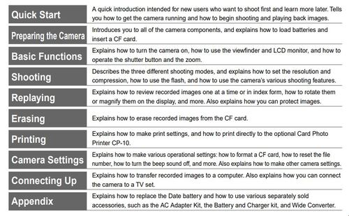
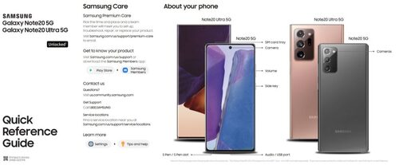

Dziś mamy dla Was sporo informacji związanych z dokumentacją, jaką na co dzień
tworzy technical writer. Zapraszamy!

Poproś kilka przypadkowych osób o to, żeby powiedziały co przychodzi im do głowy
na hasło "owoc". Każda z nich (najprawdopodobniej) poda inny przykład, w tym
nawet może pojawić się pomidor. Podobnie jest z treścią techniczną -- nie ma
jednej postaci, powstaje w różnych warunkach, a przy tym różni się formą w
zależności od produktu, który opisuje lub potrzeb, jakie ma docelowo spełnić.
Jeśli zatem zastanawiasz się,
[jak dostać pracę jako Technical Writer](http://techwriter.pl/jak-dostac-pierwsza-prace-jako-technical-writer/)
i nie wiesz jeszcze jakie treści techwriter opracowuje, przybliżamy kilka
najczęściej pisanych dokumentów technicznych.

### User Guide, User Manual czyli podręcznik użytkownika

Nawet dla osób umiarkowanie obytych z dokumentacją techniczną ten typ
dokumentacji będzie wyglądać znajomo. To klasyczny podręcznik użytkowania mający
na celu poinformowanie przyszłego użytkownika danego produktu, jak się z nim
obchodzić. Będą się tu pojawiać sekcje dotyczące bezpieczeństwa użytkowania,
opisu wyglądu lub interfejsu (w zależności od kategorii produktowej), informacje
o sposobie instalacji oraz konserwacji, opis użytkowania (no ba!) oraz
rozwiązania do najczęściej spotykanych problemów, a czasami nawet warunki
gwarancji.

Warto jednak pamiętać, że odbiorcą dokumentacji produktowej nie zawsze jest
typowy pan Kowalski próbujący rozgryźć świeżo zakupiony na święta telewizor. Jak
wiele kategorii produktowych, tak wiele różnych instrukcji użytkowania. Możemy
zatem natrafić też na dokumentację dla użytkowników specjalistycznego
oprogramowania lub sprzętu.

Można jednak -- zdroworozsądkowo na sprawę patrząc -- uznać, że podręcznik
użytkownika będzie obejmować wszelkie te obszary, które podpowiadają jak się
obyć z danym produktem unikając sugerowania modyfikacji, które wymagają
wykwalifikowanej wiedzy, bez której to zabawa w speca może skończyć się
uszczerbkiem na zdrowiu, a w najlepszej sytuacji uszkodzeniem produktu.

\[caption id="attachment_9708" align="aligncenter"
width="1013"\]
Opis rozdziałów w instrukcji do aparatów Canon, źródło: canon.pl\[/caption\]

Od strony warsztatu pisarskiego bywa, że tego typu treść daje się generować dość
szybko, o ile stosowny dział w firmie produkującej opiera swój model rozwijania
dokumentacji o ponowne użycie treści. Znaczy to tyle, że poszczególne fragmenty
(rozdziały i podsekcje) podręczników użytkownika do oferowanych produktów są na
tyle uogólnione lub tak zaprojektowane, że mogą się wpasować w większą ilość
wariantów danego produktu. Wyobraźmy sobie na przykład serię aparatów
fotograficznych, lub rodzinę lodówek, które z grubsza oferują te same
możliwości, lecz różnią się wybranymi parametrami oraz wymiarami fizycznymi.

Jeśli zaś trzeba się nad jakimś fragmentem takowej instrukcji pochylić i dodać
kilka akapitów od siebie, to może to być wyzwanie związane nie tylko stricte z
językiem technicznym, lecz czasem też reklamowym. Podręczniki użytkownika lądują
prosto w rękach klienta i wszelkie wrażenia jakie on odbierze są tu niezwykle
cenne, bo mogą zaważyć na dalszej sympatii wobec produktu oraz producenta.
Stawia się tu zatem na przystępność, atrakcyjność i nowoczesny wygląd.

\[caption id="attachment_9721" align="aligncenter"
width="1024"\]
Instrukcja do iPhone'a 12 dostępna na stronie producenta. Źródło:
apple.com\[/caption\]

Forma podręcznika w tym kontekście to kwestia umowna. Wciąż popularne jest
drukowanie opasłych instrukcji i pakowanie ich do pudełek, lecz nierzadko
zastępuje się je PDF-ami dostępnymi do pobrania na stronie producenta.
Powszechny jest także format HTML. W takim przypadku użytkownik może nawigować
po instrukcji jak po zwykłym portalu, otrzymując przy tym dostęp do wyszukiwarki
oraz pewność, że zawsze ma dostęp do najświeższej wersji dokumentu. Ta metoda
pokazuje też, że nie tylko użytkownik w tym kontekście może być zielony w
temacie, bo ileż można oszczędzić drzew decydując się na elektroniczną
dystrybucję dokumentacji technicznej!

### Quick Start Guide — skrócona instrukcja obsługi

Informację o tym jak uzyskać dostęp do elektronicznej wersji instrukcji produktu
często zawiera się w skróconej instrukcji obsługi. To ten drobny świstek
papieru, który albo wyrzucamy w pierwszej kolejności kiedy odpakowujemy świeżo
zakupiony produkt i chcemy się do niego dokopać, albo ten który jest gorzkim
rozczarowaniem kwitującym nasze przekopywanie się przez zawartość pudełka tylko
po to, aby dowiedzieć się, że już nic w nim nie ma. Ten niepozorny skrawek
papieru ma jednakże olbrzymią wartość, gdyż najczęściej w szybki i przystępny
sposób przeprowadza nas przez czynności, których opisanie przy użyciu
konwencjonalnych metod zajęłoby kilkanaście stron tekstu i nie mniej minut
naszej uwagi. Zawartość najczęściej zawęża się do ponumerowanych grafik
pokazujących montaż, rozkład elementów produktu, itp.

\[caption id="attachment_9705" align="aligncenter"
width="590"\]
Samsung Galaxy Note20 5G Quick Reference Guide Źródło: samsung.com\[/caption\]

Krótka, przystępna i elegancka -- cóż tutaj może pójść źle? Sporo, jak pokazuje
praktyka. Opracowanie skróconych instrukcji obsługi, szczególnie tych bazujących
w większości na użyciu grafik, w fazie produkcji opiera się na komunikacji
działu inżynieryjnego z dzialem grafików, którą to koordynuje właśnie tech
writer/ka. Odpowiada on/ona nie tylko za właściwy przepływ informacji, lecz
także za odpowiednie ich odfiltrowanie, aby skrócona instrukcja faktycznie była
zwięzła w treści.

Tutaj wszystko może pójść źle: nieporozumienie językowe, niepoprawna
interpretacja wytycznych co do grafiki, błędy przy skalowaniu się plików
graficznych przy produkcji finalnego pliku, ostatnie zmiany w projekcie -- można
wymieniać bez końca. I co gorsza, nie da się tutaj polegać specjalnie na
ponownym użyciu już wcześniej wydanej treści, chyba że nie doszło do zmiany w
wyglądzie produktu, co zdarza się nieczęsto. Autor niniejszego artykułu pracował
kiedyś przy opracowaniu grafik do instrukcji zmywarek, więc coś tam wie. ;)

### Developer, Administrator, Technician Guide — dla odbiorcy wykwalifikowanego

W przypadku dokumentu technicznego dedykowanego administratorom, developerom lub
technikom wchodzimy na wyższy poziom, gdyż nie uczymy tych osób jak dany produkt
obsłużyć, lecz zazwyczaj jak go zainstalować, skonfigurować, uruchomić, a nawet
zmodyfikować wedle własnych potrzeb. Mamy tu na myśli dokumenty dedykowane
skomplikowanym systemom urządzeń mechanicznych, systemom telekomunikacji,
rozwiązaniom sieciowym oraz informatycznym, a także wszelkiego rodzaju
rozwiązaniom czysto programistycznym.

Bywa, że jest to jedna instrukcja licząca sobie nawet 1000 stron lub cała
rodzina odrębnych dokumentów, gdzie każdy dedykowany jest wybranemu komponentowi
danego produktu. Niezależnie od ogólnej architektury tychże podręczników,
znajdziemy w nich szeroki przekrój treści różnego rodzaju. Natkniemy się tu
zatem na dłuższe fragmenty opisowe dające ogólny pogląd na całość architektury i
działania produktu, schematy, rysunki techniczne, materiały referencyjne oraz
specyfikacje, pojedyncze procedury lub rodziny procedur (zwane procesami),
sekcje rozwiązywania problemów, a nawet glosariusze.

\[caption id="attachment_9716" align="aligncenter"
width="742"\]
Fragment dokumentacji do Symfony 5.2. Źródło: symfony.com\[/caption\]

Co ciekawe, czasami odbiorca tych dokumentów przewyższa swą wiedzą osoby
zajmujące się projektowaniem i tworzeniem produktu, włączając w to tech
writera/kę, dlatego opracowanie dedykowanych dokumentów wymaga posiadanie albo
zaawansowanej wiedzy albo wnikliwego umysłu gotowego, aby ją przyjąć. Nie ma
jednak co popadać w strach, bo zdarza się, że odrębne zespoły pracujące w dziale
R&D (Reaserch & Development, _ang. badania i rozwój_) działają bez skrupulatnej
wiedzy poglądowej na cały produkt. I jakoś się udaje.

Ponownie zerkając na sprawę z perspektywy osoby piszącej taką dokumentację, w
przypadku tych dokumentów ma się dostęp do ich wcześniejszych wersji. Pełni ona
funkcję tzw. baseline'u, czyli wersji wyjściowej. Przy wydawaniu kolejnej
odsłony dokumentacji, duża część treści jest zwyczajnie powielana, natomiast
naszą rolą jako dokumentalisty/ki jest opisanie nowej funkcjonalności i
wprowadzenie zmian wynikających z  nowocześniejszych rozwiązań i udoskonaleń.
Taka dokumentacja przechodzi również przez niektóre elementy cyklu wytwarzania
oprogramowania, np. testowanie, celem wykrycia ewentualnych braków przed
wypuszczeniem finalnej wersji.

Kanał dystrybucji jest skrojony na potrzeby odbiorcy -- mogą to być fizyczne
kopie dokumentów w formie wydruku, płyta CD zawierająca PDF-y i/lub wersję HTML
dokumentacji do przeglądnięcia off-line lub specjalnie dedykowany portal
oferujący dostęp do bazy wiedzy, gdzie oprócz treści pisanych mogą znaleźć się
również materiały wideo oraz szkolenia.

### API Guide — w ojczystym po prostu dokumentacja API

Kolejnym istotnym filarem treści w świecie dokumentacji technicznej jest
dokumentacja API. Zagadnienie to zostało już poruszone na łamach naszego
portalu, więc po więcej szczegółów odsyłamy do stosownego artykułu, gdzie
poznacie jaka jest
[definicja i rodzaje dokumentacje API](http://techwriter.pl/dokumentacja-api-czesc-1-definicja-i-rodzaje-api/).

### Safety Leaflet — broszura informacyjna dotycząca bezpieczeństwa

Tutaj wkraczamy na obszary, w których technical writer/ka działa w służbie
bezpieczeństwa odbiorcy treści. Ulotka, tudzież broszura informująca o
bezpieczeństwie użytkowania to jeden z istotniejszych elementów treści
technicznej. Pojawia się w kontekście praktycznie każdego produktu, lecz nie
zawsze obiera taką samą formę. Może być fragmentem innego dokumentu
technicznego, nadrukiem w formie naklejki lub nadruku na folii zabezpieczającej.

Zazwyczaj jest to utarta treść współdzielona przez większość dokumentów
technicznych tworzonych w obrębie linii produktu lub nawet całej firmy. Niezbyt
często się ją też edytuje. Wyłącznie, kiedy wymagają tego zmieniające się
regulacje prawne i przepisy. Każda potrzeba edycji takiej zawartości kończy się
łańcuszkiem maili z listą sporej gromady odbiorców właściwych. Tech writer/ka
może być tu osobą inicjującą zmianę lub czasami ostatnim ogniwem w łańcuchu
dyskusji.

### Release Notes — informacje o wersji

Release Notes (w skrócie RN lub RNs) tworzy się przy wypuszczaniu kolejnej
wersji oprogramowania. Informują one o rozwiązanych błędach, usprawnieniach i
poprawkach, dodatkowych funkcjonalnościach i wszelkich zmianach istotnych z
punktu widzenia zarówno przeciętnego użytkownika, jak i developera obsługującego
dane oprogramowanie po stronie klienta.

\[caption id="attachment_9729" align="aligncenter"
width="476"\]
Przykład release notek aplikacji Orange Flex.\[/caption\]

Nie jest powiedziane, że przygotowaniem takiej informacji z definicji musi
zajmować się tech writer/ka, choć najczęściej się tak dzieje. Informacje
kompletowane są po stronie zespołów pracujących nad produktem, zaś do obowiązków
dokumentalisty/ki należy oprawa językowa, pilnowanie spójności z poprzednio
wydanymi RNs czy też właściwa ich publikacja w wyznaczonym do tego miejscu. Mogą
być generowane za pośrednictwem skryptu, lecz zdarza się też, że powstają we
współdzielonym przez wiele osób dokumencie, do którego dorzuca się kolejne
informacje istotne dla wydawanej wersji oprogramowania.

### Internal Documentation — dokumentacja dla dokumentacji i nie tylko

Istotną część pracy technical writera/ki może stanowić pisanie dokumentacji
wewnętrznej przeznaczonej do użytku zespołu techwriterskiego lub inżynieryjnego.
Zdarzyć się może też, że ktoś może pełnić funkcję dokumentalisty/ki w sposób
nieświadomy, gdyż w skład tego rodzaju treści wchodzi opis wszelkich
wykorzystywanych wewnętrznie aplikacji i praktyk umożliwiających i/lub
ułatwiających pracę. Ktoś oficjalnie może być osobą odpowiedzialną za finanse
firmy, ale jako dodatkowe zajęcie pisze procedury wykorzystywane przy pracy.
Często takie praktyki mają miejsce podczas przekazywania wiedzy innemu zespołowi
(w przypadku, kiedy firma przenosi swoją siedzibę do innego kraju).

Spisywana wiedza może też ułatwić wdrożenie nowo zatrudnionej osoby lub zostać
zachowana na przyszłość jako baza wiedzy lub sposób obejścia niedoskonałości
wykorzystywanego zestawu narzędzi. Prawda jest taka, że zawartość tych
dokumentów dyktuje samo życie. Zaspokaja ona potrzeby zespołu, jest niezbędna do
jego dalszego funkcjonowania i współdzielona we wspólnie ustalonym miejscu oraz
formacie. Może być to wewnętrzna strona internetowa, dysk współdzielony,
dokument zapisany w przystosowanym do tego narzędziu (np. Confluence) lub po
prostu arkusz kalkulacyjny.

### To nie wszystko!

Przedstawiliśmy w tym zestawieniu najczęściej spotykane dokumenty pojawiające
się w pracy tech writera/ki, lecz to z pewnością nie są wszystkie formy treści
technicznych, jakie możecie napotkać na swojej drodze. Ile ofert pracy i firm
potrzebujących wytworzyć dokumenty techniczne, tyleż różnych formatów i form.
Każdy zatem znajdzie tu coś dla siebie, bo może zdecydować się na karierę w
kategorii produktowej bliskiej własnym doświadczeniom, wiedzy czy
zainteresowaniom. Jeśli ktoś ma zapędy do tworzenia nie tylko treści pisanych,
lecz także materiałów wideo czy prezentacji na potrzeby szkolenia -- takiego
wyzwania w tej branży także można się doszukać i podjąć. Niezależnie od
preferencji, liczymy na to, że pomogliśmy i że się Wam ten artykuł przyda. ;)
