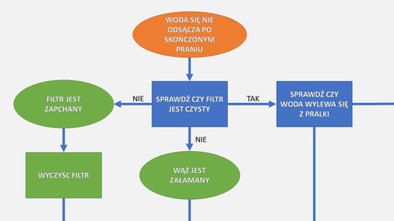

W DITA można pisać treść z multimediami a potem generować z niej HMTLe, PDFy i
tak dalej. A co, gdybyśmy chcieli na przykład wygenerować diagram z drzewa
procedur? Na szczęście się da.

<!--truncate-->

Natrafiliśmy ostatnio na
[rozwiązania firmy Intuillion, które pozwalają na generowanie rożnych rzeczy z plików DITA](http://intuillion.com/products/content-automation/overview/).
Dzięki temu, że DITA to XML, mamy dosyć dużą władzę nad tym co można z niej
generować. Można tworzyć pliki DITA z innych materiałów. Intuillion proponuje
następujące gotowe rozwiązania:

- Diagram pomagający w rozwiązywaniu problemów z plików typu DITA
  "troubleshooting"
- Diagram architektury systemu z topików DITA
- Pliki konfiguracji serwera z topików DITA
- Mapę DITA z zestawienia materiałów
- Dokumenty DITA z plików wymagań produktu

Te rozwiązania są związane z CMSem, który Intuillion reklamuje, ale mogą równie
dobrze być zastosowane w innych środowiskach. A jeżeli mamy w sobie trochę chęci
i znamy XSLT, możemy napisać swoje.



# Jak to działa?

DITA jest publikowana przez
[DITA OT](https://en.wikipedia.org/wiki/DITA_Open_Toolkit), który opiera się na
[XSLT](https://www.w3schools.com/xml/xsl_intro.asp). XSLT zamienia pliki DITA
XML w inne pliki XML - na przykład
[XSL-FO](https://en.wikipedia.org/wiki/XSL_Formatting_Objects) lub HTML. Można w
tym miejscu stworzyć dodatkową transformację, która zamieni treści DITA w plik
SVG -
[grafikę wektorową zapisaną w formacie XML](https://www.w3schools.com/graphics/svg_examples.asp).
Albo stworzyć pliki XML (lub proste pliki tekstowe), które staną się plikami
konfiguracyjnymi serwera lub aplikacji.

Transformacja w drugą stronę działa analogicznie. Pliki XML stanowiące jakiś
dokument można zamienić w pliki DITA. Zaawansowani użytkownicy mogą pokusić się
o zmienianie plików DOCX lub RTF w pliki XML.

# Przykład

Poniższy przykład jest dla osób zaznajomionych z XSLT. Gdybyśmy chcieli stworzyć
diagram z plików DITA, moglibyśmy to zrobić w następujących krokach:

1. Stworzyć plugin do DITA OT, który będzie generował nasze obrazy. Możemy
   zrobić go częścią innego pluginu, na przykład tego, który generuje nasze
   PDFy. Ale dużo lepiej zrobić z tego osobny plugin i wywoływać przed procesem
   publikacji. Wtedy możemy wygenerować nasz obrazek i dołączyć go do PDFa,
   HTMLa, i tak dalej.
2. Dodać transformacje XSLT, które pozyskają treści do diagramu. Na przykład,
   każdy `<condition>` zamieni się w zieloną elipsę.
3. Opcjonalnie, dodać instrukcje w pliku
   [ANT](https://en.wikipedia.org/wiki/Apache_Ant), które zmienią plik SVG do
   formatu PNG. Użyteczna może się tu okazać darmowa aplikacja
   [Image Magick](https://www.imagemagick.org/script/index.php).

Poniżej przykład kodu, który generuje elipsę z taga `<condition>`. To przykład
troche umowny, bo nie kalkuluje położenia i wielkości elipsy względem tekstu,
ale zarysowuje o czym mówimy.

```xml
<xsl:foreach select=".//\*\[contains(@class, ' troubleshooting/condition ')\]">
   <g>
      <ellipse cx="200" cy="80" rx="100" ry="50" style="fill:yellow;stroke:purple;stroke-width:2" />
      <text x="150" y="80" font-family="Verdana" font-size="35" fill="blue">
         <xsl:value-of select="." />
      </text>
   </g>
</xsl:foreach>
```

# Dla nie-programistów

Jeżeli nie mamy talentu do kodowania, lub czasu na to, najlepiej zwrócić się do
osoby, która zaprojektowała nasze arkusze stylów do DITA OT. Albo poprosić
zaprzyjaźnionego programistę. Pokażcie mu powyższy przykład i będzie wiedział co
zrobić.

A Wy? Macie pomysły jak moglibyście to zastosować w swojej pracy? Piszcie w
komentarzach poniżej.
