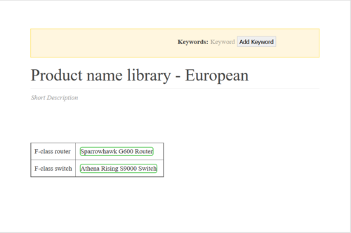

Pisaliśmy już o [podstawach](http://techwriter.pl/wszystko-o-dita-podstawy/) i
tworzeniu [strategii](http://techwriter.pl/wszystko-o-dita-strategia/) dla DITA.
Po tym łagodnym wprowadzeniu, postanowiliśmy Was rzucić na głęboką wodę, czyli
zająć się zagadnieniem conkeyref. Dzięki temu zapoznacie się z koncepcją kluczy
i pobierania treści w dicie. Dla ułatwienia posłużymy się praktycznym
przykładem, który mamy nadzieję pozwoli Wam szybko zrozumieć o co w tym
wszystkim chodzi.

<!--truncate-->

# Czym jest conkeyref?

[Conkeyref](https://docs.oasis-open.org/dita/v1.2/os/spec/common/theconkeyrefattribute.html)
to specjalny odsyłacz, który wstawia treść z innego topika znajdującego się w
tej samej mapie ditowej. Na tym etapie prawdopodobnie ta definicja brzmi jeszcze
zagadkowo. W dalszych sekcjach znajdziecie więcej szczegółów, które powinny
rozjaśnić o co chodzi.

# Przykład użycia

Załóżmy, że mamy topik wymieniający produkty, które sprzedajemy. Ten topik jest
używany we wszystkich naszych publikacjach i wygląda tak:

Nasze produkty nazywają się F-class G600 Router i F-class S9000 Switch. Jednak
nasz zespół marketingowy na Europę stwierdził, że to nudne nazwy i postanowił
sprzedawać te same produkty jako Sparrowhawk i Athena Rising.

Co teraz? W tej sytuacji możemy właśnie wykorzystać conkeyref do wstawienia nazw
produktów, dzięki czemu będziemy mogli używać nowych nazw na rynku europejskim a
starych nazw na wszystkich pozostałych rynkach.

## Dwa topiki

Żeby zastosować wspomniane powyżej rozwiązanie będziemy potrzebować dwóch
topików.

Zaczynamy od topiku **product_names.dita** dla starych dobrych nazw. Zawiera on
następujące elementy:

<ph id="**G600**">F-class G600 Router</ph> <ph id="**S9000**">F-class S9000
Switch</ph>

Każdy element ma swoje id, które odgrywa bardzo ważną rolę.

Następnie, kopiujemy ten topik i zapisujemy go jako
**european_product_names.dita**. Zmieniamy w nim tylko nazwy produktów, a id
pozostawiamy bez zmian. Dzięki temu otrzymujemy następujące elementy:

<ph id="G600">**Sparrowhawk** G600 Router</ph> <ph id="S9000">**Athena Risin**g
S9000 Switch</ph>

Te dwa topiki są naszym źródłem dla nazw produktów. Tego typu topiki nazywamy
bibliotekami, bo zawierają zasoby wykorzystywane przez mechanizmy DITA. Nie są
to topiki, które czytają nasi użytkownicy. Ich struktura wygląda dość roboczo,
na przykład tak:

Topik, który rzeczywiście trafi do naszego manuala to inny topik opisany
poniżej. Jest on wpięty do mapy na samym początku pierwszego rozdziału.

## Tak naprawdę, to jeden topik

Topik, który zostanie użyty w manualu zawiera odwołania do nazw produktów w
odpowiednim miejscu:

<ph conkeyref="product-names/**G600**"></ph>
<ph conkeyref="product-names/**S9000**"></ph>

Odwołania używają id, które ustawiliśmy w naszych topikach-bibliotekach oraz
klucza "product-names". Nasz topik włączamy do
[mapy ditowej](http://techwriter.pl/wszystko-o-dita-podstawy/).

## Odwołanie do klucza jest kluczem do sukcesu

Ustawiając odwołanie w topiku, nie odwołaliśmy się do nazwy pliku biblioteki,
ale do klucza. Klucz umieszczamy w mapie ditowej w następujący sposób:

<keydef keys="**product-names**" href="reuse/generic\_product\_names.dita" />

Element keydef zawiera naszą nazwę klucza "product-names" oraz odwołanie do
pliku generic_product_names.dita, dlatego nasze odwołanie ma postać:

product-names/G600

Zamiast

generic_product_names.dita/G600

Dzięki temu możemy w innej mapie umieścić odwołanie do klucza z inną nazwą
pliku:

<keydef keys="product-names" href="reuse/**european\_product\_names.dita**" />

# Próbka do pobrania

[Tutaj](http://techwriter.pl/wp-content/uploads/2016/09/product_catalogditamap-bundle.zip)
możecie pobrać pliki DITA, które obrazują przykład użycia opisany powyżej.
Poniżej opis paczki, którą możecie ściągnąć:

1. Mapa "generic" odwołuje się do tabeli nazw podstawowych.
2. Mapa "european" odwołuje się do tabeli nazw na Europę.
3. Folder "reuse" zawiera obie tabele nazw.
4. Plik topic.xml jest użyty w obu mapach.

W następnym odcinku napiszemy jak takie pliki otworzyć i jak wyprodukować z nich
PDFa. Dajcie znać w komentarzach jak Wam się podoba i o czym chcielibyście
przeczytać następnym razem.
