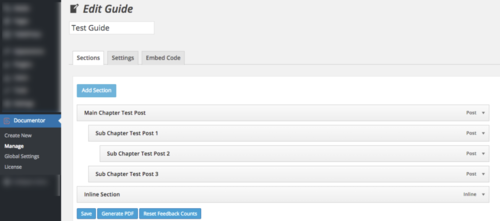

Podczas szkolenia ITCQF
([relacja](http://techwriter.pl/szkolenie-itcqf-relacja/)) spotkaliśmy Adriana,
który pracuje z narzędziem [Documentor](https://documentor.in/). Po krótkich
namowach zgodził się opisać dla Was narzędzie do intuicyjnego i przejrzystego
tworzenia dokumentacji z wykorzystaniem WordPress'a - dziękujemy!

<!--truncate-->

Documentor to plugin WordPressa pozwalający segregować zawartość naszej
dokumentacji w przejrzystą strukturę przy użyciu sekcji, eksportować dokumenty
do PDF, otrzymywać feedback od czytających, a nawet dodać opcje społecznościowe.
Idea jaka przyświeca twórcom to łatwe tworzenie dokumentacji produktu lub
procesu przy użyciu WordPressa. W szczególności dokumentów typu User Guide czy
Project Documentation. Wtyczka dostępna jest w dwóch wersjach:

- Lite – darmowej wersji, która pozwala dodać nam tylko jedną sekcję do jednej
  strony (może wystarczyć do prostych zastosowań) i nie ma możliwości zmiany
  „skórek” (oprawy graficznej)
- Documentor Pro – wersja płatna, za pomocą której możemy dodać dowolną liczbę
  dokumentów (Guides) do dowolnych stron oraz modyfikować ich wygląd. Płatne
  wersje zaczynają się od $19

Warto na pewno zacząć od darmowej wersji i zobaczyć, czy ten plugin sprawdzi się
do naszych potrzeb, można też sprawdzić przykład użycia na demo-stronie
([http://demo.documentor.in/](http://demo.documentor.in/)).

Esencją pracy z Documentor jest tworzenie dokumentów, tzw. Guides. Każdy Guide
można osadzić na stronie za pomocą krótkiego kodu (podobnie jak w przypadku
większości pluginów w WordPress). Przykładowo dla wersji Lite jest to tylko
jeden dokument: _\[documentor 1\]._

## Jak to działa?

Nasz dokument tworzymy przez dodawanie do niego sekcji, które możemy układać w
zadaną hierarchię zwykłym drag-and-drop. W widoku edycji Guide (Documentor →
Manage → Edit przy wybranym Guide) klikamy „Add Section” i wybieramy
interesującą nas zawartość. Nową sekcją może być:

- Ręcznie dodana sekcja o dowolnym tytule wyświetlanym w menu (Section Title), w
  treści dokumentu (Section Title) i zawartości
- Jeden lub więcej Postów (zdecydowanie najwygodniejsze rozwiązanie, wystarczy
  tylko zaznaczyć które z postów chcemy dodać)
- Jedna lub więcej Stron
- Link

_Tworzenie
Guide Documentora_

Przykładowo: by dodać sekcje z użyciem istniejących Postów, wchodzimy do menu
„Posts” w dodawaniu nowych sekcji, zaznaczamy interesujące nas posty, klikamy
przycisk „Insert” na dole i następnie „Back to Edit”. Dokument zawiera teraz
wylistowane sekcje, które możemy poukładać w żądaną hierarchię metodą
drag-and-drop tworząc rozdziały i podrozdziały kolejnych poziomów. Daje nam to
wygodną, przejrzystą strukturę książki.

Jedyne co nam pozostało, to osadzić tworzony dokument na stronie. W tym celu, w
sekcji „Manage” podglądamy „Shortcode” przy wybranym dokumencie, znajdujemy tam
kod potrzebny do osadzenia i wklejamy bezpośrednio do zawartości naszej strony.
Documentor wygeneruje potrzebny wygląd dokumentu.

_Wygenerowany dokument na
stronie_

## Opcje

Ogromnym plusem jest szeroki wachlarz możliwości konfiguracji. Wtyczka ma
całkiem pokaźne możliwości dostosowania wyglądu i zawartości, dostępne w
zakładce „Settings” w widoku edycji „Guide”. Możemy tam między innymi:

- Wybrać „skórkę”, czyli zestaw kolorystyki
- Położenie menu (lewa/prawa)
- Spersonalizować kolory, fonty, etc. dla sekcji, menu, zawartości i paska
- Określić czy zawartość ma być ładowana w całości czy też każda sekcja osobno
  (AJAX loading)
- Zezwolić na zapis w PDF, drukowanie, wysłanie zawartości mailem, feedback od
  użytkowników
- Włączyć opcję wyszukiwania

…i wiele innych.

## Podsumowanie

Documentor to ciekawe narzędzie przekształcające WordPress w wygodny dla
dokumentacji CMS. Z jego pomocą łatwo stworzymy czytelną strukturę, wygenerujemy
pliki PDF lub zachęcimy czytelników do interakcji. Nie jest to jednak narzędzie,
które opanujemy w 5 minut i trzeba przeznaczyć chwilę (dzień - dwa) by w pełni
dopasować go do naszych potrzeb, niemniej jest to jeden z potężniejszych
pluginów dokumentacyjnych do WordPress na rynku.

Adrian Gonciarz

Od redakcji: O możliwości wykorzystania WordPressa do tworzenia dokumentacji
pisaliśmy już jakiś czas temu,
[opisując narzędzie Helpinator](http://techwriter.pl/zaklinacz-wordpressa/).
Swoją drogą, ciekawe kto wymyśla nazwy tych narzędzi - Terminator? Może czas
stworzyć swój produkt tego typu i nazwać go na przykład...
[Kontentor](http://techwriter.pl/langlydz-part-najn/)? Co o tym sądzicie?
