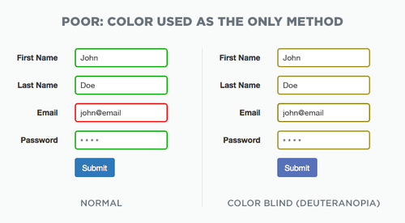
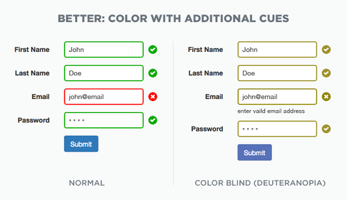
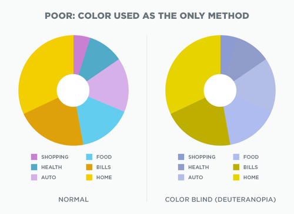
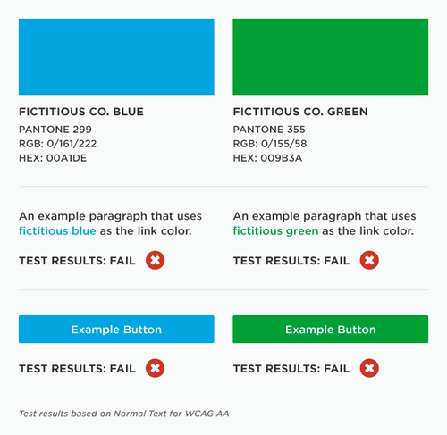
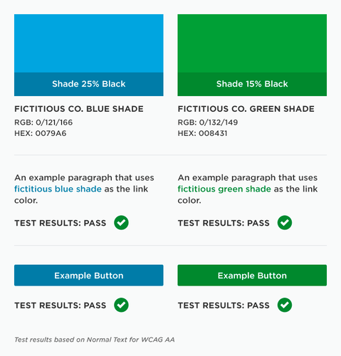
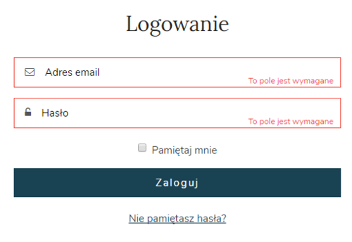

Dokumentacja techniczna powinna być dostępna dla każdego. Ale czy to oznacza, że
dokumentacja dla osób, które mają problem z rozróżnianiem kolorów to jest
zupełnie inna bajka? Nie do końca!

<!--truncate-->

W tym artykule przedstawimy kilka przydatnych wskazówek dotyczących tworzenia
dokumentacji dla daltonistów i osób mających problem z widzeniem kolorów.

## Fakty i statystyki

Według organizacji
[Colour Blind Awareness](https://www.colourblindawareness.org/) około 300 mln
ludzi na świecie to daltoniści, co stanowi  około 4% populacji. Jeśli Waszymi
odbiorcami są mężczyźni to liczba ta wzrasta do 8%.

Daltonizm to wada wzroku, na którą do tej pory nie udało się znaleźć skutecznej
metody, umożliwiającej całkowite wyleczenie. Jest sporym utrudnieniem,
ograniczając możliwości samodzielnego funkcjonowania na co dzień i
przeszkadzając w wykonywaniu wielu zawodów i czynności, w tym na przykład,
prowadzenia samochodu. W obecnej rzeczywistości, w której żyjemy, można znaleźć
rożne pomoce optyczne pomagające osobom z daltonizmem w codziennym
funkcjonowaniu.

Zobaczmy, co można zrobić, aby dokumentacja była bardziej przyjazna dla osób z
daltonizmem lub ślepotą barw.

## Ślepota barw a daltonizm

Ślepota barw (lub niedobór widzenia kolorów) to niezdolność lub zmniejszona
zdolność widzenia pewnych kolorów lub dostrzegania różnic w kolorach.

Istnieje wiele rodzajów ślepoty barw. Głównie sprowadza się to do niewyraźnego
widzenia kolorów, pomieszania kolorów lub niemożności rozróżnienia niektórych
kolorów. Jeśli chcielibyście dowiedzieć się więcej o ślepocie barw, zajrzyjcie
[(tutaj)](https://myeyebb.com/blogs/news/everything-you-need-to-know-about-color-blindness).

Z kolei ludzie z daltonizmem są w stanie widzieć rzeczy równie wyraźnie jak
zwykli użytkownicy, ale mają trudności z rozróżnianiem kolorów. Dlatego termin
„daltonizm” może być w tym przypadku zbyt ogólny.

## Na co zwrócić uwagę przy projektowaniu dokumentacji dla osób z daltonizmem?

Jak się domyślacie, kolor nie jest jedynym wizualnym środkiem przekazywania
informacji czy wyróżniania elementów w Waszej dokumentacji.

Co możecie zrobić? Poniżej kilka przydatnych podpowiedzi i przykładów.

### Dodawanie wizualnych wskazówek

Przy projektowaniu, na przykład formularzy, warto pamiętać, że kolory to nie
wszystko.

Zwykle zakładamy, że kolor zielony kojarzy się z pozytywnym wynikiem a czerwony
z negatywnym. Jednak poleganie wyłącznie na kolorach może być problematyczne dla
użytkowników z daltonizmem.

_Słaby przykład projektu formularza_

Podany przykład pokazuje jak kolory czerwony i zielony są widziane przez
zwykłego użytkownika oraz przez daltonistę.

Jak można poprawić ten formularz?

_Lepszy przykład projektu formularza_

Poprzez dodanie wizualnych wskazówek lub komunikatów o błędach można wyróżnić
pola, w których nastąpiła pomyłka. Zapewnia to użytkownikom z daltonizmem
zrozumienie wyświetlonych informacji.

Podobną wskazówkę możecie zastosować w przypadku wykresów. Jeśli Wasz odbiorca
jest daltonistą może mieć problem z dopasowaniem kolorów z legendy do ich
odpowiedników na wykresie.

_Słaby przykład projektu wykresu_

W tym przypadku można zobaczyć, jak kolory mieszają się ze sobą i stają się nie
do odróżnienia.

_Lepszy przykład projektu wykresu_

Poprzez dodanie białych granic między poszczególnymi segmentami czytelność
obrazu znacznie się poprawiła. Ponad to, dodanie objaśnień do wykresu wyraźnie
rozróżnia każdą kategorię.

Dzięki takiemu rozwiązaniu wykres jest bardziej dostępny dla użytkowników z
daltonizmem. Dla zwykłych użytkowników może być to wartością dodaną 😊.

### Projektowanie treści z kontrastem

Kontrast kolorów może ułatwić odczytanie wizualnego komunikatu.

Kontrast to różnica w kolorze, która powoduje, że dany obiekt można odróżnić od
innych obiektów znajdujących się blisko siebie. Im większy jest współczynnik
kontrastu, tym lepsza jest czytelność obrazu dla osób z daltonizmem jak i
ślepotą barw. Reasumując, dobór kolorów i kontrast odgrywają ważną rolę w
spełnieniu tych wytycznych.

_Słaby przykład doboru kontrastu_

Podany przykład pokazuje, w jaki sposób podana paleta kolorów podstawowych nie
przechodzi testu kontrastu, dopóki nie zostaną zastosowane odcienie.

Jak można to zmienić?

Zacznij używać odcieni lub cieni, aby zmodyfikować kolor na tyle, aby uzyskać
przemijający współczynnik kontrastu.

_Lepszy przykład doboru kontrastu_

No dobrze, ale jak zbadać kontrast i sprawdzić czy wybrane przez Was kolory
przechodzą test?

Oto przydatne narzędzia!

- [ContrastChecker](https://webaim.org/resources/contrastchecker/)
- [Checkmycolours](https://www.checkmycolours.com/)

### Poprawienie czytelności tekstu

Chcąc stworzyć idealne połączenie tekstu i obrazu oraz zwiększyć jego
czytelność, możecie modyfikować kolor tła, rozmiar i kolor tekstu.

Podany przykład pokazuje jak nałożony tekst na grafikę wpływa na jego
czytelność.

_Tekst nałożony na obraz bez maski_

Poprzez zmniejszenie krycia tła można zwiększyć kontrast. Efekt?

Na oko dużo lepszy 😉

_Tekst nałożony na obraz z maską_

### **Używanie filtrów kolorów**

Poniższy przykład pokazuje w jaki sposób można rozwiązać przedstawianie kolorów
dla osób z deuteranopią (czyli osób mających problem w rozróżnianiu barwy
zielonej).

_Najczęstsze deficyty koloru czerwono-zielonego_

Bez opisów rozróżnienie dostępnych opcji wydaje się niemożliwe.

Dodanie etykiety tekstowej do koloru, eliminuje zgadywanie lub wątpliwości co do
wybranego koloru. Jest to również korzystne dla osób z bez problemów z
widzeniem. Zastanówcie się czy nie zdarzało się Wam mieć problemu z określeniem
barwy wybranego produktu robiąc zakupy online?

### **Rozpoznawanie linków**

Linki powinny być łatwe do wykrycia bez polegania na kolorze.

Poniższy zrzut ekranu symuluje widzenie osoby z achromatopsją (nie widzi
koloru). Link ten jest trudny do zauważenia. Aby znaleźć łącze, użytkownik musi
najeżdżać myszą mając nadzieje, że znajdzie
link.

_Tekst widziany przez osobę z achromatopsją_

Dobrym pomysłem byłoby dodanie podkreślenia… 😊

I tu lekcja również dla nas, którą od razu postanowiliśmy wcielić w życie.

_Podkreślone linki są łatwe do zauważenia przez osobę z achromatopsją_

### **Kombinacje kolorów**

W świecie bogatym w różne kolory nie zawsze mamy możliwość kontroli istniejących
połączeń.

Czy marchewka faktycznie wyróżnia się na tle groszku? Na pewno nie dla
wszystkich osób.

Aby zapewnić daltonistom możliwość rozróżnienia grup ''obiektów", które są w
różnych kolorach, należy unikać łączenia na jednym obrazie, na przykład,
pomarańczowego i zielonego. Warto też dodać opis do ilustracji lub odnośnik, co
znacznie ułatwi jej interpretację.

_Sposoby zestawiania kolorów - kompozycja groszku i marchewki_

### Wymagane pola formularza

Oznaczanie wymaganych pól kolorem może stanowić problem, ponieważ niektórzy
użytkownicy z dysfunkcjami wzroku mogą nie widzieć różnic.

Oprócz tego możesz rozważyć oznaczanie wymaganych pól gwiazdką lub dodanie
opisu, np: To pole jest wymagane

_Przykład formularza z zostosowaniem koloru i dodatkowego opisu_

Tam, gdzie to możliwe, warto wziąć pod uwagę opcję usunięcia pola jeśli
informacja jest nieistotna.

## Czas na podsumowanie

Jeśli wśród odbiorców Waszego produktu są osoby z daltonizmem, może warto
rozpatrzeć opcję zastosowania przynajmniej kilku wymienionych wyżej wskazówek
lub skorzystania z dostępnych narzędzi, aby lepiej zrozumieć z jakimi problemami
borykają się te osoby.

- [Coblis](https://www.color-blindness.com/coblis-color-blindness-simulator/) 
  -  narzędzie zaprojektowane, aby symulować wygląd obrazu z określonymi typami
  niedoborów widzenia kolorów.
- [NoCoffee Vision Simulator](https://chrome.google.com/webstore/search/NoCoffee%20Vision%20Simulator?hl=en&gl=US) -
  narzędzie jest rozszerzeniem dostępnym dla przeglądarki Chrome, pomocne do
  zrozumienia problemów, z jakimi borykają się osoby z lekkimi lub skrajnymi
  problemami ze wzrokiem, w tym ślepotą barw.
- [Colour Blind Pal](https://colorblindpal.com/)
   \- aplikacja, która pozwala zrozumieć, jak
  daltoniści widzą kolory
- [Panasonic G90](https://www.digitalcameraworld.com/reviews/panasonic-lumix-g90g95-review) / [Panasonic G95](https://www.digitalcameraworld.com/reviews/panasonic-lumix-g90g95-review)
   - aparat, który pozwala daltonistom widzieć kolory poprzez specjalny wizjer
  elektroniczny

Mamy nadzieję, że dzięki tej wiedzy podniesiemy Waszą świadomość i zwiększymy
integralność dokumentacji technicznej!

Jeżeli chcielibyście sprawdzić czy Wasza dokumentacja jest dostępna - dajcie
znać, część naszej redakcji zajmuje się tym tematem zawodowo, na pewno chętnie
pomogą!
