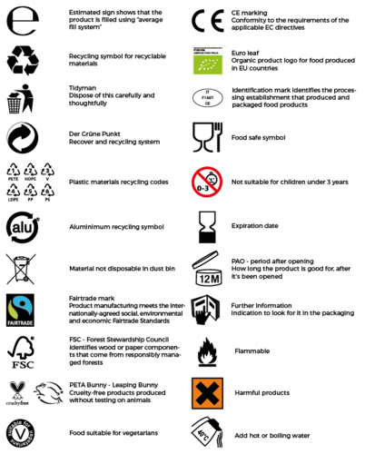
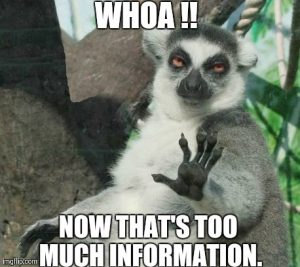

Jak i kiedy używać ilustracji, screenshotów i symboli?  Dlaczego warto używać elementów wizualnych? Czy wykorzystanie obrazów może zaangażować Waszych odbiorców lub pomóc im utrzymać koncentrację? Jak to wszystko rozsądnie zrobić i o czym warto pamiętać? Na te wszystkie pytania postaramy  się  odpowiedzieć w tym artykule!

## Gdzie, ile i jakich ilustracji używać?

Wszystko zależy od tematu, branży i grupy docelowej. Poprawne umieszczanie elementów wizualnych może pomóc Waszemu odbiorcy z niewielką wiedzą techniczną uchwycić złożoną koncepcję projektu dużo szybciej i łatwiej, niż przy użyciu samego tekstu. Jeśli już wiecie kto jest Waszym odbiorcą, warto zastanowić się, do czego potrzebne Wam są ilustracje oraz jaki ich typ będzie najbardziej pożądany. Pomocne do tego mogą być wskazówki opisane [tutaj](http://techwriter.pl/ilustracje-i-wideo-w-dokumentacji-technicznej/).

Liczba elementów wizualnych, których potrzebujecie, zależy nie tylko od docelowego odbiorcy, ale również od rodzaju treści, którą piszecie i powodu, dla którego piszecie Wasze instrukcje. Treść techniczna tworzona dla inżynierów lub środowiska produkcyjnego może wymagać większej ilości obrazów, aby, na przykład, przedstawić skomplikowane urządzenia lub komponenty, które są punktem odniesienia do zrozumienia, jak coś działa lub jak bezpiecznie obsługiwać maszyny. W tego typu dokumentach są to z reguły rysunki wektorowe, rzuty, rysunki wycinkowe, czasem zdjęcia sprzętu lub schematy procesów. Z kolei w środowisku programistów i branży IT przydatne może być użycie diagramów, wykresów przepływu czy też zrzutów ekranu. Takie elementy wizualne mogą wyjaśniać koncepcje, pozwalać użytkownikowi w pełni korzystać z produktu lub przeprowadzać go przez niezbędne kroki do pomyślnego wykonania zadania.

Bardzo ważne jest aby użycie grafiki, zdjęcia czy screenshotu w instrukcji nie było przypadkowe. Nie mogą one być interpretowane w niewłaściwy sposób, dlatego ważne jest aby ich poprawnie używać!

## Skąd brać ilustracje i inne elementy wizualne?

W zależności od stopnia złożoności treści technicznej, Wasze ilustracje, które będą w dokumentacji, będą powstawały przy współpracy z ekspertami, inżynierami, menedżerami produktów lub kierownikami projektów,  grafikami i projektantami UX. Być może w Waszej organizacji mogą istnieć  jeszcze inne działy, które mogą być pomocnymi źródłami.

Inną opcją jest szukanie obrazów i ilustracji w Internecie, należy jednak upewnić się  że mamy pozwolenie na ich użycie ;) .

W przypadku symboli warto skorzystać z istniejących standardowych symboli stworzonych przez Międzynarodową Organizację Normalizacyjną [(ISO)](https://www.iso.org/obp/ui/#iso:pub:PUB400001:en) lub norm określających jakich oznaczeń używać w danej branży, np. oznaczenia graficzne na rysunkach architektoniczno-budowlanych lub oznaczenia na diagramach elektrycznych.

## Grafika, obraz, screenshot - jak ich używać i dlaczego?

Poniżej  kilka wskazówek, które pomogą Wam upewnić się, że  elementy wizualne są używane odpowiednio.

- Unikaj wstawiania grafiki bez opisu - elementy graficzne mają za zadanie wyjaśniać informacje, a nie ozdabiać dokument. Elementy pozbawione sensu są bezużyteczne dla czytelników. Instruując Waszego odbiorcę zwiększacie szanse na lepsze zrozumienie podanych informacji, zwłaszcza jeśli odbiorca nie ma wiedzy w danej dziedzinie lub jest nowy.
    
    \[caption id="attachment\_10690" align="aligncenter" width="700"\] dobra praktyka - grafiki z opisami\[/caption\]
- Używaj tylko czytelnych grafik - jeśli czytelnik ledwo rozumie, w jakim celu użyta jest grafika lub obraz - psuje to ideę przejrzystości i prostoty tekstu. Dobierając ilustracje pamiętaj, że mają one pomóc czytelnikowi w zrozumieniu konkretnych informacji. Zastanów się, co chcesz przekazać i upewnij się, że ilustracje skupiają się na tym, co chcesz osiągnąć. Kwestia czytelności grafiki jest szczególnie ważna w przypadku zrzutów ekranu. Zrzut ekranu pomaga w zrozumieniu użycia jakiegoś narzędzia programowego lub pokazuje rezultat działania użytkownika. Pamiętajcie, aby Wasze zrzuty ekranu był czytelne. Jednym ze sposobów, który pomoże uzyskać ten efekt jest powiększenie fragmentu ekranu, tak aby tekst był wystarczająco duży. Przydatne mogą okazać się narzędzia do tworzenia zrzutów ekranu. O kilku z nich pisaliśmy [tutaj](http://techwriter.pl/snagit-znacznie-wiecej-niz-zrzuty-ekranu/) i [tutaj](http://techwriter.pl/screenpresso-narzedzie-do-tworzenia-zrzutow-ekranow-i-nie-tylko/).
- Używaj tylko grafik o wysokiej jakości - źle zaprojektowana grafika wygląda nieprofesjonalnie i niedbale - Wasza dokumentacja powinna być zrozumiała i przyciągać uwagę czytelników. W zależności od potrzeb możecie używać różnych formatów:
    
    <table style="height: 205px" width="568"><tbody><tr><td width="113"><ul><li><strong><a href="https://en.wikipedia.org/wiki/GIF">.gif</a></strong></li></ul></td><td width="513">idealny dla prostszych obrazów, małych animacji o niskiej rozdzielczości</td></tr><tr><td width="113"><ul><li><strong><a href="https://en.wikipedia.org/wiki/JPEG">.jpg, .jpeg</a></strong></li></ul></td><td width="513">umożliwia zachowanie równowagi miedzy rozmiarem a jakością obrazu</td></tr><tr><td width="113"><ul><li><strong><a href="https://en.wikipedia.org/wiki/Portable_Network_Graphics">.png</a></strong></li></ul></td><td width="513">dobry dla grafik, które wykorzystują duże płaskie obszary kolorów i wymagają przezroczystości</td></tr><tr><td width="113"><ul><li><a href="https://en.wikipedia.org/wiki/Scalable_Vector_Graphics"><strong>.svg</strong></a></li></ul></td><td width="513">idealny dla elementów interfejsu użytkownika, ikon, czy diagramów Mogą być przeszukiwane, indeksowane i kompresowane, a także skalowane bez utraty jakości</td></tr></tbody></table>
    
- Używaj prostych grafik - grafika powinna być łatwa do odczytania i zrozumiała od pierwszego spojrzenia. Ważne jest, aby na ilustracji technicznej nie działo się zbyt wiele. Jeśli, na przykład, musisz podłączyć urządzenie zarówno do gniazdka elektrycznego, jak i do konkretnej sieci, lepiej stworzyć dwie  odrębne ilustracje zamiast jednej. Dlaczego? Po pierwsze, opisana zostanie tylko jedna czynność. Po drugie, pojedyncza ilustracja z jedną czynnością motywuje do dalszego działania ;) .
    
    \[caption id="attachment\_10691" align="aligncenter" width="251"\] dobra praktyka - grafika przedstawiająca  krok 1\[/caption\]
    
    \[caption id="attachment\_10692" align="aligncenter" width="229"\] dobra praktyka - grafika przedstawiająca krok 2               \[/caption\]
- Zwróć uwagę na kolorystykę grafik - często są one czarno-białe lub szaro-białe. Jeśli jednak grafika będzie kolorowa – ważne jest aby czytelnicy zinterpretowali ja poprawnie. W niektórych kulturach kolor czerwony może być interpretowany jako zagrożenie, a w innych jako dobrobyt. Jeśli chcecie wiedzieć więcej dlaczego kolory maja znaczenie, zapraszamy [tutaj](https://www.colormatters.com/). Innym aspektem doboru kolorów w grafice jest dostępność. Jest to szczególne istotne gdy czytelnicy mogą mieć problemy ze wzrokiem, o czym więcej pisaliśmy [tutaj](http://techwriter.pl/dokumentacja-techniczna-dla-daltonistow/). Dlatego należy dokładnie sprawdzić, które kombinacje kolorów i kontrast powinny być użyte dla Waszych czytelników.
- Zwróć uwagę na kolejność grafik i ich ogólne rozmieszczenie - w niektórych krajach odbiorcy będą czytać je od lewej do prawej. W innych może być odwrotnie. Jeśli jest to konieczne ponumeruj swoje grafiki.
    
    \[caption id="attachment\_10700" align="aligncenter" width="1200"\] dobra praktyka - numeracja kroków\[/caption\]
- Używaj tylko neutralnych grafik - unikaj przedstawiania rzeczy, które są uważane za obraźliwe w różnych kulturach.
- Utwórz standardowy styl lub szablon ilustracji - ustal najlepszy format obrazu, preferowany rozmiar obrazu czy linie, aby ich użycie w dokumentacji było spójne. Stosowanie standardów czy szablonów może zapewnić, że tworzona dokumentacja jest taka sama, niezależnie od tego, kto jest jej autorem. Pomaga to również nowym członkom zespołu w ich szybkim włączeniu w proces tworzenia treści.
    
    \[caption id="attachment\_10693" align="aligncenter" width="549"\] dobra praktyka - użycie standardowych linii i stylu\[/caption\]
- Użyj zdrowego rozsądku - przemyśl, gdzie wizualna reprezentacja danych jest ważna, a gdzie zbędna. Na przykład, jeśli macie kilka tematów dotyczących podobnych danych dla różnych rozdziałów, w instrukcji będziecie musieli zachować spójność i dodać ją do innych rozdziałów.
- Myśl strategicznie - dodając grafiki lub screenshoty do podręcznika użytkownika należy ocenić Wasze zasoby. Być może w przyszłości będziecie musieli utrzymać wszystkie zwizualizowane dane co może znacząco wpłynąć na ilość pracy do jej aktualizacji.

## Podsumowując

Temat elementów wizualnych jest dość szeroki i można by go jeszcze bardziej rozwinąć. Jednak, żeby nie przeładować Was informacjami skończymy tutaj. 

Mamy nadzieję, że w przedstawionych przykładach i wskazówkach przekazaliśmy kilka przydatnych informacji, które będziecie mogli wdrożyć w Waszej dokumentacji i, że będziecie mieć lepsze zrozumienie przy tworzeniu kolejnych manuali.

Z pewnością dużo łatwiej jest stworzyć przyjazny dla użytkownika dokument wprowadzając do niego grafiki czy ilustracje ;) .
