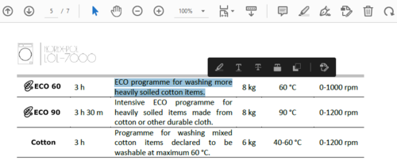
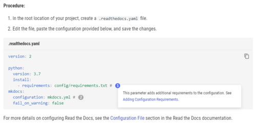

Dziś zajmiemy się tematem formatów i kanałów dystrybucji dokumentacji. Zastanowimy się także, który z nich będzie najlepszym wyborem.

No właśnie — jak to jest? Lepsza dokumentacja dystrybuowana w formacie PDF czy dostępna online w formie strony WWW? Wydrukowana i dostarczana w pudełku czy może dostępna wyłącznie w formie elektronicznej? Każdy z formatów może mieć swoich zwolenników pomimo tego, że żaden z nich w gruncie rzeczy nie jest doskonały.

Jakie zatem mogą być powody, żeby wybrać jedno zamiast drugiego? A może układ idealny to taki, kiedy dokumentacja trafia do odbiorcy w wielu formatach? Wszakże od przybytku głowa nie boli. Spróbujmy zatem przyjrzeć się temu zagadnieniu w kontekście aspektów powiązanych z dostarczeniem i odbiorem dokumentacji technicznej.

### Dostępność offline czy online?

Ale jak to offline, kiedy wszystko dzisiaj odbywa się w Sieci? — zapytacie. Wbrew pozorom dostęp do treści technicznej poza zasięgiem Internetu może być istotny w wielu różnych przypadkach. Może na przykład istnieć wymóg, aby instrukcja była dostarczana w pudełku wraz z produktem lub nasz odbiorca może życzyć sobie dostępu do treści technicznej bez konieczności łączenia się z Internetem celem większego zabezpieczenia przed cyberatakiem. Jeśli nie ma wyraźnych przeciwwskazań, warto jednak zadbać o to, aby dokumentacja była dostępna również w wersji online. Należy wtedy pamiętać, by umieścić stosowną informację w dokumentacji dystrybuowanej offline — tak na wszelki wypadek.

Warto też przy doborze odpowiedniego kanału dystrybucji rozważyć dość śmiałą aczkolwiek prawdopodobną teorię, że jeśli dostarczamy dokumentację techniczną użytkownikowi końcowemu do rąk własnych, istnieje większe prawdopodobieństwo, że się w nią zagłębi. Wprawdzie nie zakładamy, że ktoś podjąłby się samodzielnego składania mebli z Ikei gdyby ta nie dawała instrukcji w pudełku, ale już przy nauce obsługi sprzętu AGD lub RTV w człowieku z reguły budzi się większy empiryk i odkrywca. Sztuka czytania jakby idzie na dalszy plan.

A jaki format dokumentacji wybrać przy dystrybuowaniu bez użycia zasobów Internetu? Logika podpowiada, że jeśli dostępny offline, to zapewne będzie to dokument w formacie PDF. I trudno się nie zgodzić: idealnie sformatowany pod wydruk, łatwo się go daje dystrybuować na dowolnym nośniku, a przy okazji nie wymaga dodatkowego oprogramowania, bo najczęściej PDF-y można otworzyć w najprostszej przeglądarce internetowej. I nic nie stoi na przeszkodzie, aby taki dokument uzupełnić o link lub kod QR odnoszący do szerszej bazy wiedzy dostępnej online.

Nie skreślajmy jednak w tym miejscu możliwości użycia treści utrzymywanej w formacie HTML. Warto zauważyć, że jeżeli opisujemy oprogramowanie, to będzie ono często miało wbudowany tutorial lub inną pomoc, która w gruncie rzeczy opiera się o format HTML. Jeśli zaś treść techniczna dystrybuowana jest do użytkownika docelowego na nośniku danych, to nic nie stoi na przeszkodzie, aby znalazły się na nim instrukcje dostępne jako strona WWW otwierana offline. A już najlepiej, kiedy zaoferujemy na starcie dostęp do obu formatów. Istnieje ryzyko _zwiększenia effortu podczas finalnego releasu_ dokumentacji, lecz hej — uśmiech klienta wynagradza wszystkie tech writerów znoje, czyż nie?

Przy doborze odpowiedniego formatu może pomóc wzięcie kilku kryteriów opisanych poniżej.

### Personalizacja

Skoro już o zadowolonym kliencie mowa, to dobrze jest wziąć pod uwagę to, w jakim zakresie użytkownik dostarczanej przez nas dokumentacji technicznej może ją dostosować do własnych potrzeb. Czy może na niej zanotować dodatkowe informacje, wykreślić zbędne szczegóły lub zaznaczyć postępy w wykonywaniu procesów? Przy obszernych instrukcjach do skomplikowanych produktów, taka możliwość jest nie do przecenienia.

Wiadomo, że w tym przypadku prym wiodą treści drukowane. Jak to się mówi: papier wszystko przyjmie. Ale adnotacji nie boją się też PDF-y, które przy otwarciu ich z użyciem odpowiednich — często darmowych narzędzi — pozwalają na zaznaczanie i komentowanie fragmentów treści. Z resztą jak praktyka pokazuje, taka możliwość przydaje się nie tylko odbiorcom końcowym, lecz także samym tech writerom. Odpowiednio oznaczone zmiany zamieszczone w pliku PDF można podesłać do oceny związanemu z tematem zmian _Subject Matter Expertowi_.

\[caption id="attachment_10766" align="aligncenter" width="820"\] _Narzędzia do zaznaczania i przeglądania treści dostępne w Adobe Reader_\[/caption\]

Pomoc online spisuje się w tym aspekcie nieco gorzej, ponieważ tutaj musimy sami zadbać o wbudowanie mechanizmów pozwalających na personalizację treści. Wszystko tak naprawdę zależy tu od inwencji i zaawansowania tech writera w budowaniu stron WWW. Jeżeli ktoś wprawny weźmie się za zbudowanie dokumentacji w takim formacie, to naprawdę może zdziałać istne cuda: dodać narzędzia pozwalające na zaznaczenie przez użytkownika ważnych fragmentów czy sekcji, wykorzystać bardziej interaktywną naturę stron HTML do prezentowania fragmentów kodu, zaimplementować interaktywne narzędzia do zwiększenia przystępności dla odbiorców z niepełnosprawnościami, wbudować mechanizm dodawania zakładek, czy też zadbać o dobrą wyszukiwarkę. Możliwości jest co nie miara. A zaletą jest to, że dostępność i mnogość takich funkcjonalności zależy wyłącznie od nas.

### Przeszukiwanie i przeglądanie

W przypadku przeszukiwania i przeglądania treści, oba formaty właściwie idą łeb w łeb (czy jak ktoś woli — nagłówek w nagłówek). W przypadku PDF-ów korzystamy z przeszukiwarki wbudowanej w przeglądarkę tychże dokumentów. Zazwyczaj już przy przeglądaniu PDF-a za pośrednictwem zwykłej przeglądarki internetowej wynajdziemy względnie szybko potrzebną nam treść. Przy użyciu bardziej zaawansowanego narzędzia typu Acrobat Reader istnieje możliwość skorzystania z bardziej rozbudowanego narzędzia przeszukiwania, które usprawni pracę z dokumentem technicznym.

\[caption id="attachment_10773" align="aligncenter" width="590"\] _Zaawansowana wyszukiwarka Acrobat Readera_\[/caption\]

Pomoc online w gruncie rzeczy nie ustępuje tu niczym PDF-owi. Przy korzystaniu z gotowych rozwiązań pozwalających na generowanie stron z dokumentacją, wbudowana wyszukiwarka jest standardem. Uzupełnieniem może być wyszukiwarka oferowana przez samą przeglądarkę internetową, która to dodatkowo pozwoli przeszukać wyświetlaną stronę. Tutaj zatem można uznać, że oba formaty są sobie równe.

Przy doborze formatu końcowego dokumentacji technicznej warto również wziąć pod uwagę rozmiar kompletnej rodziny dokumentów, która jest dedykowana opisywanemu przez nas produktowi. Jeśli w skład takiej rodziny wchodzi kilka lub kilkadziesiąt odrębnych instrukcji, które siebie nawzajem uzupełniają, wówczas strona WWW — dostępna online lub offline — zdecydowanie ułatwi użytkownikowi przechodzenie przez kolejne fragmenty poszczególnych dokumentów. Przy konieczności przełączania się pomiędzy nawet dwoma PDF-ami istnieje ryzyko pogubienia się. A gdzie w tym wszystkim miejsce na jakąkolwiek radość z czytania i konfigurowania?

### Przystępność

Skoro już zahaczamy o tematykę interakcji i wygody użytkownika przy konsumpcji dokumentacji technicznej, warto też zastanowić się, jak format tej treści wpływa na jej przystępność. Jak wcześniej wspomnieliśmy, w format online łatwiej wbudować mechanizmy ułatwiające dostęp dla osób z niepełnosprawnościami. Możemy zadbać o przyciski zmieniające wielkość i styl czcionki, zmieniające schemat kolorów lub cały motyw strony. Zdecydowanie łatwiej odpowiedzieć na potrzeby użytkownika, kiedy nie tylko tworzymy treść, ale też mamy wpływ na to jak można ją przeglądać.

\[caption id="attachment_10764" align="aligncenter" width="831"\] _Elementy strony WWW ułatwiające przeglądanie_\[/caption\]

W przypadku PDF-a takich możliwości jest zdecydowanie mniej, bo z reguły takie dokumenty są mniej dynamiczne. Dostępu do zmiany wyglądu dokumentu ma się tu tyle, ile oferuje program, w którym ten dokument otworzymy. No dobrze — można dodać adnotację o rekomendowanym oprogramowaniu, którego należałoby użyć do przeglądania danego dokumentu, lecz jest to bardziej sposób na obejście problemu niż jego uniknięcie.

Oczywiście nie da się wyjść na przeciw wszystkim potrzebom odbiorcy, bo wtedy do drukowanej dokumentacji trzeba by było dostarczać lupę, ołówek, a najlepiej też technika-asystenta, który by przeczytał i wytłumaczył o co tak naprawdę chodzi. Trzeba przyznać, że w tym względzie dokumentacja dostępna online jest zdecydowanie lepszym rozwiązaniem. Zwłaszcza, że tę można w każdej chwili unowocześnić. PDF-a, którego ktoś już sobie ściągnął lub instrukcję, którą dostarcza się w formie wydrukowanej trudniej zastąpić nowszą wersją.

Z drugiej jednak strony to z wydrukowaną instrukcją łatwiej podejść do produktu, żeby na przykład sprawdzić układ otworów na śruby, rozstaw guzików lub portów. Nie wyobrażamy sobie raczej też możliwości składania mebli przy użyciu instrukcji przeglądanej na telefonie lub tablecie.

### Przechowywanie

Oba formaty dobrze czują się w kwestii przechowywania — plik PDF opatrzony odpowiednią rewizją lub paczka ZIP zawierająca dokumentację HTML z odpowiednią wersją builda w nazwie mogą sobie leżeć spokojnie na dysku twardym użytkownika niczemu przy tym nie wadząc. Przy dostępie do treści dostępnej wyłącznie online problem zupełnie znika, ponieważ nie ma potrzeby martwienia się o to, aby zapisywać dokumentację lokalnie na dysk.

Niemniej jednak wiadomo, że dokumentacja techniczna ma to do siebie, że zdarza się jej zagubić, zwłaszcza w momencie, kiedy najbardziej jej potrzebujemy. Wówczas można zawrzeć w jakiś sposób w/na produkcie informację o tym jak uzyskać dostęp do pomocy technicznej, a w przypadku formatu dostępnego offline, jaką wersję dokumentacji należy pobrać. Jest to praktyka dość popularna i pewnie każdy z nas miał już możliwość taką procedurę wykonać.

### Poprawki i aktualizacja

Unowocześnianie i wprowadzanie poprawek jest jednym z istotniejszych etapów życia każdego dokumentu technicznego. Zdecydowanie na tym poletku wygrywa dokumentacja online, najlepiej oparta o formę strony WWW. Możemy tu wprowadzić dowolne zmiany i aktualizacje, które będą dostępne dla wszystkich w momencie zbudowania nowej odsłony strony z dokumentacją. W przypadku treści dystrybuowanych kanałami offline jest duże ryzyko, że w momencie styczności użytkownika z dokumentem, będzie on już w pewnym sensie przeterminowany, gdyż nie będzie posiadał potrzebnych poprawek.

Nie ma tutaj reguły — aktualne poprawki będą równie ważne w dokumencie opisującym konfigurację i obsługę systemu teleinformatycznego co w instrukcji objaśniającej zasady gry planszowej. Jeśli zatem wiemy, że podstawowy kanał dystrybucji odbywa się poza dostępem do Sieci i jest to dokumentacja techniczna w postaci wydrukowanego podręcznika lub pliku dystrybuowanego na fizycznym nośniku danych, warto na samym początku takiego dokumentu poinsutrować odbiorcę, aby sprawdził czy nie istnieje jakaś nowsza wersja dokumentu, z którego ma zamiar skorzystać.

### Podsumowanie

Trudno o jednoznaczną odpowiedź na pytania postawione we wstępie. Forma końcowa dokumentacji jest niejako powiązana ze specyfiką opisywanego produktu, sposobem konfiguracji i obsługi, miejsca użytkowania czy nawet profilem odbiorcy docelowego. Wiele leży też po stronie strategii producenta. Niektórzy stawiają na nowoczesność, inni zaś na tradycję. Jedni przywiązują uwagę do prostoty, inni do konwencji.

Jeśli zatem stoisz przed wyborem formy i formatu dokumentacji technicznej, weź pod uwagę opisane przez nas kryteria — nawet jeśli to nie pomoże, to na pewno nie zaszkodzi. A jeśli masz dodatkowe spostrzeżenia lub doświadczenia dotyczące tego zagadnienia, śmiało wyraź się w sekcji z komentarzami.
