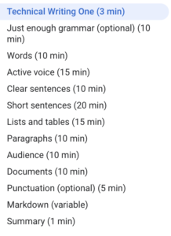
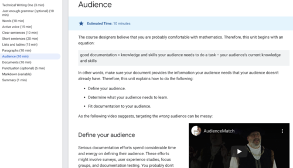
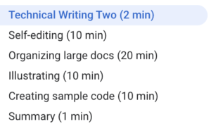

W dobie powszechnej kwarantanny i akcji #zostańwdomu mamy dla Was propozycję dwóch kursów. Mamy nadzieję, że chętnie z niej skorzystacie i wyniesiecie z nich wartościowe informacje.

### Informacje ogólne

[Technical Writing Courses](https://developers.google.com/tech-writing) znajdziecie na stronie [Google Developers](https://developers.google.com/) skierowanej do osób związanych z szeroko rozumianą branżą technologiczną. Jeżeli ktoś nie miał do tej pory do czynienia z tą witryną, w dużym skrócie: znajdziecie tam mnóstwo informacji na temat wszystkich produktów Google oraz technologii wykorzystywanych we współczesnym świecie. Każdy zainteresowany może wziąć udział w rozmowach na licznych grupach dyskusyjnych oraz przeczytać wiele branżowych tekstów na blogu. Kolejną z opcji jest możliwość skorzystania z wiedzy pracowników Google i zrobienia bezpłatnych kursów. Dostęp do całej platformy Google Developers jest również darmowy. Nas najbardziej zainteresowały wspomniane już wyżej szkolenia dla Technical Writerów. Co jest dodatkowym atutem, Google umożliwia zainteresowanym osobom pozostanie [trenerem/facylitatorem](https://developers.google.com/tech-writing/for-instructors) poniższych kursów, a nawet Technical Writerem w firmie.

Do wyboru mamy dwa poziomy kursu:

- [Technical Writing One](https://developers.google.com/tech-writing/one) - skierowany do osób, które nie pisały wcześniej dokumentacji technicznej oraz tych, które chcą w jasny i klarowny sposób powtórzyć najważniejsze zasady pisania dobrych i zrozumiałych dokumentów technicznych.
- [Technical Writing Two](https://developers.google.com/tech-writing/two) - skierowany do wszystkich, którzy ukończyli kurs Technical Writing One i chcą dalej doskonalić swoje umiejętności w tworzeniu dokumentacji technicznej.

Kursy są w języku angielskim i wymagają nieco znajomości zwrotów branżowych. Do ich wykonania potrzebujemy komputera, tabletu czy smartfona z dostępem do Internetu. Nie ma możliwości pobrania materiałów na dysk.

### Technical Writing One

Poniżej przedstawiamy spis treści z zagadnieniami, jakie zostały opisane w tej części kursu:

Zakres tematyczny kursu jest dostosowany do poziomu wiedzy grupy docelowej. Zagadnienia są jasno wyjaśnione, bez nadmiernego wchodzenia w szczegóły. Część omawianych tematów jest opcjonalna, więc kursant sam decyduje czego chce się nauczyć.

Dużym plusem są przykłady użycia poszczególnych zasad oraz ćwiczenia, które po wykonaniu można na bieżąco sprawdzać jednocześnie kontrolując poziom zdobywanej wiedzy. Zwraca uwagę fakt, że tematyka podawanych przykładów oraz ćwiczeń jest ściśle związana z językiem branżowym. Mamy tu więc mowę o kodowaniu, wykorzystaniu konkretnych narzędzi technicznych, funkcjonalności aplikacji. To zdecydowanie pomaga w zrozumieniu reguł, które choć uniwersalne dla większości tekstów, należy odpowiednio dostosować w dokumentacji technicznej.

Bardzo przypadł nam do gustu sposób ukazania problemów, z jakimi może spotkać się czytelnik, gdy tekst przez nas napisany będzie niezgodny z regułami omawianymi w kolejnych punktach kursu.

By lepiej zrozumieć trudniejsze elementy językowe twórcy kursu wykorzystali nie tylko przejrzysty układ wizualny, uproszczone definicje, tabele czy wyróżniki kolorystyczne, ale także krótkie filmy. Tak różnorodne przedstawienie treści sprawia, że osoby o różnym typie przyswajania informacji będą mogły skorzystać z wiedzy autorów kursu.

Choć głównymi odbiorcami kursu Technical Writing One są początkujący Technical Writerzy piszący dokumentację w szeroko rozumianej branży informatycznej lub osoby chcące pracować na tym stanowisku, to w kursie znajdziemy także przykłady treści z innych branż, jak na przykład fragmenty opracowań naukowych z 1953 roku. Takie urozmaicenie pokazuje jak uniwersalne są zasady rządzące pisarskim światem dokumentacji i jednocześnie sprawiają, że samym kursem mogą być zainteresowani również przedstawiciele innych branż. Dla nas było to doskonałe przypomnienie reguł języka angielskiego, co z pewnością będzie mile odebrane przez filologów, chcących się przebranżowić.

### Technical Writing Two

Część druga kursu dla Technical Writerów jest skierowana do wszystkich osób, które ukończyły część pierwszą i chcą poszerzyć zdobytą już wiedzę. Poniżej znajdziecie spis treści kursu:

W przeciwieństwie do części pierwszej, w centrum zainteresowania drugiej jest cały tekst, a nie poszczególne jego elementy. Twórcy skupili się na udoskonaleniu pracy twórczej Technical Writera poprzez dobrze przeprowadzoną edycję napisanego już tekstu oraz sposoby jakimi można go zwizualizować i uprościć.

Mamy tu sporo przykładów zarówno dobrego wykorzystania omawianych zasad, jak i liczne błędy, które towarzyszą tworzeniu dokumentacji. Odnieśliśmy wrażenie, że w tej części mamy dużo więcej praktycznych zastosowań reguł oraz więcej ćwiczeń, w których uczestnik musi pogłówkować.

### Jak zostać trenerem?

Google umożliwia osobom chętnym pozostanie trenerem/facylitarorem powyższych kursów. Aby móc prowadzić szkolenie nie trzeba być profesjonalistą, jednak doświadczenie osób z branży będzie dodatkowym plusem dla uczestników.

Żeby otrzymać wszystkie potrzebne materiały (jest ich więcej, niż te, które zostały udostępnione dla wszystkich) oraz pozwolenie na prowadzenie z nimi zajęć należy uzyskać członkostwo w [grupie Technical Writing Instructors](https://groups.google.com/forum/#!forum/technical-writing-instructors).

Osoba, która uzyskała członkostwo oraz pozwolenie na prowadzenie kursu może prowadzić zajęcia wg schematu:

Jeśli ktoś z Was jest zainteresowany, odsyłamy do przewodników dla prowadzących [część pierwszą](https://developers.google.com/tech-writing/for-instructors/one/instructors-guide) oraz [część drugą](https://developers.google.com/tech-writing/for-instructors/two/instructors-guide) kursu. W nich macie wszelkie niezbędne informacje oraz opis jak powinny być prowadzone zajęcia.

### A może chcesz zostać Technical Writerem w Google?

W ostatniej sekcji kursów _The Profession_ znajdziecie informacje kto i w jaki sposób może zostać pracownikiem Google na stanowisku Technical Writera. Chętnych odsyłamy [tutaj](https://developers.google.com/tech-writing/becoming) i życzymy szczęścia ;-)

### Podsumowanie

Na samodzielne wykonanie kursów musimy przeznaczyć około 3,5-4 godziny. Struktura i tematyka obydwu części jest przejrzysta oraz tak ustalona, że po każdej partii można bez problemu zrobić przerwę i zająć się czymś innym. Dodatkowo osoby, które mają ochotę jeszcze bardziej zagłębić się w temat mogą skorzystać z dokumentów źródłowych oraz informacji ogólnych związanych z pracą Technical Writera dostępnych w podstronach kursów. To wszystko jest bezpłatnie dostępne dla wszystkich, którzy mają ochotę zrobić sobie powtórkę czy wejść w świat Technical Writerów od podstaw. Ukończenie kursu nie daje nam żadnego certyfikatu czy uprawnień, jednak naszym zdaniem, warto skorzystać z tej okazji poszerzenia lub ugruntowania wiedzy. Może to też otworzyć szerszą perspektywę rozwoju na pozostanie trenerem lub nawet pracownikiem Google.
