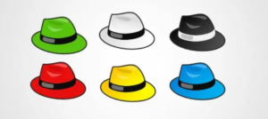
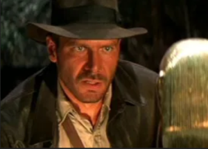

W tym artykule znajdziecie zbiór luźnych przemyśleń na temat wszechstronnego
charakteru pisarza technicznego.

<!--truncate-->

> Świat jest teatrem, aktorami ludzie,
>
> Którzy kolejno wchodzą i znikają.
>
> Każdy tam aktor niejedną gra rolę

_`Wiliam Szekspir, fragment aktu drugiego z "Jak Wam się podoba", tłumaczenie Leon Ulrich.`_

Trudno nie zgodzić się z powyższym cytatem. Każdego dnia wcielamy się w kolejne
role, zmieniając maski i rekwizyty. Również w życiu zawodowym. Weźmy na przykład
taką rolę, jaką jest bycie _tech writerem (pisarzem technicznym)_. Czy jest to
jedna rola? Czy jest ich może wiele?

W obrębie tak szerokiego nurtu jakim jest _technical writing_ występuje cała
gama specjalizacji. Zależnie od domeny i metod pracy można zaliczać się do
specjalistów od podręczników użytkownika, dokumentacji projektowej czy API.
Można być ekspertem od tworzenia multimedialnych materiałów edukacyjnych.
Istnieją też role hybrydowe.

Niezależnie jednak od tego jak dokładnie definiujesz swoją profesję, w obrębie
danej niszy masz wiele mniejszych ról do odegrania. Jednym z wyzwań, lecz także
zalet tego zawodu jest potrzeba wszechstronności, dzięki czemu masz okazję, by
zmieniać punkty widzenia jak kapelusze.

Dlaczego akurat kapelusze? Zaczerpnąłem je z koncepcji dr Edwarda de Bono, który
opracował koncepcję sześciu odmiennych "kapeluszy" myślowych, wedle której w
danym momencie rozpatrujemy problem patrząc na niego pod jednym kątem. W ramach
tego modelu wyróżnić można myślenie skłaniające się w stronę faktów, emocji,
ideałów, korzyści, planowania czy oceniania. (Zainteresowanych odsyłam do
Wikipedii: [notka biograficzna](https://pl.wikipedia.org/wiki/Edward_de_Bono),
[koncepcja](https://en.wikipedia.org/wiki/Six_Thinking_Hats)). Jestem
przekonany, że w obrębie każdej specjalizacji istnieją szczególne aktywności do
wykonania i jeden kapelusz tam nie wystarczy.

Przedstawiam zatem moją subiektywną listę ról. Jedne z nich mogą być nieco
egzotyczne, inne wydać się mogą przyziemne, ale sądzę, że wielu czytelników
rozpozna wśród nich swoje własne.

---

# 

## Detektyw

W opinii większości nie-dokumentalistów lwią część czasu dokumentalista spędza
na pisaniu i szlifowaniu tekstów. Nic bardziej mylnego. Powiedziałbym, że dobre
zdefiniowanie tematu i określenie niezbędnych źródeł informacji to już połowa
sukcesu. Istnieją projekty, w których najtrudniejsze jest dotarcie do sedna
problemu i znalezienie osób potrafiących odpowiedzieć na wymagane pytania.
Zwłaszcza w dużych organizacjach przydatna okazuje się pamięć do twarzy i
zdolność kojarzenia kto może okazać się pomocny przy jakim zapytaniu.

Z biegiem czasu nabierasz wprawy i przy dowolnym temacie będziesz mieć gotową
listę osób "podejrzanych" o to, że coś wiedzą.

O zaawansowanych technikach perswazji, które należy stosować w przypadkach
trudnych, gdy informator twierdzi wymijająco: "_ja nic nie wiem, nie pytaj,
zarobiony jestem_" nie będę tu wspominał, bo są to tajniki, których zdradzić nie
mogę.

## Archeolog

Jest to rola zbliżona do detektywa, ale jeszcze trudniejsza do odegrania i
często bywa niewdzięczna. Wyzwania są tu podobne, z jedną kluczową różnicą: osób
mogących udzielić informacji jest niewiele, artefakt do opisania istnieje od
dawien dawna i nie doczekał się, jak dotąd, godziwego opisu. Dokumentalista
sięga po archaiczne teksty, pozostałości starożytnych cywilizacji, manuskrypty,
logi czy zapisy na firmowym intranecie. Wszelkie takie znaleziska mogą rzucić
choć odrobinę światła na sprawę. Kto jak kto, ale dobry skryba kieruje się
szóstym zmysłem i jest w stanie wydobyć takie wykopaliska spod ziemi.

## Dziennikarz

W pewnych projektach nie otrzymujesz gotowych zleceń. Masz aktywnie obserwować
sytuację i szukać nowych, obiecujących tematów. Niektóre wątki okazują się mniej
godne uwagi niż się na początku zdawało. Raz na jakiś czas trafiasz na żyłę
złota. Może być to materiał, o którym dokumentacja dotychczas milczała a
informacja okazuje się wartością dodaną dla odbiorców. Jako dziennikarz, masz
zobowiązania wobec swoich czytelników, których obiecałeś rzetelnie informować o
istotnych aspektach produktu czy aplikacji. Masz za zadanie stać po stronie
prawdy i jako społecznik, starasz się jak najlepiej występować w interesie
użytkownika końcowego.

Dodatkowo, jesteś w stanie rozmawiać dosłownie z każdym. Potrafisz wyciągnąć
porywającą historię od kogoś, kto jest bardzo małomówny lub początkowo
niezainteresowany udzieleniem wyczerpującego wywiadu.

## Gospodarz programu telewizyjnego

Na spotkaniach dotyczących kwestii technicznych, podczas których trzeba znaleźć
odpowiedź na skomplikowany problem, zazwyczaj potrzebny jest moderator. Jeśli go
brakuje, obowiązki gospodarza spotkania podejmuje dokumentalista. Dba on o to,
by rozmowa się toczyła, gdy zaczyna grzęznąć na mieliźnie, naprowadza ją na
właściwe tory, jeśli goście odbiegają od meritum i czasem musi ostudzić
atmosferę, jeśli emocje zaczynają udzielać się wszystkim.

## Protokolant

Robienie notatek po spotkaniach jest niezmiernie ważne. Dobre podsumowanie
dyskusji na skomplikowany temat może zająć w przybliżeniu tyle co samo
spotkanie. Warto to robić, żeby po ustaleniach pozostał ślad i widoczna była
ścieżka decyzyjna, która przywiodła nas do rozwiązania. Spisanie różnych
aspektów problemu na papierze pomaga rozłożenia kwestii na czynniki pierwsze,
dzięki czemu łatwiej jest o podjęcie rozsądnej decyzji.

## Nauczyciel

Nawet jeśli nie tworzysz e-learningu, każda pisana instrukcja ma wymiar
dydaktyczny. Zależy Ci na tym, by przekazana informacja była zrozumiała i
przystępna.

_Technical writer_ często dzieli się wiedzą z innymi. Chętnie szkoli nowe osoby
w zespole.

## Grafik komputerowy

Niezależnie od umiejętności w tej dziedzinie, zdarzyć się może, że potrzebujesz
rozplanować układ strony, wybrać do niej odpowiednie grafiki. Często też
tworzysz niezbędne ilustracje. Efekt nie będzie dziełem sztuki, ale z pewnością
będzie to użyteczne i przemyślane.

## Tester

Pisarz techniczny często bywa jedną z pierwszych osób widzących na oczy prototyp
aplikacji do opisania. Wiadomo, że w zespołach mamy specjalistów w tej
dziedzinie, ale co dwie głowy to nie jedna. Również i dokumentalista może wykryć
nieprawidłowe zachowanie algorytmu, czy literówkę w interfejsie. Może też
zwrócić uwagę na mylące, niespójne etykiety przycisków. Dodatkowe czujne oko
potrafi wiele wychwycić, co ma bezpośredni wpływ na jakość produktu.

## Specjalista od User Experience

Przy projektowaniu stron z dokumentacją, często zadajemy sobie pytanie: w jakiej
kolejności i hierarchii ułożyć informacje, by użytkownik mógł je najłatwiej
znaleźć. W końcu każdy dokument, strona i prezentacja są interfejsem między
odbiorcą i informacją, dlatego ważne jest dostosować formę tak, by jak najlepiej
wpisywała się w potrzeby czytelnika.

Dokumentalista opracowuje optymalną nawigację po treściach, które tworzy. Ma też
wrodzoną tendencję do grupowania i katalogowania tematów - każdy z nich ma swoje
miejsce w skomplikowanej całości.

## Architekt informacji

Architekt informacji - brzmi to groźnie. Jednak wielu z nas udziela się na tym
polu, nawet o tym nie wiedząc. Architekt systemowy decyduje o projekcie systemu
i sposobie zapisu informacji. Choć _tech writer_ działa w ramach szkieletu
ustalonego przez architekta, ma duże pole do popisu, jeśli chodzi o sposób
ułożenia i zaprezentowania informacji. Dokumentacja jest jak budynek, też ma
swoje podstawy, o które trzeba zadbać, żeby powstała stabilna konstrukcja.
Podobnie jak bibliotekarz, kataloguje i porządkuje tematy aż w końcu ułożone są
w logiczny sposób, co pozwala na ich łatwe odnalezienie i ułożenie koncepcji w
głowach odbiorców.

## Ogrodnik

Rola ta zazębia się z rolą architekta. Poniżej przykłady reprezentujące dwie
biblioteki dokumentów.

**1\. Starannie zaprojektowany zestaw dokumentów, które są odświeżane i
pielęgnowane:**

**2\. Gąszcz nieaktualnych stron i popsutych linków, wśród których ukryte są
przydatne strony, ułożone w nieprzemyślanej strukturze:**

Dokumentalista jest dobrym duchem projektu, otacza swoje twory opieką niczym
ogrodnik. Od jego samozaparcia i inicjatywy zależy czy dokumentacja stopniowo
rozwija się bujnie jak zadbany ogród, bo w przeciwnym wypadku powoli popadnie w
ruinę. Zapewnienie aktualności dokumentacji jest jednym z kluczowych problemów,
z którymi wiele firm się zmaga.

### Epilog

Podsumowując, _technical writing_ to coraz bardziej multidyscyplinarne zajęcie,
podczas którego masz szanse na rozwinięcie wielu kompetencji i talentów.
Codzienna rzeczywistość bardzo często wykracza poza samo pisanie.

A jakie role Ty odgrywasz, o których tu nie wspomniałem? Które są Twoje
ulubione?

Podziel się w komentarzach.

A tymczasem, kurtyna.
