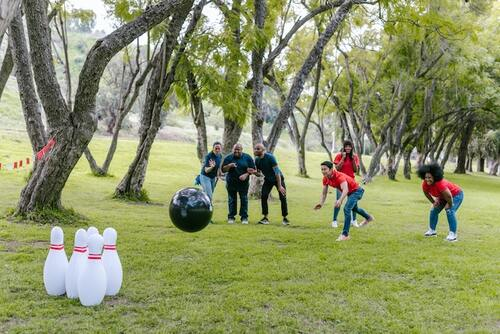

Dziś mamy dla Was podsumowanie kolejnej, już trzeciej, edycji studiów
podyplomowych na kierunku Komunikacja Techniczna. Zapraszamy!

<!--truncate-->

Mamy szczęście, bo kolejna z naszych redaktorek jest absolwentką tego kierunku,
dzięki czemu możecie przeczytać poniższy artykuł. Justyna, bardzo dziękujemy!

---

Dobiegła końca 3. edycja studiów podyplomowych z
[Komunikacji Technicznej](https://vistula.edu.pl/kierunki-studiow/komunikacja-techniczna)
na Akademii Biznesu i Finansów Vistula, w których niżej podpisana również brała
udział. Tak samo jak poprzednie, również i ta edycja cieszyła się ogromnym
powodzeniem i zakończyła się niewątpliwym sukcesem.

## Początek

Studia wystartowały z lekkim poślizgiem, bo dopiero w drugiej połowie
listopada 2022. Na pierwszych zajęciach każdy z pewną nieśmiałością mówił o
sobie, swoich planach zawodowych, oczekiwaniach co do studiów i doświadczeniach
z komunikacją techniczną. Wśród chętnych zgłębiania tajników zawodu tech writera
znaleźli się angliści (głównie tłumacze, ale też nauczyciele języka
angielskiego), osoby zajmujące się logistyką, projektami biznesowymi,
szkoleniami czy wsparciem technicznym. Pojawiły się też osoby zajmujące się na
co dzień tworzeniem treści, jak również zawodowi tech writerzy.

## Koła w ruch

A potem wszystko ruszyło pełną parą. Zajęcia odbywały się co 2 tygodnie w soboty
i w niedziele, od 9:00 do 15:00/16:00. Każdy obciążony dodatkowo pracą zawodową
w ciągu tygodnia, a czasem i w weekendy, znajdował czas, żeby pojawić się na
zajęciach. Na szczęście nie musiał wychodzić poza duży pokój czy swój gabinet,
bo spotkania odbywały się online na platformie Teams.

## Duży zastrzyk wiedzy

Prowadzący przygotowali dla nas wachlarz tematów. Znalazły się wśród nich
zagadnienia dotyczące m.in. specyfiki pracy tech writera, środowiska komunikacji
technicznej i związanych z tym wymagań, zarządzania procesem, zespołem i
projektem.

Było też dużo o pracy z tekstem technicznym (m.in. podstawy Docs-as-Code,
Markdowna, GitHuba, Visual Studio Code, było również i o internacjonalizacji i
Simplified Technical English). A na dokładkę podstawy technologii webowych
(m.in. HTML, CSS, Javascript).

Nie byłoby studiów z komunikacji technicznej bez omówienia podstawowych jej
technologii (m.in. tworzenia dokumentacji API, statycznych generatorów stron jak
GitHub czy Just-the-Docs). Towarzyszyły temu również zajęcia z technik i
narzędzi stosowanych w dokumentacji technicznej (m.in. MadCap Flare, Oxygen,
było także słów kilka o lokalizacji).

Nie zabrakło również zajęć będących przygotowaniem do egzaminu ITCQF, na których
został omówiony sylabus zalecany przez ośrodek egzaminacyjny.

Ukłony w stronę naszych wykładowców, którzy chętnie dzielili się z nami swoją
ogromną wiedzą, doświadczeniem, wprowadzali pozytywną atmosferę na zajęciach i
zawsze byli dostępni, gdy ich potrzebowaliśmy, także poza godzinami zajęć.

## Integracja

Ponieważ widywaliśmy się tylko online, zakiełkowała w nas chęć spotkania na
żywo. Chcieliśmy zobaczyć się twarzą w twarz, wymienić doświadczeniami czy
zwyczajnie porozmawiać ze sobą poza monitorem komputera.

Owocem tego była integracja grupy we Wrocławiu w marcu 2023. Po kolacji na
wrocławskiej starówce przenieśliśmy się do jednej ze znanych we Wrocławiu
kręgielni. A na drugi dzień część grupy udała się na poszukiwanie krasnali
wrocławskich.

Spotkanie okazało się strzałem w dziesiątkę. Nie tylko świetnie spędziliśmy
czas, polubiliśmy się, ale znaleźliśmy wspólne tematy i zainteresowania. Po
zlocie we Wrocławiu powstała podgrupa warszawska, która swoją mniejszą
integrację ma już za sobą, a kolejne przed sobą. Cała grupa studentów
komunikacji technicznej również ma drugą integrację przed sobą. Bo wierzymy, że
jeśli tylko jest dobra wola w ludziach, wszystko się uda.

## Back to school

Po integracji szybko wróciliśmy do swoich obowiązków zawodowych i studenckich.
Zajęcia dalej szły swoim trybem, a dla nas zbliżał się termin wykonania i
oddania pracy zaliczeniowej. Miał to być projekt przygotowany w jednym z
narzędzi, które poznaliśmy w czasie studiów.

Największym powodzeniem cieszył się wśród studentów MadCap Flare, ale były też
projekty przygotowane w Just the Docs czy Oxygenie.

## Tematy prac i inwencja autorów

Tematy prac zaliczeniowych były przeróżne. Niektórzy studenci wybrali swój
własny temat do udokumentowania, inni skorzystali z propozycji przygotowanych
przez prowadzących.

I tak wśród prac końcowych można znaleźć projekty dotyczące tematyki
techwriterskiej czy około techwriterskiej (było np. o wkładzie tech writerów w
projekty „open source”, o aplikacjach „open source”, o „user research”, pisaniu
dokumentacji API, o podręcznikach stylu, o strategiach komunikacji w zespołach
projektowych czy Docs as Code dla opornych).

Niektórzy studenci podjęli się tematów związanych stricte ze swoją pracą
zawodową. Pisali czy to o aplikacjach używanych w ich firmach, czy o programach,
które powstały w ich firmie i do powstania których walnie się przyczynili. Albo
zaangażowali się w tematy z pogranicza tech writingu i tłumaczeń – jak kolega,
który pisał o możliwości czytania plików Mardowna przez popularne narzędzia
wspomagające tłumaczenie (tzw. CATy).

Inni napisali prace użytkowe, np. o zakładaniu działalności gospodarczej w
Polsce, czy jak z nauczyciela stać się tech writerem. Jeszcze inni podjęli
tematy gorąco dyskutowane w przestrzeni publicznej, czyli kwestie dobrze nam już
znanego (i nie przez wszystkich lubianego) ChatGPT.

Były też prace związane z hobby, któremu z pasją oddają się studenci, jak
projekt o popularnej grze logicznej SpaceChem, o filmach o escape roomach, czy o
szydełkowaniu krasnala świątecznego.

Niżej podpisana napisała właśnie instrukcję do szydełkowania krasnala
świątecznego. Temat na pierwszy rzut oka frywolny i nie za bardzo tech
writerski. To było nie lada wyzwanie napisać instrukcję w taki sposób, żeby
wpisywała się w wymagania dokumentacji technicznej. Wiele godzin pracy później
taka instrukcja powstała. Została również przetestowana. Po testach okazało się,
że instrukcja działa, jako że ich efektem był krasnal wyszydełkowany przez
testerkę.

## To już jest koniec

Ostatnie zajęcia na studiach były poświęcone obronie prac końcowych. Każdy ze
studentów miał za zadanie opowiedzieć o swoim projekcie. Czyli powiedzieć, kto
był jego opiekunem, czego dotyczy temat pracy, dlaczego taki akurat temat został
wybrany, miał zaprezentować swój projekt, a na koniec opowiedzieć o wyzwaniach,
jakie napotkał podczas przygotowywania projektu, a także czego się przy tym
nauczył.

Wszystkie projekty stały na bardzo wysokim poziomie. Widać było, ile pracy, potu
i łez każdy z autorów w nie włożył. Oczywiście jak to na studiach otrzymaliśmy
oceny. Były one różne, ale żadna nie zeszła poniżej „czwórki”.

Dziękując nam po obronie za cały ostatni rok wspólnej pracy i nauki, Tomek, nasz
główny prowadzący i mentor, zachęcał do podejścia do egzaminu ITCQF. Bo dzięki
niemu uzyskamy tzw. papier, który potwierdzi, że jesteśmy certyfikowanymi tech
writerami. - Tworzycie już społeczność tech writerską. Gratuluję Wam. – dodał na
koniec.

Co wynieśliśmy z tych studiów? Ogromną dawkę wiedzy, umiejętności, podstawy
programów używanych przez tech writerów, nową lepszą pracę w branży (tak, kilka
osób zmieniło pracę), a także kontakty i być może przyjaźnie, które mam nadzieję
przetrwają długi czas.

---

Autorką tekstu jest Justyna Kula, nasza redakcyjna koleżanka.
