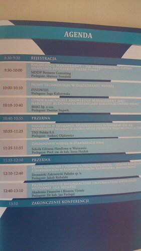

Jakiś czas temu
[informowaliśmy Was o tej konferencji](http://techwriter.pl/konferencja-knowledge-management-solutions/),
dziś krótka relacja i wrażenia z punktu widzenia uczestnika.

<!--truncate-->

Na początek, z kronikarskiego obowiązku, kilka informacji organizacyjnych:

- Czas: **29 października** **2014**, 9:30-13:00
- Miejsce: **Warszawa**, biurowiec Millenium Plaza, Al. Jerozolimskie 123A
- WWW: [http://knowledgemanagementsummit.pl/](http://knowledgemanagementsummit.pl/)
- Liczba uczestników: około 50
- Agenda:

Kluczowe rzeczy, które udało nam się wyłapać z poszczególnych prezentacji
przedstawiamy poniżej. Niecierpliwych od razu uprzedzamy, że najlepsze było na
końcu.

## Knowledge Management - jak zdiagnozować czego właściwie potrzebuje nasza firma?

Weź pod uwagę:

- Kluczowe kompetencje
- Zasoby wiedzy
- Problemy do rozwiązania i możliwe usprawnienia
- Planowanie projektów
- Inne...

Pomyśl o tym jaką wiedzę potrzebujesz mieć i STOSOWAĆ w:

- Projektach
- Pracy z klientami
- Przygotowywaniu ofert
- Walce z konkurencją
- Wewnętrznej organizacji
- Codziennym zarządzaniu pracownikami
- Inne...

Po czym zadzwoń do MDDP Business Consulting, a światowej klasy specjaliści zajmą
się całą resztą 😊

## Nowe technologie w zarządzaniu wiedzą.

Bardzo ciekawe wyniki globalnych badań, nam najbardziej zapadły w pamięć dwa
fakty:

- "Pracownicy biurowi spędzają od 15% do 35% czasu na poszukiwaniu informacji."
- "Pracownicy biurowi spędzają więcej czasu na odtwarzaniu informacji niż na ich
  tworzeniu".

Brzmi znajomo? Firma FINDWISE ma na to rozwiązanie 😊

## Oprogramowanie Knowledge Management jako narzędzie budowania potencjału strategicznego firmy.

Po tym wystąpieniu został nam link do strony
[Knowledge Management World](http://www.kmworld.com/), oraz przemyślenia na
temat poziomów zaawansowania zarządzania wiedzą w firmach:

- Najniższy poziom to poziom IT - mamy super system do zarządzania wiedzą i
  wszyscy liczą, że dzięki temu wszystkie problemy się rozwiążą 😉
- Poziom HR i kultury korporacyjnej - dział kadr i menedżment współtworzą,
  zachęcają i używają zasobów wiedzy dostępnych w firmie przechowywanych w wyżej
  wspomnianym systemie IT.
- Poziom kategoryzacji i zarządzania zawartością - niestety rzadko spotykany 😊.

Na jakim poziomie funkcjonuje Wasza firma? Jeżeli chcecie wejść na poziom
pierwszy - firma BSSG ma dla Was gotowy produkt 😊

## Narzędzia w działaniu. Wykorzystanie rozwiązań KM na przykładzie realizacji globalnego projektu badawczego w TNS.

Ciekawy przykład z życia i ciekawy projekt, w którym zarządzanie wiedzą okazało
się kluczowe. Wykorzystano takie narzędzia jak:

- Maile 😊
- Szkolenia on-line
- Intranet
- Webinaria
- Warsztaty
- Quizy

Prowadzący prezentację w przekonujący sposób przedstawił zalety poszczególnych
rozwiązań i kilka ich wad. Nam najbardziej spodobało się stwierdzenie, że
kluczem jest uczynienie każdego menedżera odpowiedzialnym za zarządzanie wiedzą
w jego projekcie i organizacji. Jak to zrobić? Pokazać mu, jaki to może mieć
wpływ na jego karierę!

## Prawa autorskie i tejemnica przedsiębiorstwa - legalne korzystanie z dokumentów w ramach systemów Knowledge Management.

Prawnik z kancelarii DZP skupił się na dwóch tematach:

- Ustawie o prawie autorskim.
- Tajemnicy przedsiębiorstwa oraz ochronie tzw. know-how (na przykład za pomocą
  umów NDA - non-diclosure agreements).

Do tej pory zastanawiamy się, co chciał nam przekazać i dochodzimy do wniosku,
że codziennie łamiemy jakieś prawo, a jeśli nawet nie, to na pewno ktoś i tak
może nas pozwać. Ale z drugiej strony zawsze ktoś inny może nas wybronić.

## Zarządzanie wiedzą w strategiach firm.

Tak, istnieją firmy, które robią coś takiego! Można też o tym ciekawie
opowiadać! Pani profesor Irena Hejduk ze Szkoły Głównej Handlowej szczyci się
ponad 20-letnim doświadczeniem w zarządzaniu (nie tylko wiedzą) - i to było
widać. Naszym skromnym zdaniem jedna z dwóch najlepszych prezentacji całej
konferencji.

Dowiedzieliśmy się czym różnią się dane od informacji, co to jest wiedza, czym
różni się od pozostałych dwóch i dlaczego wiedza to nie mądrość. Odświeżające.

Wystąpienie na dużym poziomie (również abstrakcji). Ale można było wychwycić
także bardzo praktyczne wskazówki. Na przykład taką - planując projekt dotyczący
przekazywania wiedzy, koniecznie upewnij się, że w zespole projektowym są nie
tylko posiadacze wiedzy, ale również odbiorcy. To oni wiedzą najlepiej jakie są
ich potrzeby!

## Przeładowanie informacyjne (information overload) - wyzwanie dla biznesu.

Ostatnia prezentacja - profesora Jana Fazlagica z Akademii Finansów i Biznesu
Vistula - miała najładniejszą szatę graficzną a prowadzący najbardziej się
spieszył 😊. Ale było bardzo ciekawie. Odwrotnie niż wszyscy poprzednicy,
wykładowca skupił się na tym, jak ograniczyć przepływ informacji i ograniczyć
efekt [przeciążenia wiedzą](http://en.wikipedia.org/wiki/Information_overload),
którego przecież wszyscy na co dzień doświadczamy.

Kilka haseł które zapadły nam w pamięć:

- W smartfonie jest około 250 000 patentów
- [Data smog](http://en.wikipedia.org/wiki/Data_Smog)
- 90% zawartości Internetu to opinie, a tylko 10% to fakty
- [Information Fatigue Syndrom](http://www.naturalnews.com/041057_internet_fatigue_information_overload_news.html)
  (IFS)
- [Cognitive Overload](http://www.teachingenglish.org.uk/knowledge-database/cognitive-overload)
- [Quizzics](http://leife.wordpress.com/2008/04/12/knowledge-navigation-quizzics/)

Wszystko to efekty niesamowicie niskiego kosztu produkcji i przekazywania
informacji w dzisiejszych czasach. Jesteśmy zarzucani newsami, analizami,
opiniami, książkami, a do tego, paradoksalnie, cały czas rośnie konsumpcja
papieru na świecie. Jak się przed tym bronić? - stosować filtry, personalizować
wyszukiwanie, ćwiczyć siłę woli, czytać streszczenia. Dokładna diagnoza problemu
i recepty - w dwóch książkach pana profesora, których nie omieszkał polecić
słuchaczom 😊

## Podsumowanie

Nasza relacja jest chyba dłuższa niż konferencja 😊, która wydaje się być
głównie wydarzeniem marketingowo-sprzedażowym. Trudno ją polecać, ale i trudno
odradzić, biorąc pod uwagę zerowy koszt uczestnictwa (poza czasem). Niektórym
uczestnikom udało się nawet wygrać ciekawe nagrody w końcowym losowaniu.
Większość prezentacji bardzo powierzchownie ślizgało się po tematach, ale
wynikało to zapewne z ograniczonych możliwości czasowych.

Dlaczego o niej w ogóle piszemy? Przede wszystkim dlatego, że praca techwritera
to właśnie praca z wiedzą, nad wiedzą i jej przekazywaniem. To jest sedno i
esencja naszej pracy - przekazywanie wiedzy. Chcemy również, abyście przez
moment zastanowili się nad tym, jak wygląda zarządzanie wiedzą w Waszej firmie.
I - jeśli nie jest idealnie - spróbowali coś zmienić. Warto.

A dodatkowo, oczywiście, chcieliśmy zamieścić w Internecie jeszcze jedną opinię,
zwiększyć Wasz IFS oraz cognitive overload oraz zagęścić data smog 😉.
