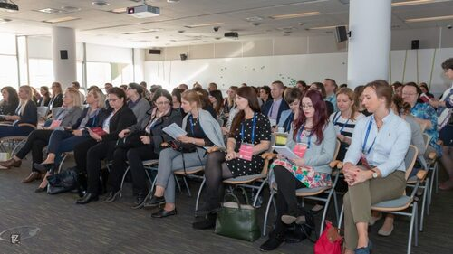
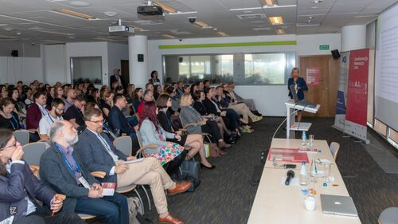
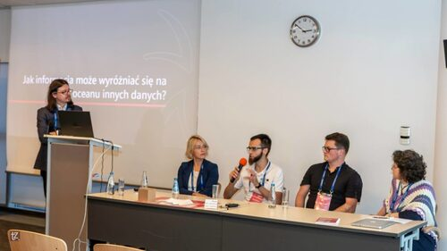
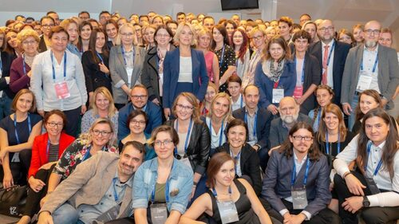

Niedawno, a dokładniej 29 września 2018, mieliśmy okazję gościć
na [Konferencji Tłumaczy](https://www.konferencjatlumaczy.pl/). Nie ukrywamy, że
czekaliśmy z niecierpliwością na to wydarzenie, ponieważ byliśmy ciekawi "jak to
się robi w branży tłumaczeniowej". Dlatego ochoczo wybraliśmy się do Centrum
Konferencyjnego Zielna w Warszawie, żeby szukać inspiracji. Jak przystało na
partnera medialnego wydarzenia, uprzejmie donosimy, co się wydarzyło.

<!--truncate-->

## Zaczynamy

Konferencję otworzył Agenor Hofmann-Delbor, współautor książki "Programiści i
tłumacze. Wprowadzenie do lokalizacji oprogramowania" oraz, jak udało nam się
wywnioskować, bardzo dobrze znana postać w środowisku tłumaczy. Krótkie
przywitanie oraz podziękowania dla partnerów i zespołu organizacyjnego były
dobrą rozgrzewką przed pierwszymi prelekcjami.

\[caption id="attachment_7288" align="aligncenter"
width="590"\]
Źródło: zasoby organizatora Konferencji Tłumaczy\[/caption\]

## Technologie tłumaczeniowe z innej perspektywy

Przy mównicy ponownie pojawił się Agenor z prezentacją pt. **"Od troglodytów do
kosmitów, czyli krótka historia technologii tłumaczeniowych"**. Wbrew temu, co
moglibyśmy wywnioskować z tytułu, nie była to mocno techniczna prezentacja
omawiająca wszelakiej maści oprogramowanie tłumaczeniowe. Prowadzący postanowił
pokazać nam, że technologia tłumaczeniowa to coś więcej niż narzędzia i że
tłumaczenia mają mocne powiązanie z historią i kulturą.

Cofnęliśmy się do zamierzchłych czasów, kiedy podstawowym sposobem komunikacji
naszych przodków był przekaz ustny. Niestety, ta forma jest narażona w dużym
stopniu na powstawanie nieścisłości, ponieważ nasza pamięć biologiczna jest
zawodna. Dlatego zaczęto stosować różne sposoby utrwalania informacji,
zaczynając od rycia w kamieniu poprzez pisanie na pergaminie, a kończąc na
współczesnych metodach cyfrowego zapisu danych.

Kolejnym ważnym krokiem w zmianie postrzegania przez nas świata było pojawienie
się radia na początku XX wieku. Ten wynalazek sprawił, że przekaz ustny stał się
bardziej dostępny, przez co ludzie zaczęli mieć kontakt z innymi językami i
kulturami. Z biegiem lat zaczęły pojawiać się również nowe środki transportu,
przez co otworzyły się nowe możliwości podróżowania, takie jak rejsy statkiem.
Zwiększona mobilność miała także ogromny wpływ na poszerzenie naszych
horyzontów.

Agenor pokazał nam również [Eniaca](https://pl.wikipedia.org/wiki/ENIAC),
maszynę obliczeniową, która na tamte czasy miała ogromne możliwości i
zdecydowanie przetarła szlaki dla cyfryzacji. Do połowy lat siedemdziesiątych,
Eniac uznawany był za pierwszy komputer. Maszyna ta była programowana za pomocą
kart perforowanych, a zajmowały się tym osoby pracujące na
stanowisku [“computer”](https://pl.wikipedia.org/wiki/Obliczeniowiec), co po
polsku można przetłumaczyć na “obliczeniowiec”. Zawód ten był wykonywany głównie
przez kobiety. Eniac był projektem militarnym. Jak się okazuje, branża
tłumaczeniowa na przestrzeni lat rozwijała się znacząco właśnie dzięki
inwestycjom wojskowym. Za
czasów [Josepha McCarthiego](https://pl.wikipedia.org/wiki/Joseph_McCarthy) w
USA zainwestowano masę pieniędzy w technologie tłumaczeniowe umożliwiające
sprawniejsze tłumaczenie z rosyjskiego na angielski. Prowadzący wspomniał o
firmie Language Weaver, która ma również swoje korzenie w świecie militarnym.

Ostatnie lata to ewolucja w kierunku nowych technologii i świata multimediów
oraz próby odnalezienia wzorców w otaczającej nas rzeczywistości, które
umożliwią nam stworzenie sztucznej inteligencji. Swoją drogą tłumaczenia
maszynowe to gorący temat w świecie tłumaczeń, który jest powodem wielu
ożywionych dyskusji. Ale o tym za chwilę.

Ciekawe podejście do tematu technologii tłumaczeniowych pokazujące, że warto
spojrzeć na to zagadnienie przez pryzmat kultury i historii. Dzięki temu
będziemy w stanie sobie uświadomić szerszy kontekst, w jakim osadzona jest
branża tłumaczeniowa.

## Tłumaczenia maszynowe - wchodzisz w to?

Kolejnym wystąpieniem, które wzbudziło nasze zainteresowanie była prezentacja
Arety Kempińskiej z Bireta Professional Translations pt. "**Przejść na ciemną
stronę mocy? Czyli: łódź o nazwie tłumaczenia maszynowe odpływa. Kto z nas zdąży
do niej wsiąść?"**. Była to próba spojrzenia na tłumaczenia maszynowe z
perspektywy tłumacza oraz właściciela firmy tłumaczeniowej.

Tłumaczenie maszynowe nie jest prawdziwym tłumaczeniem - to tylko zbliżony do
języka źródłowego ekwiwalent stworzony na podstawie dostępnych danych. Z tego
powodu tłumacze nie powinni się stresować, że maszyny pozbawią ich części albo
całości dochodów. Pomimo rosnącej jakości tłumaczeń maszynowych, przed nami
jeszcze daleka droga do perfekcji. Dlatego też, tłumaczenia wykonane
automatycznie potrzebują postedycji, czyli ostatecznej redakcji tekstu, kiedy
poprawiane są błędy i struktura. Istnieje nawet norma, ISO 18587:2017, która
definiuje wymagania dotyczące tego procesu.

Podczas postedycji powinniśmy uzupełnić braki w tekście i poprawić błędy
wykorzystując maksymalnie podpowiedzi maszyny. W przypadku neuronowego
tłumaczenia maszynowego trzeba przygotować dobrze tekst źródłowy (np. zwrócić
szczególną uwagę na literówki i podwójne spacje) a w trakcie sprawdzania
wygenerowanego tekstu być czujnym na użycie różnych słów do przetłumaczenia tego
samego terminu.

Musimy również pamiętać, że postedycja nie może zająć więcej niż przetłumaczenie
tekstu, bo wtedy względy ekonomiczne stosowania tłumaczeń maszynowych przestają
istnieć. A statystyki przemawiają zdecydowanie na korzyść stosowania
automatyzacji w tłumaczeniu. Średnia prędkość tłumaczenia to 2000-3000 słów
dziennie, a średnia prędkość postedycji to 4000-5000 słów dziennie.

\[caption id="attachment_7282" align="aligncenter"
width="590"\]
Źródło: zasoby organizatora Konferencji Tłumaczy\[/caption\]

Po prezentacji wywiązała się ożywiona dyskusja, co dowodzi iż wśród tłumaczy
temat ten budzi sporo emocji. Nie brakowało zarówno zwolenników, jak i
przeciwników automatyzacji. Pojawiły się głosy, że tłumaczenia maszynowe mają
jeszcze przed sobą daleką drogę i że od kilku lat głosi się rychły upadek
tradycyjnych tłumaczeń, a wbrew tym przepowiedniom pracy nie brakuje. Jeden z
uczestników podał też informację, że według badania z 2017, które przeprowadzono
w USA, automatyzacja pozbawi pracy 19 milionów osób, ale jednocześnie spowoduje
powstanie 21 milionów innych miejsc pracy, więc ogólny rozrachunek wychodzi na
plus. Oczywiście będą to inne stanowiska wymagające innych umiejętności, dlatego
warto zacząć się dokształcać i rozpoznawać nowe możliwości.

Niezależnie od tego, czy jesteśmy zwolennikami, czy przeciwnikami tłumaczeń
maszynowych, to nie zmienimy tego, że ta dziedzina rozwija się bardzo
dynamicznie. Warto przyjrzeć się temu, co oferuje rynek, nawet jeśli kilka
miesięcy temu już to robiliśmy, bo w tym krótkim czasie naprawdę sporo mogło się
zmienić.

## Tabloidyzacja przejmuje świat

Profesor Katarzyna Kłosińska, którą możecie kojarzyć z radiowej Trójki, uraczyła
nas bardzo ciekawą prezentacją pt. "**Od tabloidyzacji przekazu do tabloidyzacji
języka"**. Na początek prowadząca przeprowadziła nas przez historię słowa
“tabloid”, które na przełomie XIX i XX wieku oznaczało treść zawartą w małej
formie, a na początku XX wieku gazetę o wymiarach mniejszych niż standardowe,
którą często czytali robotnicy w czasie dojazdów do pracy ze względu na
chwytliwą i nieskomplikowaną treść. Następnie, ukształtowała się pełna definicja
słowa tabloid jako gazety, której główne cechy to wyrazista szata graficzna,
prosty język i historie opisujące zwykłe sprawy zwykłych ludzi.

Z kolei “tabloidyzacja” to prostota przekazu, specyficzna tematyka oraz
sensacyjność. Obecnie jesteśmy świadkami postępującej tabloidyzacji języka i
przekazu, czyli nastawienia na ikoniczność, symplifikacje oraz ludyczność.

Ikoniczność uwidacznia się w trendzie stosowania emotikonów. Zamiast opisywać
swoje emocje słowami, wyrażamy je za pomocą kilku znaków, co niestety często
upraszcza i spłyca nasz przekaz. Okazuje się, że niektórzy tak bardzo lubią
emotki, że stosują je nawet w oficjalnych pismach urzędowych. Raczej nie
polecamy podążania w tym kierunku. Błędy frazeologiczne są również oznaką
przesuwania się z logosfery w ikonosferę. Jesteśmy nastawieni na “tu i teraz”,
szybko chcemy wyrazić jakieś emocje, ale robimy to nieudolnie, w związku z czym
powstają takie osobliwe konstrukcje językowe jak "można to tak zrobić, że koń
się uśmieje”.

Kolejną cechą tabloidyzacji jest ludyczność, czyli nastawienie na zabawę.
Przejawem ludyczności jest tworzenie form mających odświeżyć repertuar językowy
i ich powszechna akceptacja, a skutkiem ludyczności jest traktowanie języka jako
przedmiotu gry. Stąd pojawiają się reinterpretacje słowotwórcze jak “le Targ” i
“but elka” (but w rozmiarze L) czy pseudoanglicyzmy jak “grobbing”, “churching”
i “bikejka”. Prowadząca poleciła nam
stronę [Schronisko dla słów](http://www.schroniskodlaslow.pl/), na której
znajdziecie więcej przykładów.

\[caption id="attachment_7280" align="aligncenter"
width="590"\]
Źródło: zasoby organizatora Konferencji Tłumaczy\[/caption\]

Symplyfikacja to trzeci filar tabloidyzacji. Jest to korzystanie z technik
słowotwórczych, które nie wymagają wysiłku. Ten trend widać we wzroście liczby
złożeń bezafiksalnych (“seksmasaż”, “teleświęta”), wzroście liczby derywatów,
których utworzenie nie wymaga wysiłku (“ziobrysta” zamiast “ziobrzysta”,
“forumowy” zamiast “forowy”), braku odmiany nazwisk, niepoprawnej odmianie
rzeczowników oraz konstrukcjach przypominających język angielski (“Ochota ser
festiwal” zamiast “Ochocki festiwal serów”, “media patronat” zamiast “patronat
medialny”).Przyczyną tabloidyzacji może być życie w nadmiarze informacji.
Jednostka dąży do naruszenia norm, bo to pozwala przeżyć w świecie. Ikoniczność
i skrótowość to obrona przed nadmiarem informacji.

Bardzo ciekawa prezentacja z mnóstwem przykładów, które uświadomiły nam, jak
słabo niekiedy posługujemy się językiem ojczystym i, co najgorsze, nie jesteśmy
tego świadomi. Celem prowadzącej było zwrócenie naszej uwagi na pewne zjawiska,
które zachodzą w języku i przekazie, ale nie ich wartościowanie. Swoją drogą,
nie jest łatwo ocenić czy np. wspomniana wyżej ludyczność przejawiająca się w
nowych i często ciekawych wyrażeniach to oznaka kreatywności i zabawy językiem,
czy naruszenie fundamentalnych zasad poprawnej polszczyzny. Tabloidyzacja może
być groźna, jeśli nie jesteśmy świadomi, że takie zjawisko istnieje, i kiedy nie
umiemy ocenić, które formy są poprawne.

## Co ma UX do tłumaczeń

Na koniec konferencji pojawił się akcent z komunikacji technicznej. Ewa Dacko w
swojej prezentacji "**UX w tłumaczeniach – hit, kit czy mit?"**, starała się nam
pokazać, że zasady UX powinny być również stosowane w tłumaczeniach. Prowadząca
zawodowo zajmuje się tłumaczeniami technicznymi, ale posiada też doświadczenie w
marketingu, projektowaniu stron i UX.

Na początku dowiedzieliśmy się czym jest UX. Krótko mówiąc, jest to całość
interakcji użytkownika z firmą oraz jej usługami i produktami. Jeśli
potrzebujecie bardziej wyszukanej definicji, to możecie sięgnąć do normy ISO
9241-210:2010.

\[caption id="attachment_7278" align="aligncenter"
width="590"\]
Źródło: zasoby organizatora Konferencji Tłumaczy\[/caption\]

Im bardziej personalizujemy produkt, tym drożej i łatwiej można go sprzedać.
Producenci zorientowali się, że to kura znosząca złote jaja i że warto
inwestować w ulepszanie doświadczeń użytkownika. Do Starbucksa idziemy nie tylko
po to, żeby wypić kawę, ale też dlatego, że jest to modne.

Ważne jest to, że nie można postawić znaku równości pomiędzy UI (interfejs
użytkownika) i UX. Interfejs to istotny czynnik w UX, ale to nie wszystko.
Prowadząca zwróciła też uwagę na to, jak ważną częścią UX są badania - badania
potrzeb, badania ewaluacyjne, badania optymalizacyjne, oraz desk research. Są
one podstawą podejmowania właściwych decyzji, jeśli chodzi o odpowiadanie na
potrzeby użytkowników.

Po ogólnym wprowadzeniu prowadząca starała się pokazać, dlaczego tłumacze
powinni zaprzątać sobie głowę dobrymi praktykami UX. Tłumaczenie jest dobre,
jeśli jest funkcjonalne, przydatne i budzi pozytywne emocje. W swojej pracy,
tłumacze powinni pamiętać o takich aspektach UX jak komunikatywność,
architektura informacji oraz personalizacja.

Oprócz dużej ilości teorii zobaczyliśmy też ciekawe przykłady ze stron
internetowych, aplikacji i urządzeń, które ilustrowały problemy wynikające z
braku stosowania zasad UX w tłumaczeniach.

W jaki sposób tłumacze mogą sobie ułatwić pamiętanie o zasadach UX? Na przykład,
poprzez stworzenie briefu UX, czyli krótkiego dokumentu z wymaganiami i
założeniami projektu tłumaczeniowego oraz poprzez definiowanie persony, czyli
odbiorcy naszego tłumaczenia i jego potrzeb.

Dla osób zajmujących się komunikacją techniczną na co dzień, zasady
przedstawione w prezentacji to chleb powszedni. Niemniej jednak słuchaliśmy
wystąpienia z dużym zainteresowaniem, ponieważ spojrzenie na UX z perspektywy
tłumaczeń było czymś nietuzinkowym.

Materiały z prezentacji znajdziecie na stronie prelegentki:

- [Slajdy](https://drive.google.com/open?id=1uTojyQGdppMeaczQVSoAsMQKvph1NCI9)
- [Brief UX](https://drive.google.com/open?id=1xgfgNgBp9yQpciayeRe74FSilWsMT4I_)
- [Szablon persony](https://drive.google.com/open?id=18iig5KmUpb6098KW1-PGOOYN0zKhHQGl)

## Porozmawiajmy o przyszłości

Między prezentacjami odbyła się dyskusja, w której specjaliści od tłumaczenia i
komunikacji technicznej połączyli siły, żeby porozmawiać o komunikacji
przyszłości i jej wpływie na warsztat tłumacza. Przedstawiciel naszego portalu,
Michał Skowron, miał przyjemność być częścią panelu dyskusyjnego, w którym
zasiedli również Marta Bartnicka z firmy IBM, Areta Kempińska z Bireta
Professional Translations oraz nasz dobry znajomy, Tomasz Prus z Unit4.

\[caption id="attachment_7279" align="aligncenter"
width="590"\]
Źródło: zasoby organizatora Konferencji Tłumaczy\[/caption\]

Po ożywionej dyskusji, w której brali aktywnie udział również uczestnicy
konferencji, wysnuł się jeden główny wniosek - tłumacze i tech writerzy powinni
stać po tej samej stronie barykady. Tech writerzy, wywierając wpływ na
programistów w celu podnoszenia jakości treści, która znajduje się w
oprogramowaniu, pomagają nie tylko użytkownikom, ale również tłumaczom. Mając
dobre źródła, specjaliści od przekładu są w stanie dostarczać tłumaczenia o dużo
lepszej jakości.

Stosowanie dobrych praktyk tworzenia dokumentacji, takich jak spójność i jasność
przekazu, powoduje, że tłumaczenia maszynowe są dokładniejsze, pamięć
tłumaczeniowa jest w stanie pokryć większą część tekstu, przez co tłumaczenia
dostarczane mogą być szybciej i taniej. To powoduje, że zysk jest zarówno po
stronie zleceniodawcy, jak i wykonawcy tłumaczenia.

Z kolei tłumacze mogą pomóc tech writerom poprzez systematyczne raportowanie
problemów, z jakimi spotykają się podczas swojej pracy. Dzięki temu tech
writerzy będą w stanie dostarczać lepszą treść i unikać powielania tych samych
błędów, które są kosztowne dla wszystkich.

Metodą osiągnięcia takiej owocnej współpracy jest oczywiście… komunikacja. Obie
strony muszą zadbać o systematyczną wymianę wiedzy i doświadczeń oraz nie bać
się konstruktywnej krytyki.

## Podsumowanie

Konferencja Tłumaczy nie była wydarzeniem związanym bezpośrednio z komunikacją
techniczną. Jednak dużą częścią naszego zawodu jest budowanie mostów
komunikacyjnych pomiędzy różnymi grupami, dlatego też wychodzenie poza obręb
naszej profesji powinno być dla nas rzeczą naturalną. Z tego właśnie powodu
zdecydowaliśmy się na udział w konferencji.

Było to wzbogacające doświadczenie dla obu stron. My, jako Tech Writerzy
mieliśmy okazję zobaczyć, z jakimi wyzwaniami mierzą się tłumacze i jakie trendy
obecnie panują wśród specjalistów od przekładu. Była to również dla nas
doskonała okazja, żeby zobaczyć, jakie konsekwencje może mieć niestosowanie się
do dobrych praktyk tworzenia treści. To, co dla nas wydaje się błahostką, może
być sporym utrudnieniem dla osób, które muszą tłumaczyć, to co wychodzi spod
naszego techwriterskiego pióra. Z kolei tłumacze mogli dowiedzieć się o
istnieniu naszej profesji i o tym, czym zajmujemy się na co dzień.

Dziękujemy organizatorom za zaproszenie a wszystkim uczestnikom za ciepłe
przyjęcie i cierpliwość w słuchaniu naszych, czasem przydługich, wywodów na
temat tech commu. Mamy nadzieję, że nawiązana nić współpracy zaowocuje kolejnymi
spotkaniami, podczas których tech writerzy i tłumacze będą mogli dzielić się
wiedzą.

Gratulujemy też zdobywcom nagród branżowych oraz zwycięzcom naszego quizu, w
którym uczestnicy musieli wykazać się nie tylko wiedzą na temat naszego portalu,
ale również kreatywnością.

\[caption id="attachment_7277" align="aligncenter"
width="590"\]
Źródło: zasoby organizatora Konferencji Tłumaczy\[/caption\]

Zdjęcia z wydarzenia znajdziecie pod linkami poniżej:

- [Konferencja](https://www.facebook.com/pg/KonferencjaTlumaczy/photos/?tab=album&album_id=1179027058921839&__tn__=-UC-R)
- [Networking](https://www.facebook.com/pg/KonferencjaTlumaczy/photos/?tab=album&album_id=1179980872159791)
