W tym roku mieliśmy przyjemność być partnerem medialnym konferencji
[MadWorld](http://www.madcapsoftware.com/events/madworld/?utm_source=TechWriterPL&utm_medium=Banner&utm_campaign=MadWorld2017)
organizowanej przez firmę [MadCap Software](http://www.madcapsoftware.com/).
Dzięki ogromnej sile woli, licznym poświęceniom i niebywałej determinacji udało
nam się dotrzeć do słonecznej Kalifornii, dlatego też mamy dla Was relację z
pierwszej ręki.

Konferencja rozpoczęła się w niedzielę (2 kwietnia). W ten dzień można było się
zarejestrować, odwiedzić ekspertów od produktów MadCap
w [Hospitality Lounge](#hospitality_lounge) i wziąć udział w przyjęciu
powitalnym. W poniedziałek i wtorek (3-4 kwietnia) miały miejsce prezentacje. W
ciągu tych dwóch dni również można było porozmawiać z ekspertami w Hospitality
Lounge. Każdy dzień zakończony był imprezą. Środa (5 kwietnia) była przeznaczona
dla osób, które wykupiły osobną wejściówkę na warsztaty. Ten dzień zakończył się
krótkim spotkaniem przy piwie (lub czymś mocniejszym). Organizacja wydarzenia
stała na wysokim poziomie. Proces rejestracji przebiegł bardzo sprawnie i po
kilku minutach mogliśmy się już cieszyć naszym pakietem rejestracyjnym, w którym
można było znaleźć m.in. koszulkę oraz kubek termiczny.

[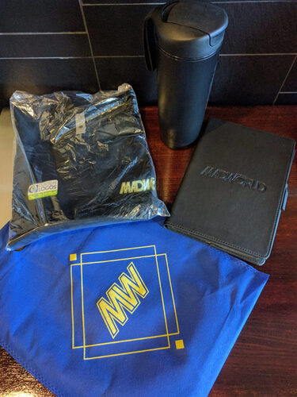](http://techwriter.pl/wp-content/uploads/2017/05/IMG_20170402_160115.jpg)

Jeśli chodzi o organizatorów, to byli bardzo otwarci i przyjaźni w stosunku do
uczestników. W powietrzu można było wyczuć “amerykański luz”, który zachęcał,
żeby zamienić ze wszystkimi słowo lub dwa.

# Wielkie otwarcie

Pierwszy dzień prezentacji otworzyła sesja ogólna. Na scenie pojawił się
**Anthony Olivier**, kapitan statku MadCap, lub jak kto woli, po prostu CEO. Po
krótkim powitaniu uczestników przedstawił nam z grubsza jakie zmiany ostatnimi
czasy nastąpiły w stylu pracy firmy i jej produktach. MadCap stał się bardziej
Agile’owy. Dawniej wypuszczali jedną wersję na rok, teraz chcą częściej
naprawiać problemy i dostarczać nowe funkcje.
[MadCap Central](http://www.madcapsoftware.com/products/central/) wzbogacił się
ostatnio o integrację ze Slackiem, a
[Flare](http://www.madcapsoftware.com/products/flare/), np. o nowości w skórce
Top Nav i integrację z wyszukiwarką Google.

[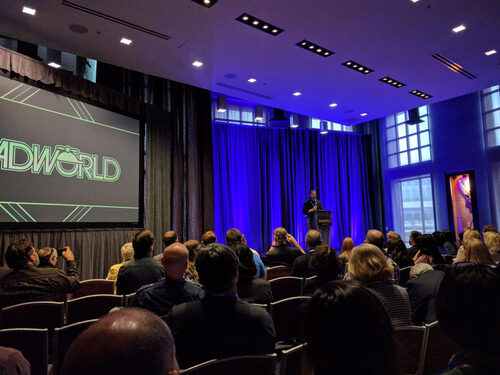](http://techwriter.pl/wp-content/uploads/2017/05/IMG_20170403_083744.jpg)Następnie
mikrofon przejęła **Jennifer Morse**, Product Evangelist w MadCap. Po omówieniu
rzeczy organizacyjnych oddała scenę prelegentom. Każdy z nich pokrótce opowiadał
o sobie i prezentacjach oraz warsztatach, które miał poprowadzić. Niekiedy były
to mini stand-upy, które wzbudzały salwę śmiechu na sali. Poza rozrywkowym
aspektem, ta część konferencji była świetną okazją, żeby przyjrzeć się
dokładniej prezentacjom i oswoić się z prelegentami. Widząc tylko nazwisko na
papierze możemy czasem czuć się onieśmieleni autorytetem i pozycją prowadzącego
prezentację. Po takim krótkim wstępie okazuje się jednak, że prelegenci “nie
gryzą” i wtedy łatwiej uczestnikom nawiązać z nimi bezpośredni kontakt. Dobre
posunięcie ze strony organizatorów.

# Prezentacje

## Pierwszy dzień

Każdy z dwóch dni prezentacji oferował uczestnikom 5 sesji, z której każda miała
4 wątki (tracks), dlatego czasami ciężko było się zdecydować, który wybrać.
Pomocna tutaj była [prezentacja otwierająca](#otwarcie), podczas której
poznaliśmy bliżej tematy prelekcji. Oprócz tego mogliśmy się posiłkować
harmonogramem, w którym przy każdej prezentacji była informacja o jej poziomie
zaawansowania i o narzędziu lub dziedzinie, której dotyczyła.

Pierwsza prezentacja, w której uczestniczyliśmy nosiła tytuł **Maximizing Re-use
within MadCap Flare**. Poprowadził ją
[**Matthew Ellison**](http://www.madcapsoftware.com/events/madworld/speakers/matthew-ellison/),
który na rozgrzewkę pokazał nam kilka zdjęć ze swoich występów teatralnych,
które są jego hobby. Następnie opowiedział nam o tym w jaki sposób można
wycisnąć maksymalne korzyści z ponownego wykorzystania treści (reuse) za pomocą
snippetów (wycinków treści, które mogą być wielokrotnie użyte) i zmiennych.
Główna zasada ponownego wykorzystania treści  to “pisz raz, używaj wiele razy”.
Musimy jednak pamiętać, żeby nie dostać na tym punkcie obsesji, bo będziemy
więcej czasu spędzać na zarządzaniu reusem niż to jest warte. Następnie, Matthew
omówił główne różnice pomiędzy snippetami i zmiennymi oraz w jaki sposób możemy
je współdzielić pomiędzy projektami. Jedną z opcji jest posiadanie głównego
projektu (Global Project) ze wspólnymi elementami, które następnie importujemy
do innych projektów. Ciekawostką były Snippet Variables, czyli możliwość
przypisania wartości zmiennym we właściwościach snippeta. Widać było gołym
okiem, że Matthew to zaprawiony w bojach prezenter. Kiedy coś szło nie tak,
potrafił obrócić to w żart i zaskarbić sobie jeszcze większą sympatię
publiczności.

Kolejne wystąpienie pt. **“Wait, What Did You Just Do?” Tips for Enhancing Your
Authoring Experience** poprowadził
[**Derek Warren**](http://www.madcapsoftware.com/events/madworld/speakers/derek-warren/).
Prezentacja była bardzo praktyczna, ale niezbyt porywająca. Prelegent
demonstrował sposoby na ułatwienie sobie pracy we Flarze. Wspomniał o Quick
Launch box (do szybkiego odnalezienia konkretnego topiku), widoku File List
(dającym nam ogólny pogląd na topiki jakie mamy) oraz funkcjach Locate in TOC i
Locate in Explorer (dzięki, którym możemy odnaleźć topik w spisie treści i oknie
Content Explorer). Derek pokazał nam również jak tworzyć i zachowywać różne
układy okien (Layouts). Na przykład, możemy sobie stworzyć inny układ okien do
pracy na małym i dużym ekranie. Zasugerował nam też korzystanie z makr do
wykonywania często powtarzanych operacji.

Po obfitym lunchu, powróciliśmy do sali na prezentację
[**Daniela Fergusona**](http://www.madcapsoftware.com/events/madworld/speakers/daniel-ferguson/)
pt. **Be Responsible: Using MadCap Flare’s Responsive Design Editor**.
Prowadzący zaczął od historii o tym jak lata wcześniej został zwolniony z pracy
(notabene razem z Tomem Johnsonem, autorem bloga
[I’d Rather Be Writing](http://idratherbewriting.com/)) i zdecydował się zostać
niezależnym konsultantem. Używał wtedy Flare’a zaledwie od pół roku, ale
umieścił na swojej stronie informację o znajomości tego narzędzia. To
spowodowało, że dostał pierwsze zlecenie – migrację dokumentacji z Author-it do
Flare’a. Była to ciężka przeprawa, ale warto było wylać trochę potu i łez,
ponieważ obecnie ponad 90% zleceń jakie otrzymuje jest związane z Flarem. Po tym
krótkim wstępie, Daniel opowiedział nam trochę o Responsive Web Design. Ten
rodzaj projektowania oznacza, że rozmiar strony dostosowuje się do wielkości
ekranu przez co przeglądanie jej na urządzeniach mobilnych jest prostsze.
Głównie dzieje się tak za sprawą odpowiedniej konfiguracji CSS, w której
określamy osobne ustawienia dla różnych medium. Dlatego musimy unikać używania
stylów lokalnych (inline styles). Jeśli chodzi o Flare’a i Responsive Web
Design, to jest on wspierany w pełni dopiero od wersji 12 kiedy wprowadzono
Responsive Design Editor. Dzięki niemu, możemy skonfigurować treść pod względem
responsywności. Żeby taką konfigurację zrobić dobrze, musimy zapoznać się z
pojęciem siatki (grid), czyli podziałem ekranu na segmenty, w których będzie
pojawiać się treść. Po części teoretycznej, przeszliśmy do ćwiczenia, dzięki
któremu nauczyliśmy się jak we Flarze skonfigurować Responsive Layout. Była to
bardzo praktyczna prezentacja, której forma bardziej przypominała warsztat.
Takie prezentacje lubimy najbardziej, bo można z nich najwięcej wyciągnąć.

Po zgłębieniu tajników responsywnego projektowania treści, przeszliśmy do
całkowicie innego zagadnienia.
[**Lindsay Vannarsdall**](http://www.madcapsoftware.com/events/madworld/speakers/lindsay-vannarsdall/)
w swojej prezentacji **Using MadCap Contributor and MadCap Analyzer for MadCap
Flare Topic Review** pokazała nam w jaki sposób w jej firmie radzą sobie z
recenzją dokumentacji przez ekspertów. Dawniej wysyłali do nich pliki PDF, w
których zaznaczali swoje uwagi. Proces wprowadzania takich zmian w topikach we
Flarze był żmudny i nieefektywny, więc firma postanowiła zmienić ten proces.
Obecnie używają MadCap Contributora, Analyzera oraz File Tags we Flarze. Cały
proces rozpoczyna się od aktualizacji topików we Flarze i stworzenia z nich
paczki do recenzji. Następnie paczka jest wysyłana do eksperta, który używa
Contributora. Po tym jak sprawdzi i poprawi topiki, odsyła paczkę do Tech
Writera, który importuje ją z powrotem do Flare’a i akceptuje lub odrzuca
poszczególne zmiany. Dodatkowo, żeby usprawnić cały proces, używają File Tags z
imionami ekspertów oraz raportu w Analyzerze, który pokazuje gdzie poszczególne
tagi są użyte. Taki raport jest eksportowany do CSV i na bieżąco aktualizowany,
żeby śledzić postęp recenzji. Sama prezentacja była dość krótka, ale resztę
czasu wypełniły pytania i dyskusja. Wygląda na to, że dla wielu osób proces
recenzowania treści jest bardzo problematyczny.

[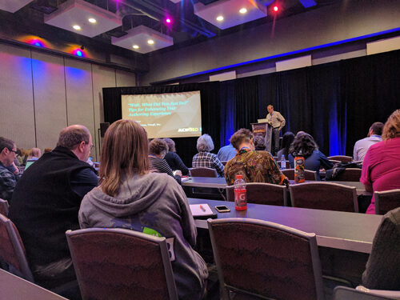](http://techwriter.pl/wp-content/uploads/2017/05/IMG_20170403_110913.jpg)

Krótka przerwa, a po niej nastąpiła ostatnia poniedziałkowa prezentacja - **One
Year with MadCap Flare: Problems, Solutions, & Other Fun Innovations**.
[**Morgan Hancock**](http://www.madcapsoftware.com/events/madworld/speakers/morgan-hancock/)
opowiadała o wyzwaniach i problemach z jakimi musiała się mierzyć w pierwszym
roku użytkowania Flare’a. Pokazała nam pewne elementy, które musieli stworzyć
poza Flarem, takie jak możliwość zmiany wersji językowej, która otwiera ten sam
topik w innych języku, skrypt zamieniający niektóre zmienne na tekst przed
wysłaniem tekstu do tłumaczenia czy wyświetlanie dwóch topików na jednej
stronie. Po tym jak opowiedziała nam ogólnie o tym co zrobili, przeprowadziła
szybkie głosowanie podczas, którego uczestnicy wybrali 3 elementy, które chcieli
omówić dokładniej. Niestety, była to najsłabsza prezentacja w jakiej
uczestniczyliśmy. Poruszane tematy były ciekawe jednak sposób ich przedstawienia
spowodował, że prezentacja dużo straciła.

## Drugi dzień

Wtorek rozpoczęliśmy od prezentacji **Working with MadCap Flare and Confluence
in a Dispersed Team**.
[**Jayna Locke**](http://www.madcapsoftware.com/events/madworld/speakers/jayna-locke/)
przedstawiła różne scenariusze współpracy między osobami dostarczającymi wiedzę
do dokumentacji i Tech Writerami przy użyciu Flare’a i Confluence. Jeden ze
scenariuszy zakłada, że ekspert tworzy pierwszy szkic dokumentacji w Confluence
a następnie Tech Writer przenosi go do Flare'a i tam szlifuje. Po skończonej
pracy generuje PDFa lub HTMLa i wrzuca do przestrzeni (space) w Confluence gdzie
znajdują się materiały do recenzji. Największym problemem w używaniu Flare’a i
Confluence jest brak integracji między tymi dwoma narzędziami. Dlatego
przenoszenie treści między nimi nie jest łatwe i trzeba stosować różne obejścia.
Niektórzy tworzą skrypty, które obrabiają dokumentację stworzoną we Flarze, żeby
nadawała się do importu do Confluence. Inni eksportują treść do pliku Word i
importują taki plik do Confluence. W wersji 2017, Flare został wzbogacony o nowy
format generowania dokumentacji – czysty XHTML, który nie zawiera tagów Flare’a.
Dzięki temu formatowi można łatwiej importować treść do Confluence. Po wykładzie
wywiązała się dyskusja. Jeden z uczestników zasugerował, że do eksportu treści z
Confluence można użyć
wtyczki [Scroll HTML Exporter](https://marketplace.atlassian.com/plugins/com.k15t.scroll.scroll-html/server/overview).

W kolejnej prezentacji pt. **To “Template” or Not to “Template”?** prowadząca
[**Nita Beck**](http://www.madcapsoftware.com/events/madworld/speakers/nita-beck/)
przeprowadziła nas przez szablony, które są dostępne domyślnie we Flarze.
Dowiedzieliśmy się o istnieniu np. takich szablonów jak Slideshow, służącego do
tworzenia prezentacji, i San Diego, przeznaczonego do celów treningowych dla
nowych użytkowników. Szablony zawierają domyślnie targety, dzięki którym można
wygenerować dokumentację do różnych formatów. Oprócz domyślnych szablonów, można
też stworzyć własne. Prowadząca przedstawiła również strategię używania kilku
szablonów. Zaczynamy od jednego projektu opartego na jednym szablonie, potem
tworzymy nowy projekt tymczasowy i z niego importujemy (za pomocą Global Project
linking) tylko te rzeczy, które są nam potrzebne. Następnie usuwamy linki do
projektu, z którego importowaliśmy elementy. Najłatwiej to zrobić usuwając plik
importu.

Następne wystąpienie nosiło tytuł **A New Look at Extending HTML5 Targets with
jQuery**.
[**Scott DeLoach**](http://www.madcapsoftware.com/events/madworld/speakers/scott-deloach/)
w bardzo przejrzysty sposób wprowadził nas w świat wtyczek jQuery, które można
wykorzystać w dokumentacji generowanej do formatu HTML5. Na początku prowadzący
wyjaśnił nam czym jest jQuery i że jest ono używane w samym Flarze przy
tworzeniu niektórych elementów, takich jak drop-down czy pop-up. Wtyczkę jQuery
można dodać na dwa sposoby: linkować bezpośrednio do zasobów dostępnych w sieci
albo ściągnąć wtyczkę. Następnie Scott zaprezentował nam masę ciekawych
przykładów. Na przykład, wtyczka readingTime pokazuje liczbę słów na stronie
oraz szacowany czas potrzebny na przeczytanie tekstu, a wtyczka tableExport
pozwala nam wyeksportować tabelkę ze strony do różnych formatów, m.in. Word,
Excel i PDF. Kolejnym przykładem jest wtyczka tagCloud, która znajduje wszystkie
znaczniki conceptów, ktore są dodane do kodu na stronie. Każdy znaleziony
concept przedstawiony jest w formie przycisku, którego można użyć do wyszukania
tego conceptu na stronie. Była to świetna prezentacja zarówno pod względem
tematyki jak i sposobu przedstawienia. Na pewno będziemy przyglądać się bliżej
temu zagadnieniu.

[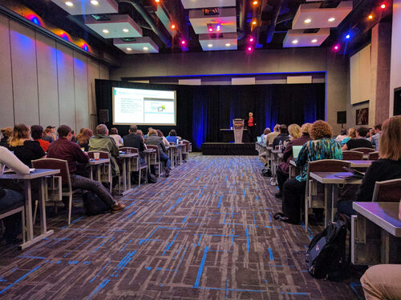](http://techwriter.pl/wp-content/uploads/2017/05/IMG_20170404_111507.jpg)

Po jQuery przyszedł czas na Page Layouts, czyli układy stron, których używamy do
generowania dokumentacji przeznaczonej do druku, np. PDF.
[**Robert Plano**](http://www.madcapsoftware.com/events/madworld/speakers/robert-plano/)
w swojej prezentacji **Mastering Page Layouts in MadCap Flare** wyjaśnił nam do
czego są potrzebne Page Layouts, z jakich elementow się składają oraz jakie
szablony mamy domyślnie do dyspozycji we Flarze. Robert pokazał nam kilka
ciekawych ustawień. Na przykład, kiedy mamy w layoucie dwie ramki Body możemy za
pomocą stylu spowodować, żeby nowy paragraf został wyświetlony w drugiej ramce,
zamiast ustawiać tekst za pomocą spacji. Pokazał nam też co należy zrobić, żeby
treść wyświetlała się w trzech kolumnach na stronie. Prezentacja była
praktycznym demo, które krok po kroku wyjaśniało jak ustawić Page Layouts na
różne sposoby. Prezentacja szczególnie przydatna dla osób, które nigdy wcześniej
nie używały tego elementu we Flarze.

Wtorek zakończyliśmy udziałem w sesji **MadCap Flare Wishlist: An Open Forum
Session with MadCap Software** prowadzonej przez organizatorów. Była to otwarta
dyskusja, podczas której uczestnicy mieli szansę wypowiedzieć się na temat tego
jakie rzeczy nie odpowiadają im we Flarze i jakie nowe funkcje chcieliby
zobaczyć w nowych wersjach. Nie była to jednak sesja przeznaczona na
rozwiązywanie problemów związanych z konkretnymi projektami, tylko ogólna
dyskusja. Jak to mówią “uderz w stół, a nożyce się odezwą”, dlatego nie trzeba
było specjalnie nikogo ciągnąć za język. Chętnych do wypowiedzenia się nie
brakowało. Prawdopodobnie gdyby sesja trwała dwa razy dłużej bez problemu dałoby
się wypełnić ten czas. Uczestnicy zgłosili propozycje takie jak poprawienie
mechanizmu wyszukiwania poprzez dodanie możliwości użycia kilku filtrów
jednocześnie, dodanie możliwości związanych z analizą projektu (np. analiza
poziomu trudności użytego języka), poprawienie importu z FrameMakera, żeby
obrazki automatycznie trafiały do katalogu Resources, możliwość przypisywania
skrótów klawiszowych do większej liczby funkcji oraz integracja z JIRA i
Confluence. Sesja była bardzo intensywna, więc na jej zakończenie organizatorzy
mieli całkiem sporą listę rzeczy, którymi będą musieli się zająć. Oczywiście nie
spodziewamy się, że nagle wszystko zostanie naprawione czy dodane, ale taka
otwarta dyskusja to znak, że MadCap wychodzi naprzeciw swoim użytkownikom i
stara się słuchać ich opinii.

# Warsztaty

Główna część konferencji zakończyła się we wtorek. Środa była w całości
przeznaczona na dodatkowo płatne warsztaty. W sumie były 4 sesje, po 2 wątki
(tracki) w każdej sesji.

Pierwsze warsztaty, które wybraliśmy nosiły nazwę **Maximize Content Reuse with
MadCap Flare**. Poprowadziła
je [**Denise Kadilak**](http://www.madcapsoftware.com/events/madworld/speakers/denise-kadilak/),
która skupiła się na dwóch sposobach ponownego wykorzystania treści. Pierwszy z
nich to Global Project linking. W tej opcji mamy jeden projekt główny, w którym
przechowujemy elementy wykorzystywane w innych projektach. Oprócz głównego
projektu mamy projekty podrzędne, w których tworzymy właściwą treść. Wszelkie
elementy wspólne z głównego projektu są z niego importowane do projektów
podrzędnych. Denise wspomniała, że u nich sytuacja jest jeszcze bardziej
złożona, bo występuje import elementów na poziomie projektów podrzędnych. Drugi
sposób na ponowne wykorzystanie treści to Runtime merge. Polega on na
podlinkowaniu w Table of Contents w projekcie głównym projektów podrzędnych.
Dzięki temu w trakcie budowania dokumentacji wszystkie projekty zostaną
wygenerowane jako jedna dokumentacja. Jest to całkiem interesująca opcja, jednak
ma spore ograniczenie. Na tę chwilę działa tylko dla formatu HTML5 w układzie
tri-pane (trzy okna).

[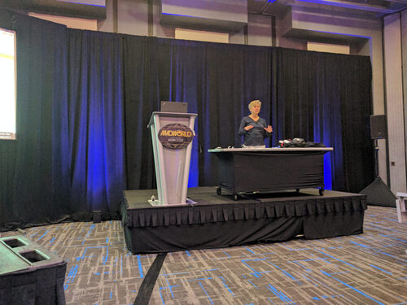](http://techwriter.pl/wp-content/uploads/2017/05/IMG_20170405_080244.jpg)

Kolejne warsztaty nosiły nazwę **Advanced CSS: Using CSS Design Elegant
Solutions to Everyday HTML Problems**.
[**Mike Kelley**](http://www.madcapsoftware.com/events/madworld/speakers/mike-kelley/)
pokazywał nam jak można wzbogacić swój arkusz stylów o ciekawe efekty.
Dowiedzieliśmy się jak dodać autonumerację elementów, przejścia, takie jak obrót
czy wygaszenie, oraz jak wyrównać poszczególne elementy na stronie. Wspomniał
również o CSS Grid Layout, czyli o nowym 2-wymiarowym układzie, który bierze pod
uwagę zarówno wiersze jak i kolumny na stronie. Pokazał nam także font icons,
czyli zestaw wektorowych ikonek, których możemy użyć zamiast zwykłych obrazków.
Ich zaletą jest to, że się dobrze skalują nie tracąc na jakości. Można ich użyć
np. we wszelkiego rodzaju wskazówkach lub ostrzeżeniach w dokumentacji lub w
listach wypunktowanych zamiast tradycyjnych “bulletów”. Warsztaty krok po kroku
prowadziły nas przez konfigurację poszczególnych elementów CSS. Mike Kelley
okazał się świetnym prowadzącym z dużym poczuciem humoru. Chętnie odpowiadał na
pytania i sam nawet zachęcał do rzucania mu “wyzwań”. Na samym początku
warsztatów prowadzący zdradził nam, że praktycznie nie słyszy i prosił o
wyrozumiałość. Prawdopodobnie nikt by nawet tego nie zauważył, gdyby nam o tym
nie powiedział, ponieważ absolutnie nie miało to żadnego wpływu na przebieg
warsztatów. Jesteśmy pełni podziwu, że pomimo takich przeciwności losu, Mike nie
ma żadnego problemu z publicznymi wystąpieniami i co więcej jest w tym bardzo
dobry.

https://twitter.com/ollyhell/status/849685169208344576

Ostatnimi warsztatami był **MAD for MadCap Flare Certification Bootcamp**
przygotowujący do zdania certyfikatu potwierdzającego znajomość Flare’a. Całość
została podzielona na dwie sesje. Warsztaty były prowadzone przez
[**Scotta DeLoacha**](http://www.madcapsoftware.com/events/madworld/speakers/scott-deloach/)
oraz
[**Mike’a Hamiltona**](http://www.madcapsoftware.com/events/madworld/speakers/mike-hamilton/),
którzy przeszli przekrojowo przez funkcje Flare’a i zapoznali nas z
przykładowymi pytaniam jakie można spotkać podczas zdawania testu
certyfikującego. Zaczęliśmy od projektów a skończyliśmy na śledzeniu zmian, po
drodze dotykając jeszcze zagadnień związanych z linkami, stylami, topikami,
zmiennymi, budowaniem dokumentacji czy też raportami. Nie sposób tutaj wymienić
wszystkiego o czym była mowa. Z ciekawostek można wspomnieć pytanie o to jaką
maksymalną wielkość może mieć projekt. Odpowiedź brzmi, że nie ma żadnego
ograniczenia. Do tej odpowiedzi Mike dodał jeszcze, że największy projekt
Flare’a jaki do tej pory widział liczył 300 000 topików. Zbudowanie tego potwora
początkowo trwało 9 godzin. Potem udało się ten czas zredukować o ponad połowę.
Pomimo ogromnej ilości informacji jaką dostaliśmy podczas tych warsztatów,
chciało się tam zostać jeszcze na jedną sesję. W dużej części była to zasługa
prowadzących, którzy potrafili utrzymać nasze zainteresowanie od początku do
końca.

Na koniec wypełniliśmy test, taki jaki muszą zdać osoby ubiegające się o
certyfikat Flare. Byliśmy przekonani, że to był test próbny, ale spotkała nas
miła niespodzianka – osobom, które zdały test został zaliczony na poczet
certyfikatu Flare. Oznacza to, że jeśli takie osoby zdecydują się wykupić
egzamin będą musiały przygotować tylko próbny projekt. Wielu osobom, w tym także
nam, dało to powody do radości 😊

# Loża ekspertów

Przez trzy dni uczestnicy mieli do dyspozycji **Hospitality Lounge** gdzie mogli
udać się po wsparcie. W praktyce była to osobna sala, w której urzędowali
pracownicy firmy MadCap. Można było po prostu tam pójść i wylać swoje żale, co
też oczywiście uczyniliśmy (i to niejednokrotnie). Wszystkie osoby, z którymi
rozmawialiśmy były cierpliwe, wyrozumiałe i chętne do pomocy. Nawet po dłuższym
narzekaniu z naszej strony nie poddawali się i starali się znaleźć jakieś
rozwiązanie. ?

Nie da się ukryć, że Hospitality Lounge jest bardzo ważną częścią konferencji
MadWorld. Było to widać doskonale po liczbie osób ustawiających się w kolejce do
ekspertów. Uczestnicy cenią sobie bardzo możliwość porozmawiania twarzą w twarz
o tym z jakimi problemami mierzą się używając produktów firmy MadCap. Dla wielu
z nich jest to wystarczający argument, żeby kupić wejściówkę na MadWorld.

# Aplikacja

Organizatorzy stworzyli dla uczestników specjalną aplikację konferencyjną. Można
było w niej sprawdzić harmonogram konferencji i oznaczyć wydarzenia, w których
chcieliśmy wziąć udział. Aplikacja miała też możliwość ustawienia przypomnień
przed wydarzeniami, które dodaliśmy do naszego harmonogramu. Było to szczególnie
pomocne kiedy w przerwie między prezentacjami wdawaliśmy się w ożywioną dyskusję
z innymi uczestnikami tracąc poczucie czasu.

[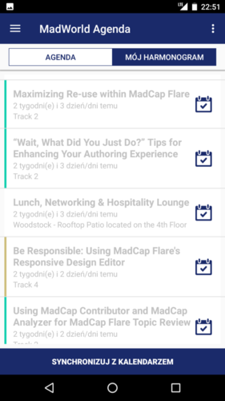](http://techwriter.pl/wp-content/uploads/2017/04/MadWorld-app1.png)

Oprócz tego, aplikacja spełniała też funkcję wewnętrznego Twittera. Uczestnicy
na gorąco wrzucali zdjęcia i komentowali wydarzenia.

[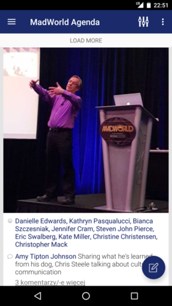](http://techwriter.pl/wp-content/uploads/2017/04/MadWorld-app2.png)

Był nawet konkurs na najbardziej aktywnych użytkowników. Za każdą aktywność
przyznawane były punkty. Na koniec konferencji, zwycięzcy otrzymali od
organizatorów nagrody rzeczowe. Dobry przykład gamifikacji.

# Tańce, hulańce, swawole

Żadna dobra konferencja nie może obyć się bez rozrywki pozwalającej uczestnikom
rozluźnić się po intensywnym chłonięciu wiedzy. Nie inaczej było w przypadku
MadWorld. Każdy dzień konferencji zakończony był wydarzeniem towarzyskim,
podczas którego można było przy drinku i jedzeniu nawiązać nowe znajomości.

https://twitter.com/neilmatheson/status/848689027167510532

Uczestnicy byli bardzo skorzy do interakcji, dlatego za każdym razem w miejscu
spotkania było gwarno i wesoło. Jedna z imprez odbyła się w pobliskim barze
country.

Główną atrakcją była nauka amerykańskiego tańca liniowego. Musimy przyznać, że
kilka rzędów Tech Writerów wykonujących te same ruchy taneczne to dość
niecodzienny widok 😉

# Miejsce konferencji

Tegoroczna edycja konferencji odbyła się w
[hotelu Hard Rock](http://www.hardrockhotelsd.com/), zlokalizowanym w
historycznej dzielnicy Gaslamp. Według nas był to dobry wybór. Główną zaletą
była lokalizacja hotelu w centrum miasta, przez co łatwo było się do niego
dostać.

[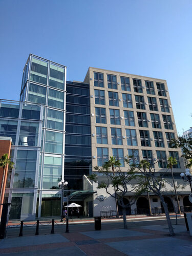](http://techwriter.pl/wp-content/uploads/2017/05/IMG_20170404_084040.jpg)

[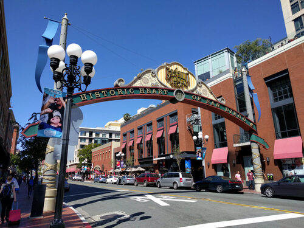](http://techwriter.pl/wp-content/uploads/2017/05/IMG_20170401_144803.jpg)Wynajęte
sale konferencyjne były przestronne i komfortowe. Przy wejściu do każdej sali
był wyświetlacz pokazujący jej numer oraz plan prezentacji. Dzięki temu łatwiej
było się odnaleźć. Jedyną niedogodnością był niedobór gniazdek w salach, który
był szczególnie odczuwalny podczas warsztatów, kiedy to laptopy były bardzo
potrzebne.

[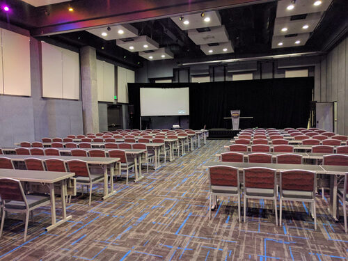](http://techwriter.pl/wp-content/uploads/2017/05/IMG_20170402_143618.jpg)

Pracownicy hotelu zapewnili uczestnikom profesjonalną obsługę oraz świetny
catering. Uczestnicy w cenie wejściówki mieli śniadanie i lunch. Podczas dni
kiedy odbywały się prezentacje były one serwowane na tarasie. Dzięki temu można
było cieszyć się piękną pogodą i odetchnąć chwilę na świeżym powietrzu w
przerwie między prezentacjami.

https://twitter.com/MichaelJasper/status/848993111875473409

# Miasto

Konferencja
[MadWorld](http://www.madworldconference.com/?utm_source=TechWriterPL&utm_medium=Banner&utm_campaign=MadWorld2017)
od pięciu lat odbywa się w San Diego. Co tu dużo pisać - miasto jest piękne i
ciężko się w nim nudzić. Są muzea, parki, plaże, restauracje i browary
rzemieślnicze.

[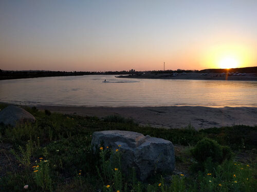](http://techwriter.pl/wp-content/uploads/2017/05/IMG_20170331_190024.jpg)[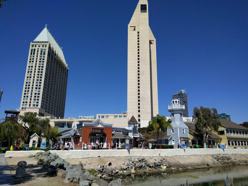](http://techwriter.pl/wp-content/uploads/2017/05/IMG_20170401_143036.jpg)Pogoda
zdecydowanie sprzyja aktywnemu spędzaniu wolnego czasu. Polecamy przemierzanie
miasta na piechotę. Wbrew powszechnemu przekonaniu, miasta w Ameryce potrafią
być przyjazne pieszym ? Możecie też wypożyczyć rower i pojeździć po okolicy.
Infrastruktura jest bardzo dobrze przygotowana, dlatego pomimo dużego ruchu
samochodowego w mieście i poza nim, można bezpiecznie podróżować rowerem.
Kolejna opcja to wypuszczenie się kilka kilometrów za miasto i pochodzenie po
górkach. Naprawdę warto – można się solidnie zmęczyć podziwiając przepiękne
widoki.

[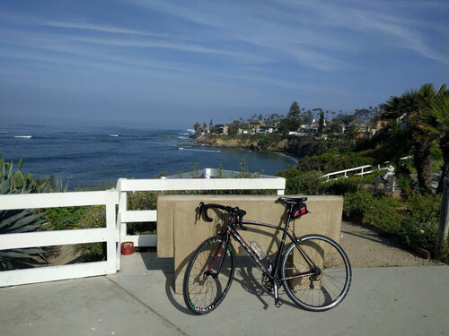](http://techwriter.pl/wp-content/uploads/2017/05/IMG_20170407_091438.jpg)[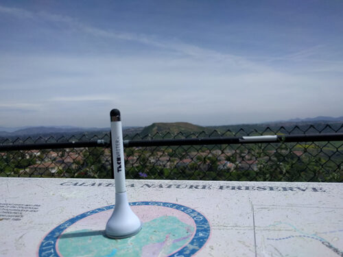](http://techwriter.pl/wp-content/uploads/2017/05/IMG_20170407_125902.jpg)Jeśli
wszystkie opisane propozycje to dla Was ciągle za mało, wystarczy kupić bilet na
pociąg i w niecałe 3 godziny będziecie w Los Angeles. A tam czeka na Was kolejna
porcja atrakcji.

Jak widać, w San Diego każdy znajdzie coś dla siebie. Zarówno Ci, którzy lubią
leniuchować jak i Ci, którzy nie mogą usiedzieć na miejscu.

# Podsumowanie

Jak wiadomo, MadWorld jest przeznaczony dla bardzo wąskiej grupy odbiorców.
Konferencję można by określić jako coroczny zjazd użytkowników produktów
MadCapa. Ale nie ma w tym absolutnie nic złego. Takie wydarzenia też są
potrzebne. Dzięki MadWorld, Tech Writerzy używający Flare’a mają miejsce, w
którym mogą zdobyć konkretną wiedzę, uzyskać pomoc od ekspertów, poznać nowe
osoby, które mają podobne problemy i które mogą podzielić się swoim
doświadczeniem.

Atmosfera panująca na konferencji jest świetna. Widać, że ludzie nie tylko dużo
się uczą, ale też dobrze się przy tym bawią. Poziom prezentacji, jak to bywa na
takich wydarzeniach, jest zróżnicowany. Ponadto wiadomo, że każdy uczestnik
przyjeżdża na konferencję z różnym poziomem doświadczenia i określonymi
oczekiwaniami. Dlatego to co dla jednych jest oczywiste, dla innych jest czymś
odkrywczym. Jednak przy tak dużej liczbie prezentacji, na pewno każdy znajdzie
coś dla siebie i zdobędzie wartościową wiedzę.

Koszt uczestnictwa jest dość wysoki. Oprócz ceny wejściówek, musimy liczyć się z
kosztami przelotów i noclegów. Po zsumowaniu tego wszystkiego, dostajemy całkiem
sporą sumę. Bądźmy realistami – nie będzie łatwo przekonać szefa do przyznania
nam takiego budżetu. Ale jeśli jest na to jakaś szansa, to warto powalczyć ze
względu na to wszystko o czym pisaliśmy wyżej. Oprócz wartościowej konferencji,
będziecie mieć też szansę na mini wakacje w słonecznej Kalifornii co sprawia, że
MadWorld wydaje się jeszcze bardziej kuszący 😊

Podsumowując, jeśli korzystacie na co dzień z Flare’a, to zdecydowanie polecamy
udział w MadWorld.

https://twitter.com/CFree22/status/850117198605504513

Jeśli interesuje Was co mają do powiedzenia na temat konferencji inni
uczestnicy, odsyłamy do linków poniżej:

- [My First MadWorld: Excerpts from a Newbie and Why It Was Worth My Time](http://www.madcapsoftware.com/blog/2017/04/27/first-madworld-excerpts-newbie-worth-time/)
- [Madworld Day 1](https://medium.com/@thejoelwilhelm/madworld-day-1-422ea4f11160)
- [MadWorld Day 2](https://medium.com/@thejoelwilhelm/madworld-day-2-4accf23c9913)
- [MadWorld 2017 Thoughts Part 1](https://blog.ericswalberg.com/2017/04/18/madworld-2017-thoughts-part-1/)
- [MadWorld 2017 Thoughts Part 2](https://blog.ericswalberg.com/2017/04/24/madworld-2017-thoughts-part-2/)

Na koniec, dziękujemy serdecznie organizatorom za ciepłe przyjęcie i mamy
nadzieję, że w następnym roku uda nam się wrócić do San Diego.

[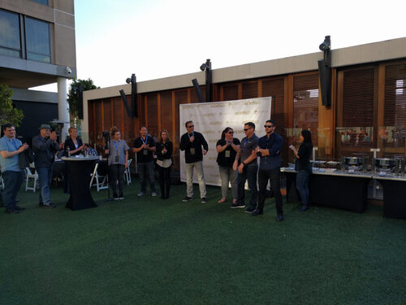](http://techwriter.pl/wp-content/uploads/2017/05/IMG_20170404_181518.jpg)
