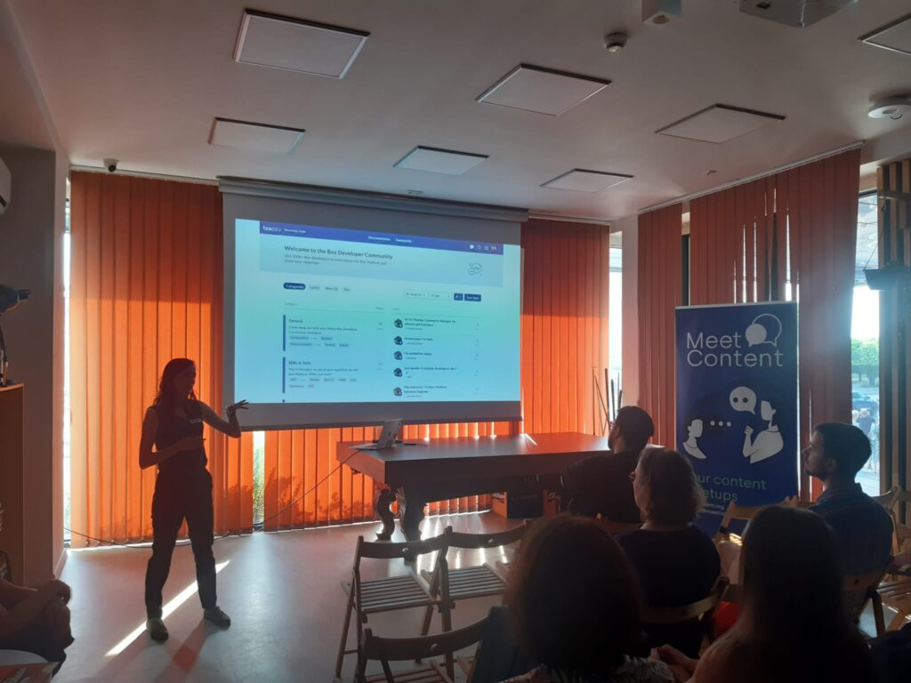

Serdecznie zapraszamy do zapoznania się z relacją z czerwcowego MeetContent w
Krakowie. Nasz redakcyjny kolega Andrzej i jego koleżanka z Hitachi Energy -
Julia wzięli udział w tym spotkaniu i postanowili podzielić się wrażeniami i
tym, co udało im się dowiedzieć o projekcie skupionym na dokumentacji API, SDK w
którym bardzo wiele zależy od zgrania i współpracy dwóch ról: Technical Writera
i Developer Advocate.

## Pierwsze spotkanie z Contentem

Dla Andrzeja i Julii Dąbrowskiej krakowska odsłona MeetContent nr 14 była
pierwszym spotkaniem tego rodzaju. Zdarzenie to miało miejsce 20.06.2023 w
Techie’s Space – jest to resto-bar stworzony przez firmę informatyczną Codete.
Jest to lokal o wyjątkowym wystroju, z licznymi odwołaniami do subkultury
programistów i pokrewnych im dusz. W Techie’s Space odbywają się różne MeetUpy,
nie tylko na tematy dokumentacyjne.

Fantastyczne miejsce, ale mamy jedno zastrzeżenie. Otóż, podczas żywiołowej
dyskusji uczestników, strumień świadomości Julii został totalnie zaburzony przez
niewinnie wyglądającą instalację na pobliskiej ścianie. Cóż takiego zawierała
owa instalacja, że uwaga Julii poszybowała jak ptak w jej stronę? Otóż... były
to płyty główne od PC-tów. Kompletny brak podzielności uwagi w połączeniu z
trudno skrywaną fascynacją płytami wzięły górę, szczególnie, że Julia ma na
swoim koncie epizod, gdy takowe skręcała. Jeśli fascynujesz się technologią, to
pobyt w Techie's Space może przyprawić Cie o zawrót głowy! I jak tu się skupić
na rozmowie, gdy na telebimie ludzie grają w Super Mario Bros?

Andrzej wpadł na spotkanie niedługo po odbytej zabawie integracyjnej z zespołem
z Hitachi Energy, która polegała na rozwiązywaniu zagadek podczas spacerowania
po Krakowie. Po rozkminieniu wszystkich detektywistycznych łamigłówek w tamten
upalny dzień, i po wstępnym rozruszaniu szarych komórek, był gotów na poznanie
nowych dla niego faktów z branży komunikacji.

Julia i Andrzej przybyli na spotkanie pełni dobrych przeczuć, a także… pytań,
które wymagały odpowiedzi.

## Pytania

Julia zdecydowała się wziąć udział w wydarzeniu, bo przywiodła ją ciekawość, bo
chciała się dowiedzieć, kim jest specjalista od Developer Relations. Andrzej
miał niejasne wyobrażenie takiej roli i chciał ustalić podstawowe fakty.

Nie ma w tym nic dziwnego -  rola jaką pełni Olga Stefaniuk jest dość egzotyczna
i niszowa, nawet dla technical writerów, którzy sami rezydują w wąskiej niszy.
Mam nadzieję, że ten krótki artykuł pomoże choć trochę rzucić światło na tę
specjalność.

## Okiem Technical Writerki

W ostatnim czasie był to niejedyny występ Basi. Około trzy tygodnie wcześniej
mieliśmy przyjemność słuchać jej na dużej scenie [soap!](https://soapconf.com/)
gdzie razem z Edytą Rakowską przedstawiły temat: „There’s no ContentOps without
a ContentPlan”, który został bardzo ciepło przyjęty. Jeśli chcesz przeczytać
podsumowanie tego i innych wystąpień, zapraszam do zapoznania się
z [Relacją z konferencji Soap 2023](http://techwriter.pl/relacja-z-tegorocznej-konferencji-soap-2023/)

Na mniejszej scenie MeetContent, Basia przybliżyła nam wysiłki nielicznego, ale
świetnie zorganizowanego zespołu technical writerów, którzy w firmie Box mierzą
się z opisywaniem 30 produktów, które wymagają tworzenia dokumentacji API, SDK,
CLI (_Command Line Interface_) i
[Elementów UI](https://developer.box.com/guides/embed/ui-elements/), przy
współpracy z wieloma specjalistami, zwłaszcza z Developer Advocate.

## Kim jest Developer Advocate?

Olga rozpoczęła opowieścią o nieformalnym określeniu krążącym w gronie podobnych
jej specjalistów. Otóż, na stronie internetowej opisującej stanowiska różnych
osób pewnej firmy pojawiła się zabawna literówka w nazwie roli - **Advocado**, a
następnie jedna z osób przyjęła takie określenie i zaczęła z niego korzystać na
Twitterze. Tak narodził się pomysł na maskotkę ich drużyny.

Wyjaśnijmy najpierw podstawy przyjętego nazewnictwa. Podstawowym określeniem
stanowiska jest "Developer Advocate". Osoba wykonująca tę rolę działa w ramach
zespołu lub działu "Developer Relations" (w skrócie "DevRel"). "Developer
Relations" to również określenie obszaru działań w firmie. Uff. Skoro mamy za
sobą fundamenty określenia, przejdźmy do samej definicji.

Developer Advocate zwraca baczną uwagę na problemy techniczne, z którymi
borykają się developerzy zewnętrzni integrujący rozwiązania firmy Box w swoich
produktach.

Celem Olgi jest poznanie potrzeb, blokerów i problemów - kluczowe jest poznanie
tych trudności i rozwiązanie ich, co wpływa na lepsze doświadczenia developerów
(_developer experience_).

Developer Advocate zbiera techniczny feedback i przekuwa go w konkretne
działania:

- tworzenie treści, które publikowane są w formie bloga
- usprawnianie portalu dla developerów
- zarządzanie forum developerów
- obecność na konferencjach i mediach społecznościowych
- wydawanie newslettera (informowanie o zmianach i nowych wersjach, itd.)
- zlecanie aktualizacja dokumentacji
- przygotowywanie prezentacji o produkcie
- opracowywanie materiałów edukacyjnych.

Jednym z zadań Developer Advocate jest analiza _user journey_ dla konkretnej
persony np.: developer lub administrator. We współpracy z technical writerem
opracowywana jest cała ścieżka edukacyjna jaką dana persona musi przejść, by
postawić pierwsze kroki. W ścieżce edukacyjnej zawierają się wszystkie materiały
i instrukcje z wiedzą niezbędną do rozpoczęcia pracy z rozwiązaniami firmy Box.

Developer Advocate, żeby móc wejść w buty innych developerów również potrzebuje
znać technologie - Olga uczy się Node.js, a za pomocą React stworzyła katalog
przykładowych próbek kodu w różnych językach programowania.

Dla zespołu Developer Relations kluczowe jest zapewnienie dwustronnej
komunikacji między developerami tworzącymi rozwiązania Box a developerami,
którzy z nich korzystają.

Developerzy-klienci nie chcą zakrzywiających rzeczywistość marketingowych
sloganów, potrzebują klarownych instrukcji jak użyć rozwiązanie i jak odnaleźć
się w gąszczu dokumentów w bazie wiedzy. Jeśli zobaczą, że ich głos jest
wysłuchiwany, a witryna i produkty zmieniają się dla nich na lepsze, większa
szansa, że zainwestują swój czas i pieniądze w rozwiązania dające im największe
możliwości.

## Kim nie jest Developer Advocate?

Mimo pewnych nachodzących na siebie obszarów, rolę Developer Advocate można
odróżnić od Developer Evangelist. Ewangelista często postrzegany jest bardziej
jako wybijająca się jednostka występująca na różnych konferencjach, która głosi
dobrą nowinę o produktach i technologiach. Czasami jednak nazwy tych stanowisk
są używane zamiennie, ponieważ te terminy są dość płynne, a obowiązki często się
pokrywają.

Developer Advocate bynajmniej nie jest osobą reprezentującą w firmie
developerów, która negocjuje dla nich najwyższe podwyżki 😉 Wobec jeszcze
słabego nagłośnienia tego stanowiska, niektórzy słysząc samą nazwę potrafią snuć
bardzo ciekawe domysły 😉

Mam nadzieję, że ten artykuł choć w minimalnym stopniu przyczyni się do lepszego
rozumienia tej wymagającej roli.

## Sesja Q&A

Po opowieściach padło wiele rzeczowych pytań, a publika zdawała się nie mieć
dość i chciała dowiedzieć się jak najwięcej. Utwierdziliśmy się w przekonaniu,
że Developer Advocate wykazuje się szerokim wachlarzem talentów, żongluje
wieloma aktywnościami i mało ma okazji do nudzenia się podczas powtarzalnych,
schematycznych działań. Osoba taka działa w skomplikowanym ekosystemie i stale
współpracuje z technical writerem.

Sama branża API dynamicznie się rozwija, coraz więcej ludzi będzie opracowywać
dokumentację dla developerów. Utrzymanie konstruktywnej relacji z developerami
stojącymi po obu stronach produktu będzie tylko zyskiwać na znaczeniu.

Choć opisywanie API stanowi dla Andrzeja dalszą perspektywę, ta prezentacja
dobrze wyjaśniła mu dynamikę pracy z produktem adresowanym do programistów.

Dziękujemy serdecznie [Basi](https://www.linkedin.com/in/barbara-szwarc/) i
[Oldze](https://www.linkedin.com/in/olgastefaniuk/) za poświęcony czas i
pozytywną energię. Życzymy im dalszych sukcesów. Zainteresowanych efektami ich
pracy zapraszam do obejrzenia portalu
[https://developer.box.com](https://developer.box.com). Dodatkowo, jeśli chcesz
się dowiedzieć więcej o Developer Relations, zapraszamy na tę stronę z bardziej
szczegółowym opracowaniem:
[https://developerrelations.com/what-is-developer-relations](https://developerrelations.com/what-is-developer-relations).

Może ktoś z widowni zechce w przyszłości rozpocząć karierę jako **Developer
Advocate** vel **Advocado**? Kto wie, być może jako tech writerzy i tech
writerki kiedyś będziecie współpracować z Developer Advocate?

Życzymy udanego okresu wakacyjnego - w sezonie urlopowym nie będzie wydarzeń
MeetContent. Powrócą one od września. Trzymajcie się!
