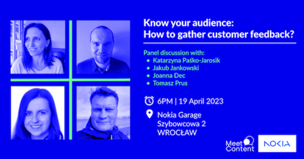
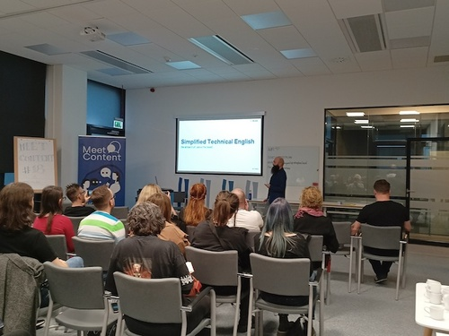

To już mała tradycja, że co kilka tygodni zapraszamy Was na kolejną edycję
MeetCotent do Wrocławia. Nie inaczej będzie teraz - nowa odsłona meetupu już 19
kwietnia. Poniżej najważniejsze informacje na jej temat, a także podsumowanie
tego, co działo się na spotkaniu w marcu.

Zanim jednak przejdziemy do konkretów chcielibyśmy podzielić się z Wami
informacją, że nasz portal objął patronatem medialnym meetupy organizowane przez
społeczność MeetContent z Wrocławia. Spodziewajcie się więc regularnych
artykułów o tym co dziać się będzie w światku wrocławskiego techwritingu oraz
relacji z tego, jak przebiegły kolejne edycje spotkań. A co nas czeka już za
kilka tygodni?

### **Kwiecień - Nokia Garage**

Kwietniowy MeetContentWRO odbędzie się w **Nokia Garage**. Wraz z organizatorami
mamy nadzieję, że to niesamowite miejsce zainspiruje wszystkich uczestników do
wyjścia poza utarte schematy. W Nokii wróci format dyskusji panelowej.

Tym razem tematem rozmowy będzie: _Know your audience - How to gather customer
feedback?_

Odbiorcy to punkt centralny dla każdego twórcy treści. Wiemy, że od odbiorców
powinien zaczynać się każdy nowy dokument i na nich się kończyć. Robimy to też
dla siebie - w końcu żaden autor nie chce pisać do szuflady 🙃

W rozmowie w Nokia Garage wezmą udział doświadczeni specjaliści i managerowie od
treści  technicznych:

- [Katarzyna Paśko-Jarosik](https://www.linkedin.com/in/katarzyna-pa%C5%9Bko-jarosik-49413116/) -
  obecnie _Documentation Team Manager_ w Nokii. Wcześniej również _Technical
  Editor_, _Technical Writer_, a potem _Product Owner_. Kasia jest również jedną
  ze współorganizatorek MeetContentWRO.
- [Jakub Jankowski](https://www.linkedin.com/in/jakub-jankowski-91a458144/) -
  obecnie _Documentation Manager_ w Nokii, mocno zaangażowany w różne inicjatywy
  związane z badaniem satysfakcji i opinii klientów. Zaczynał w Nokii w 2008
  jako _Technical Writer_, potem _Technical Manager_, gdzie skupiał się głównie
  na współpracy z klientami i zbieraniu feedbacku.
- [Joanna Dec](https://www.linkedin.com/in/joanna-dec-01718394/) - obecnie _Area
  Product Owner_ w Nokii. Joanna zaczynała tam od stanowiska _Project Support_ w
  dziale Customer Documentation, gdzie również pracowała jako _Technical
  Writer_.
- [Tomasz Prus](https://www.linkedin.com/in/tomasz-prus-4b09b01a/) - obecnie
  _Experience Design Manager_ w Atlassian. Pasjonat treści technicznych i
  wszystkiego, co z nimi związane. Tomek jest szkoleniowcem ITCQF i wykładowcą
  Komunikacji Technicznej na Akademii Finansów i Biznesu Vistula oraz
  współorganizuje MeetContentWRO.

Jak widać, zasoby wiedzy i doświadczenia są ogromne. Co z kolei zapowiada
ciekawą dyskusję, w której między innymi poruszone zostaną tematy takie jak:

- Jakie są metody zbierania feedbacku od klientów?
- Czego można dowiedzieć się analizując dane z Google Analytics?
- Jak często pytać o feedback?
- Jak przygotować się do sesji feedbacku z klientem?
- No i wisienka na torcie: Czy klient ma zawsze rację? 😉

W imieniu organizatorów zapraszamy Was serdecznie na: **_Know your audience -
How to gather customer feedback?_**

### **Gdzie i kiedy**

19 kwietnia 2023 godzina 18:00

Nokia Garage, ul. Szybowcowa 2

[Formularz zgłoszeniowy](https://docs.google.com/forms/d/e/1FAIpQLSfgDsAJS5P14atsjU_PqOHumXMVgf6ycAcm7TqcoH42607XzA/viewform)

### **Marzec - Etteplan**

W marcu spotkaliśmy się w firmie **Etteplan** na pogaduchy o _Simplified
Technical English_ (STE). Tytuł prezentacji był wymowny, ale na koniec wszyscy
rozumieliśmy dlaczego: _STE - How to control the beast_. Prowadzący,
[Jan Sosna](https://www.linkedin.com/in/jan-sosna/) i
[Barbara Kardel-Piątkowska](https://www.linkedin.com/in/barbara-kardel-piatkowska/)
opowiedzieli fascynującą historię o powstaniu STE, a właściwie o potrzebie,
która go stworzyła. STE to podstawa w branżach, w których właściwe zrozumienie
dokumentacji technicznej jest kluczowe dla ludzkiego zdrowia i życia.

Z dużą dawką humoru i dystansu, aplikowaną przez prowadzących, dowiedzieliśmy
się o podstawowych zasadach i poznaliśmy barwne przykłady.

Język STE polega między innymi na:

- posługiwaniu się konkretnymi instrukcjami,
- używaniu prostych czasów i strony czynnej,
- eliminacji synonimów i wszelkiego żargonu,
- unikaniu zbitek rzeczownikowych,
- braku średnika 😀,
- używania standardowego słownika, który zawiera zatwierdzone i niezatwierdzone
  zwroty i słowa.

Wszystko to wydawało się niezwykle ograniczające dla swobody Technical Writerów.
Jednak oboje prowadzący podkreślali, że STE można dostosować do potrzeb
konkretnego projektu. Na przykład za pomocą specyficznych dla klienta nazw
technicznych czy stosowania glosariusza klienta.

Po fantastycznym wystąpieniu wszyscy rozumieliśmy STE nieco lepiej: jego wady,
zalety i właściwe środowisko implementacji. W pytaniach od uczestników pojawiały
się głównie kwestie łatwości lokalizowania treści w STE a także czy może być
stosowany do dokumentowania software’u?

Pytanie pozostało otwarte. STE to świetne narzędzie i, podobnie jak każde inne,
ma swoje spektrum zastosowań. A software, jak to software, rządzi się swoimi
prawami… 😉

Jeśli zainteresował Was temat STE, tu możecie znaleźć aktualną specyfikację:
[https://www.asd-ste100.org/](https://www.asd-ste100.org/)

Dziękujemy za udział i widzimy się **19 kwietnia** w **Nokia Garage**!

---

Artykuł powstał we współpracy z Moniką Mrozek z MeetContent.
