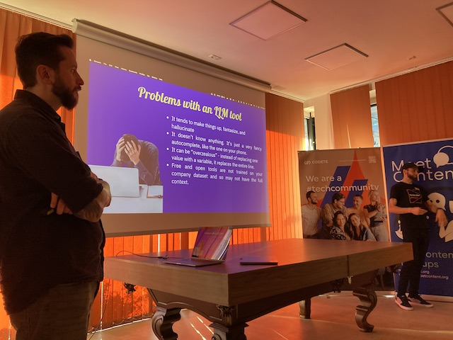
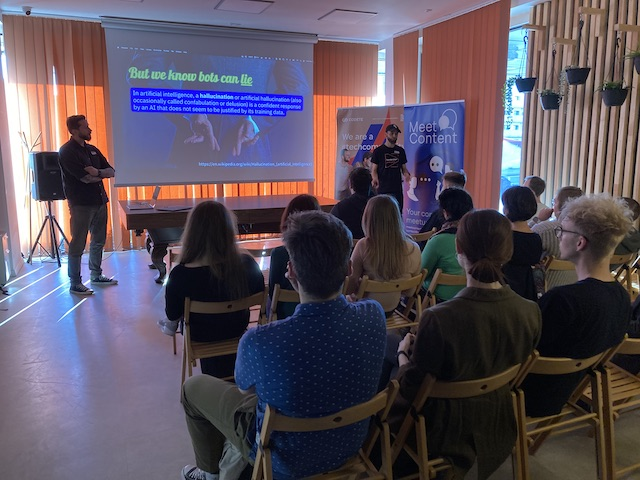
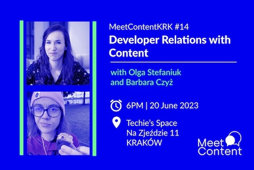

Za nami pierwsza edycja MeetContent Kraków, która odbyła się po pandemii. Poniżej kilka słów podsumowania oraz zapowiedź tego co czeka nas w czerwcu.

Po dłuższej przerwie, MeetContentKRK powrócił z nowymi tematami i przestrzenią, w której wszyscy entuzjaści contentu mogą wymieniać się doświadczeniami i pomysłami.

### **Maj - podsumowanie**

Tematem spotkania, które odbyło się 9 maja w [Techie’s Space](https://www.facebook.com/techies.krakow/) był jeden z najbardziej “hot” tematów ostatnich tygodni, czyli sztuczna inteligencja i jej rola w tworzeniu treści.

 Prelegentami podczas majowej edycji MeetContentKRK byli założyciele i prowadzący podcastu [TechWriter koduje](https://techwriterkoduje.pl/): Michał Skowron i Paweł Kowaluk, którzy na co dzień wspomagają tech writerów i tworzenie dokumentacji zajmując się narzędziami do dokumentacji w Guidewire Software, a temat ich prezentacji to: _Don't panic! How to ride the wave of AI in technical communication and not drown_. Prezentacja przyniosła nam dużą dawkę nowych informacji i odpowiedzi na kilka ciekawych pytań:

- Najważniejsze pytanie: Czy AI zabierze nam pracę? Zapytaliśmy o to Bing Chata i (ponoć szczerze) odpowiedział, że absolutnie nie ;) Tak naprawdę AI ma nam tylko pomóc w naszych codziennych zadaniach, a nie przejmować nasze obowiązki.
- Co to jest AI i co oznaczają pojęcia takie jak Generative Adversarial Networks i Large Language Models.
- W czym AI może nam pomóc?
    - **Gumowa kaczuszka**: Borykasz się z trudnym tematem? A może masz jakiś pomysł, ale nie wiesz czy jest on sensowny? Wykorzystaj AI do przedyskutowania swojego rozwiązania i uzyskania feedbacku! Pozwoli Ci to na rozszerzenie spojrzenia na problem i uzyskania dodatkowych pomysłów jak go rozwiązać.
    - **“Writing buddy”**: Wykorzystaj AI do tworzenia abstraktów lub tekstów marketingowych a nawet struktury dokumentacji. AI może ci pomóc również w wygenerowaniu fragmentów kodu, który potem umieścisz w dokumentacji.
    - **Proofreading**: AI może pomóc ci w sprawdzeniu błędów w tekście, zaproponować inne opcje, usprawnienia które sprawią, że dokument będzie jeszcze lepszy.
    - **Interakcja z użytkownikami**: Bot może odpowiadać na pytania użytkowników, przesyłać odpowiednie dokumenty, instruować jak wykonać zadania.

Nasi prezenterzy odpowiedzieli również na najbardziej popularne pytania od publiczności, między innymi:

- jak wykorzystać pluginy i czy warto je tworzyć,
- czy tylko najlepsi twórcy treści zostaną na rynku, podczas gdy całą resztę przejmie AI  

Odpowiadają na ostatnie pytanie w wielkim skrócie, AI może nam pomóc w automatyzacji zadań, ale nie będzie tak kreatywne i empatyczne jak technical writer.

Dodatkowe materiały: [https://www.canva.com/design/DAFhwQaRefE/Mp2-2koQ8VD44ye2f6eRLw/view](https://www.canva.com/design/DAFhwQaRefE/Mp2-2koQ8VD44ye2f6eRLw/view)

### **Czerwiec - co nas czeka?**

Następne spotkanie odbędzie się **20 czerwca** o godzinie **18:00**, ponownie w [Techie’s Space](https://www.facebook.com/techies.krakow/), a jego tytuł to: _Developer Relations with Content._

Termin _Developer Relations_ zyskuje ostatnio coraz większe uznanie w świecie IT, dlatego warto dowiedzieć się o nim czegoś więcej.

Czym zajmuje się DevRel, komu jest to potrzebne oraz jak Developer Relations może współpracować z twórcami treści - to podstawowe pytania, na które postarają się odpowiedzieć Olga Stefaniuk oraz Barbara Czyż. Dziewczyny podadzą także kilka przypadków użycia DevRel z własnej, codziennej codziennej pracy, a także odpowiedzą na wszystkie pytania :).

Olga Stefaniuk - Olga obecnie cieszy się pracą jako Developer Advocate w Box. Swoje doświadczenie zdobywała pracując jako Front-end Developer z naciskiem na tworzenie aplikacji w frameworku Vue.js oraz poprawę dostępności sieci. Jest także liderem organizacji non-profit o nazwie girls.js, która pomaga kobietom w nauce podstaw JavaScript.

Barbara Czyż - Barbara jest dociekliwą technical writerką, pasjonującą się podejściem docs-as-code i światem API. Po przygodach z DITA i Markdown dołączyła do Boxa, by tworzyć dokumentację programistyczną i zacieśniać relacje z API i kodem. Jest także współorganizatorką MeetContentKRK.

Pamiętajcie, by zgłosić chęć udziału w wydarzeniu poprzez wypełnienie [formularza](https://docs.google.com/forms/d/e/1FAIpQLScQhT4qzT3kklyT5RTyJ_1dQe20ScUrD9ElgCvNjTyfciMj3g/viewform).

Udanego spotkania!

* * *

Artykuł powstał w ramach współpracy z Barbarą Czyż z MeetContentKRK
