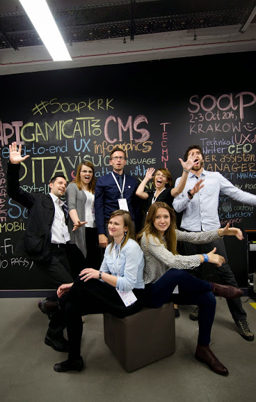

Co mają ze sobą wspólnego mydło, kolor różowy, dawna fabryka kabli, white terrier, hulajnoga, kawa i selfie w toalecie? Na pierwszy rzut oka wydaje się, że niezbyt wiele. Jednak uczestnicy tegorocznej konferencji [soap!](http://soapconf.com/) doskonale wiedzą o co chodzi. Dalsza część artykułu powinna Wam dać odpowiedź skąd się wziął ten zagadkowy zestaw.

soap! 2014 odbywał się w siedzibie [hub:raum](https://www.hubraum.com/), która mieści się przy ul. Przemysłowej 12 w Krakowie. Jest to budynek dawnej fabryki kabli, który został zaadaptowany na przestrzenie biurowe. W związku z tym panuje tam przemysłowy klimat, który według nas dodał tylko uroku całemu wydarzeniu. Ciekawe było to, że konferencja toczyła się w aktywnej strefie co-workingu wypełnionej różnego rodzaju osobnikami, nierzadko ze słuchawkami na uszach. Jeden z takich osobników do pracy przyjeżdża na hulajnodze, a drugi dzieli trudy zarabiania na chleb z white terrierem, który lubi gonić za piłką. O dziwo, te ciekawostki nie zakłócały przebiegu konferencji.

## Wchodzimy

W tym roku mieliśmy zaszczyt być oficjalnym patronem medialnym soap!, dlatego nie próbowaliśmy się spóźnić tak jak w zeszłym roku (dla tych, którzy nie pamiętają, przypominamy, że się nie udało :)) Wdrapaliśmy się schodami na ostatnie piętro. Przy recepcji przywitały nas uśmiechnięte panie, które wydawały pakiety dla uczestników. Były kartki do notowania, naklejki, identyfikator, czyli to co trzeba. Połączenie identyfikatora z programem konferencji to strzał w dziesiątkę. Złapaliśmy jakiś długopis, których było pod dostatkiem w różnych kolorach i formach i uderzyliśmy w kierunku strefy bufetowej w celu uzupełnienia braków kofeiny. Nie było się do czego przyczepić - kawa była dobra, ciepła i w wystarczającej ilości. Zajęliśmy miejsce i rozpoczęliśmy czekanie na mowę otwierającą. Czas oczekiwania spożytkowaliśmy na kontemplację walorów estetycznych otoczenia. Podłoga, przełączniki, kurtyny, surowy beton przywodzące na myśl magazyn marketu budowlanego zostały okraszone nowoczesnymi elementami. Stylistyka modna i przyjemna dla oka, dobrze współgrająca z oprawą graficzną konferencji.

## Zaczęło się

Miejsce w centrum uwagi przejął jeden z twórców soap!, [Paweł Kowaluk](http://soapconf.com/team/), któremu przypadła rola wygłoszenia mowy otwierającej. Hasłem przewodnim tegorocznej edycji soap! było "a clean start". Paweł starał się przybliżyć uczestnikom całą ideę oraz przedstawić obecne trendy w tworzeniu dokumentacji. Dziedzina komunikacji technicznej w Polsce jeszcze raczkuje, dlatego stoimy przed zadaniem nadania jej kształtu. Jest to ciężkie zadanie, bo nie za bardzo jest na czym się oprzeć. Paweł starał się nas przekonać, że taki stan rzeczy jest też, albo przede wszystkim, pozytywny, bo nie mamy na sobie ciężaru przeszłości, tylko możemy ukształtować polską komunikację techniczną tak jak chcemy. Kolejnym tematem jaki poruszył były kierunki, w których zmierza dokumentacja techniczna. Przede wszystkim powinna się skupiać na kliencie, a nie na produkcie. Użytkownicy oczekują informacji, które pozwolą im rozpocząć szybko pracę z produktem, które pojawiają się wtedy kiedy ich potrzebują i które można łatwo wyszukać. Idąc dalej, Paweł pokusił się o tezę, że czasami można nawet darować sobie dostarczanie dokumentacji do produktu. Jako przykład podał twórców aplikacji [Omnipaste](https://www.omnipasteapp.com/), z którymi współpracował. Ich celem było stworzenie przejrzystego interfejsu użytkownika, który nie wymaga dokumentacji w tradycyjnym rozumieniu tego słowa. Zamiast tego na stronie produktu znajdują się krótkie prezentacje multimedialne oraz zwięzłe opisy pokazujące możliwości produktu. Ciekawy punkt widzenia. Niekoniecznie takie podejście można zastosować w przypadku skomplikowanych rozwiązań biznesowych, ale warto pamiętać, że opasłe instrukcje opisujące każdy detal produktu nie zawsze są pomocne.

## Tymczasem w toalecie

Zazwyczaj toaleta nie znajduje się w opisach konferencji dotyczących komunikacji technicznej, jednak w wypadku soap! musieliśmy zrobić odstępstwo. Nie mamy tu na myśli zachwycania się elementami armatury. Organizatorzy prawdopodobnie wyszli z założenia, że każda część przestrzeni musi zostać wykorzystana do maksimum i dlatego przeznaczyli toaletę na produkcję selfie (podejrzewamy, że [groufie](http://www.dailytech.com/Huawei+Trademarks+Groufie+a+Panoramic+Selfie/article34889.htm) też było dozwolone ;)). Na lustrze w toalecie znajdowała się karteczka zachęcająca do przełamania nieśmiałości i trzasnięcia sobie foci. Dla amatorów mocniejszych wrażeń przygotowane były akcesoria, takie jak okulary do pływania czy kask rowerowy. Okazało się, że wiele osób podjęło wyzwanie. Efektów możecie szukać na Twitterze na profilu [@SoapConf](https://twitter.com/SoapConf) lub używając hashtaga [#soapkrk](https://twitter.com/hashtag/soapkrk).

## Zacny networking

Nie samymi prezentacjami człowiek żyje, dlatego organizatorzy zadbali również o mniej formalną stronę konferencji. Po pierwszym dniu można było wymienić doświadczenia z innymi uczestnikami przy kieliszku wina, a po drugim dniu w trakcie imprezy. Wszyscy wiemy, że nic tak nie łączy jak wspólne toasty za dobry [kontent](http://techwriter.pl/langlydz-part-najn/).

## Garść faktów

A teraz czas na trochę twardych faktów. Dane otrzymaliśmy od organizatorów, więc nie jest to nasza wesoła twórczość tak jak to co napisaliśmy powyżej ;) Pierwszy (darmowy) dzień konferencji przyciągnął 142 uczestników, drugi (płatny) dzień 98. Ogółem spożyto około 400 kubków kawy i herbaty oraz około 700 szklanek wody i soku. Dwa dni konferencji dostarczyły nam 18 prezentacji i 3 warsztaty, które poprowadziło ogółem 25 mówców i trenerów z Polski, Niemiec, Francji, Wielkiej Brytanii, Hiszpanii, Austrii, Kanady, Stanów Zjednoczonych i Indii. Wśród uczestników znaleźli się przedstawiciele firm takich jak Dassault Systems, IBM, VSoft, Electrolux, Ericpol, Avast Software, Interlingua Language Services GmbH, Autodesk, Roche, Motorola Solutions czy Google. Spektrum poruszonych tematów obejmowało m.in. dokumentację dla API, grywalizację, UX, DITA, opowiadanie historii, silosy, strategię zarządzania treścią oraz Agile.

## Podsumujmy

Nasze ogólne odczucia są zdecydowanie pozytywne. Mówimy tu o kwestiach organizacyjnych, prezentacje będziemy przedstawiać w kolejnych artykułach. Widać, że organizatorzy angażują się z zapałem w całe wydarzenie i podchodzą do tego profesjonalnie, ale bez tzw. kołka w... co doskonale widać poniżej.

 Były drobne niedociągnięcia, ale nic takiego o czym warto byłoby się rozpisywać. Poza tym takie techniczne potknięcia są wpisane w obraz tego typu wydarzeń. Krótko mówiąc, kawa dobra, jadło smaczne, ludzie fajni, atmosfera luźna i przyjazna. Potwierdzamy to o czym śpiewały Fasolki, mydło zdecydowanie lubi zabawę. Na pewno wrócimy w przyszłym roku.
