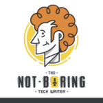

Żyjecie w biegu i coraz częściej doskwiera Wam tzw. "niedoczas". Ciągle gdzieś chodzicie, jeździcie i biegacie. Chcecie pogodzić ze sobą pracę zawodową, życie rodzinne, aktywność fizyczną i rozwój swoich umiejętności, ale doba ma tylko 24 godziny.

Jeśli rzadko kiedy macie czas usiąść spokojnie i przeczytać branżowy artykuł lub książkę to może opcja nabywania wiedzy poprzez słuchanie okaże się dla Was alternatywą wartą rozważenia. Słuchać można podczas podróży do pracy, ćwiczeń i leżakowania dzięki czemu łatwiej wpleść taki typ uczenia się w wypełniony po brzegi obowiązkami dzień. W tej części cyklu "Naucz się sam(a)" przedstawiamy zestawienie ciekawych według nas źródeł wiedzy słuchanej.

# Podcasty

Na początek wszystkim dobrze znane podcasty, czyli publikacje dźwiękowe w formie regularnych odcinków.

## Write the Docs Podcast

[http://podcast.writethedocs.org](http://podcast.writethedocs.org)

Podcast prowadzony jest przez Jareda Morgana mieszkającego w Australii, Chrisa Warda mieszkającego w Niemczech oraz dobrze wszystkim znanego Toma Johnsona z USA. Ich największym wyzwaniem jest znalezienie odpowiedniego momentu na nagranie podcasta, ze względu na tak różne strefy czasowe. Oprócz prowadzących w każdym odcinku pojawiają się goście. Poruszane są takie tematy jak tworzenie dokumentacji, która jest bardziej uczłowieczona, miejsce Tech Writerów w organizacji czy używanie aplikacji Postman do tworzenia API i dokumentacji.

Podcast jest otwarty dla każdego, więc jeśli tylko macie ochotę to możecie skontaktować się z zespołem, żeby zaproponować temat na kolejny odcinek albo zgłosić chęć udziału.

## Content Content Podcast

[http://edmarsh.com/content-content-podcast](http://edmarsh.com/content-content-podcast)

Prowadzony przez Eda Marsha, doświadczonego Tech Writera, który do rozmowy zaprasza specjalistów zajmujących się szeroko pojętą treścią. Podcasty są prowadzone w formie luźnych pogawędek z gośćmi, ale nie oznacza to, że nie będziecie w stanie z nich wyciągnąć wartościowych informacji.

## The CherryLeaf Podcast

[https://cherryleaf.podbean.com](https://cherryleaf.podbean.com)

Podcast prowadzony przez aktywnie udzielającego się w środowisku tech comm Ellisa Pratta, właściciela firmy Cherryleaf, który jest dużym fanem chatbotów. Odcinki są relatywnie krótkie przez co łatwo je odsłuchiwać na bieżąco. W ostatnim czasie przewijały się tematy takie jak narzędzia do tworzenia e-learningów, bieżące trendy w komunikacji technicznej czy modelowanie procesów biznesowych.

## The Content Strategy Experts Podcast

[https://www.scriptorium.com/content-strategy-experts-podcast](https://www.scriptorium.com/content-strategy-experts-podcast)

Podcast tworzony przez ekspertów z firmy Scriptorium, którzy specjalizują się w strategii tworzenia treści i standardzie DITA. Dlatego też większość odcinków podcasta obraca się właśnie wokół tych zagadnień. Firmę możecie kojarzyć z takich kultowych publikacji jak "Technical Writing 101" i "Content Strategy 101", które swoją drogą można ściągnąć za darmo w formacie EPUB z [ich strony](https://www.scriptorium.com/books/).

## 10-Minute Tech Comm

[https://www.podbean.com/podcast-detail/36ttb-52a6a/10-Minute+Tech+Comm](https://www.podbean.com/podcast-detail/36ttb-52a6a/10-Minute+Tech+Comm)

Podcast tworzony przez University of Alabama in Huntsville (UAH). Dziesięciominutowe wywiady z osobami związanymi z branżą tech comm - pracownikami naukowymi oraz osobami pracującymi w komunikacji technicznej na co dzień. Ciekawy akcent akademicki na tle innych podcastów. Niektórzy goście to osoby z tytułem doktora, które oferują naukowe spojrzenie na pewne kwestie związane z naszą branżą.

## The Not-Boring Tech Writer Podcast

[https://www.thenotboringtechwriter.com/](https://www.thenotboringtechwriter.com/)

Stworzony przez Jacoba Mosesa, którego misją jest pokazanie światu, że bycie Tech Writerem nie jest nudne. Każdy odcinek podcasta ma na celu nauczenie słuchaczy jakiejś umiejętności. Przewinęły się takie tematy jak single sourcing, współpraca pomiędzy działem dokumentacji i wsparcia technicznego czy typy wiedzy potrzebne Tech Writerom, żeby odnieść sukces w swojej roli. Ciekawi goście i wartościowe porady.

Podcast był nagrywany dość krótko i został zawieszony w 2016 roku. Nieoficjalnie udało nam się dowiedzieć, że autor planuje powrócić do nagrywania w bliskiej przyszłości. Trzymamy kciuki, żeby się udało.

Poza wyżej wymienionymi podcastami, warto wspomnieć też o dobrze wszystkim znanym blogu [I'd Rather Be Writing](http://idratherbewriting.com/). Co prawda, Tom Johnson nie ma swojego własnego podcasta, ale niektóre jego artykuły są dostępne w wersji audio (na przykład [ten](http://idratherbewriting.com/2017/12/01/how-to-become-a-voracious-reader/)).

I jeszcze mała ciekawostka. Nasz dobry kolega Paweł Kowaluk miał okazję być gościem podcasta Write the Docs oraz Content Content. Poniżej podajemy linki do nagrań:

- [Write the Docs odcinek 7](http://podcast.writethedocs.org/2017/07/03/episode-7-machine-automation-and-poland/)
- [Content Content odcinek 16](http://edmarsh.com/2017/06/27/like-thomas-pynchon-pawel-kowaluk-content-content-episode-16)

# Poczytaj mi...

Dzieciom czytają rodzice (a jeśli tego nie robią to powinni ;) ), a nam może poczytać syntezator mowy. Zamiana tekstu na mowę (text to speech) to kolejna oprócz podcastów opcja na poszerzanie wiedzy poprzez słuchanie. Dzięki temu rozwiązaniu możecie odsłuchiwać książki i artykuły, których nie macie czasu przeczytać. Oczywiście ta metoda ma swoje ograniczenia. Jeśli tekst jest uzupełniony dużą ilością grafiki, która jest kluczowa dla zrozumienia przekazu, wtedy odsłuchanie artykułu może mijać się z celem. Jednak istnieje cała masa materiałów, które syntezator mowy może nam przeczytać i będzie to miało dla nas wartość.

Na rynku istnieje mnóstwo aplikacji przerabiających tekst na mowę. Na przykład, popularne czytniki PDF [Foxit Reader](https://www.foxitsoftware.com/pdf-reader/) i [Adobe Reader](https://acrobat.adobe.com/pl/pl/acrobat/pdf-reader.html) mają wbudowaną opcję czytania tekstu na głos. Jeśli używacie Androida to mamy dla Was jedną aplikację, która całkiem dobrze sobie radzi z odczytywaniem tekstu - [@Voice Aloud Reader](https://play.google.com/store/apps/details?id=com.hyperionics.avar&hl=pl).

Małą niedogodnością jest to, że darmowa wersja wyświetla nam reklamy. Ale za niewiele ponad 20 zł możecie kupić wersję bez reklam. Po zainstalowaniu, aplikacja pojawia się jako jedna z dostępnych opcji w funkcji "Udostępnij". Po jej wybraniu tekst artykułu czy strony zostanie załadowany do aplikacji. Potem wystarczy już tylko nacisnąć przycisk odtwarzania. Oprócz tego możemy zbudować sobie listę artykułów do przeczytania, wkleić tekst bezpośrednio do aplikacji lub załadować plik PDF z pamięci telefonu. Interfejs graficzny programu nie powala, ale nie dajcie się zwieść - aplikacja ma spore możliwości.

Istnieje wiele innych aplikacji, które być może są lepsze lub tańsze, ale wspominamy akurat o tej, ponieważ od jakiegoś czasu sami jej używamy. Wiele razy umilała nam podróż czytając artykuły branżowe i uważamy, że radzi sobie z tym zadaniem całkiem nieźle.

Jeśli pominęliśmy jakiś ciekawy podcast lub inne rozwiązanie, które pozwala poszerzać wiedzę o tech commie poprzez słuchanie, to dajcie nam znać w komentarzach lub podzielcie się taką wiedzą z innymi na Facebooku, w prowadzonej przez nas grupie ["Tworzenie dokumentacji"](https://web.facebook.com/groups/342747819400007/).
