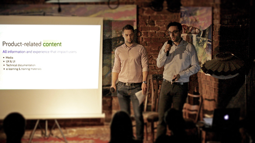

Dopiero co [opisywaliśmy](http://techwriter.pl/relacja-z-kolejnej-edycji-krakowskiego-meetcontent/) trzecie krakowskie spotkanie MeetContent, a już mamy dla Was kolejne sprawozdanie. Tym razem publikujemy jeszcze ciepłą relację z meetupu inaugurującego wrocławski cykl spotkań MeetContent. Tekst został przygotowany przez organizatorów, my tylko puszczamy go dalej w świat :) Miłej lektury!

\*\*\*

Czym jest „content”? Na czym polega praca z „contentem”? Jak wygląda kariera w pracy z „contentem”?

Na takie pytania musieli odpowiedzieć paneliści na MeetContentWRO #1, czyli pierwszej edycji wrocławskiego MeetContent.

Wrocławskie środowisko TechComm pokazało, że nie śpi.

Pierwszy meetup dotyczący pracy z contentem został zorganizowany przez koordynatorów wrocławskiej edycji meetupów MeetContent, Daniela Barrio Fierro, Wojtka Baranowskiego i Tomka Prusa.

Klimat krakowskiego „Artefakt Cafe” udało się odnaleźć we wrocławskiej „Mleczarni”, a liczba gości pokazała, że we Wrocławiu jest spore zainteresowanie tematami TechComm.

Meetup miał formę panelu dyskusyjnego prowadzonego przez Daniela i Wojtka. Panelistami byli: **Erin Vang** – menedżerka działu technical communication w Dolby Laboratories, **Gosia Radymiak** – założycielka soap! technical communication (soapconf.com i meetcontent.org), **Wojtek Aleksander** – specjalista od UX w GetResponse oraz **Tomek Prus** – menedżer w dziale dokumentacji w Unit4.

W formularzu rejestracyjnym goście odpowiadali na pytanie czym jest dla nich content:

„A set of assets that deliver experience”

„The words I write, the knowledge you gain”

„A piece of info that satisfies users’ needs”

„Content is what I can use to do things”

Ten zestaw odpowiedzi pokazuje o jak rozległym i ciekawym pojęciu mówimy.

Na szerokim spojrzeniu na content skupia się też działalność grupy MeetContent, której głównymi tematami spotkań mają być zarówno dokumentacja techniczna, jak i „media”, UX oraz e-learning.

Na  początku paneliści podzielili się z uczestnikami swoją historią w pracy z contentem. Jak można się domyśleć, wspólnym mianownikiem dla wszystkich był technical writing. Jednocześnie zwrócili uwagę, jak szerokie perspektywy otwiera taka kariera – czy to wśród stanowisk technicznych (jak testerzy oprogramowania czy software developerzy), czy stanowisk menedżerskich lub związanych z UX.

Co lubicie w pracy z contentem? Wojtek opowiedział o możliwości wpływania na ludzi przy przy pomocy informacji oraz o elastyczności jaką ma w pracy. Tomek stwierdził, że nigdy nie nudził się w pracy, ponieważ zawsze mógł pracować nad wieloma różnymi rzeczami. Erin podsumowała, że najprzyjemniejsza jest możliwość współpracy ze wspaniałymi ludźmi.

Dowiedzieliśmy się również, na jakie cechy zwracają uwagę menedżerowie w czasie rekrutacji na stanowisko w pracy z contentem. Erin zawsze poszukuje ludzi, którzy potrafią pokazać swoją osobowość i potrafią się szybko uczyć. Była również pozytywnie zaskoczona, że w Polsce można spotkać tak dużo ludzi dobrze przygotowanych do pracy w technical writingu. Z kolei Tomek stara się budować zespół składający się z ludzi posiadających zróżnicowane umiejętności, a cechą wspólną powinno być „detektywistyczne” podejście do pracy. Gosia zwróciła również uwagę, jak znajomość języka obcego otwiera szerokie możliwości w karierze związanej z contentem.

Ciężkim tematem, z którym musieli zmierzyć się paneliści było pytanie o najtrudniejsze wyzwanie z jakim spotkali się w trakcie swojej kariery. Usłyszeliśmy o problemach ze zmianą mentalności ludzi przy wprowadzaniu standardu DITA, niedocenianiu pracy, ale także o tym jak mały błąd w dokumentacji może spowodować zagrożenie życia inżyniera montującego system radiowy na maszcie telekomunikacyjnym.

Na koniec padły pytania od publiczności.

„Trzeba być twardym jak wiking, który bije się o swoje” odpowiedział Wojtek na pytanie o to jak w korporacji zawalczyć o możliwość uzyskania feedbacku od klienta na temat dokumentacji.

„Wiking musi mieć również dobrą łódź w postaci wsparcia menedżerskiego”, słusznie zauważył Tomek. Wszyscy paneliści zgodzili się, że jest to trudny temat i warto pomyśleć o takich rozwiązaniach jak ankiety.

Dyskusję zamknęło pytanie o przyszłość.

Paneliści stwierdzili, że na pewno warto tworzyć informację w taki sposób, aby nie była zależna od kontekstu – dzięki temu będzie ona zawsze aktualna, niezależnie w jakiej postaci dostarczymy ją odbiorcy. A przedstawienie informacji w prosty sposób pozwala czynić świat lepszym :)

Z pewnością nie było to spotkanie które pozwoliło „odkryć Amerykę”, ale też nie taki był cel tego panelu. Dzięki ciekawym rozmówcom udało się pokazać ludzką stronę pracy z contentem, a wszyscy goście mogli poczuć, że poruszane były problemy, które dotykają wszystkich, niezależnie od firmy czy branży.

Jednocześnie sądzę, że każdy mógł wynieść z tego spotkania coś dla siebie, jakąś złotą myśl lub celną uwagę. A najważniejszy cel – pokazanie, że we Wrocławiu też jest środowisko TechComm – z pewnością udało się spełnić.

\*\*\*

Zachęcamy do zaglądania na [stronę społeczności MeetContent](http://meetcontent.org/), gdzie znajdziecie informacje o kolejnych wydarzeniach we Wrocławiu i Krakowie, a także formularz do zgłaszania własnych wystąpień. Wszystkie pytania i uwagi możecie przesyłać na adres **[contact@meetcontent.org](mailto:contact@meetcontent.org)**.
