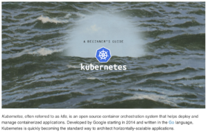
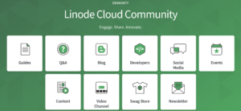

Mamy dziś dla Was propozycję ciekawej, wirtualnej biblioteki, której zasoby możecie nie tylko przeglądać, ale też tworzyć, nie wstając z fotela. Szczegóły poniżej. Zapraszamy!

### Linode - informacje ogólne

[Linode](https://www.linode.com/) to amerykańska firma oferująca usługi związane z chmurą obliczeniową. Jest obecna na rynku od 2003 roku. Celem firmy jest dotarcie do jak najszerszej liczby klientów, którzy w prosty i przyjazny użytkownikowi sposób będą mogli korzystać z usług wirtualnej chmury stworzonej przez pracowników Linode.

### Linode a technical writing

Firma Linode posiada szeroką ofertę usług związanych z różnymi technologiami dlatego jednym z ważnych elementów jej portfolio jest dobra dokumentacja. Jej pracownicy nie tylko piszą ją dla konkretnych produktów oferowanych przez firmę, ale także tworzą ogólnie dostępną bazę wiedzy, którą postaramy się przybliżyć w dalszej części tekstu.

Jeśli posiadacie doświadczenie w tworzeniu dokumentacji technicznej i zainteresują Was zasoby wiedzy oferowane przez Linode możecie sami zostać członkami zespołu. Jak to zrobić?

### Pisz dla Linode

[Pisz dla Linode](https://www.linode.com/lp/write-for-linode/) to nazwa programu skierowana do freelancerów z doświadczeniem w pisaniu dokumentacji. Osoby zainteresowane będą tworzyć materiały do Biblioteki Linode, o której przeczytacie poniżej. W zależności od rodzaju dostarczonego tekstu, w ramach programu można zarobić conajmniej $100 za aktualizację istniejącego dokumentu lub minimum $300 za w pełni autorski tekst.

#### Jak dołączyć do programu?

Wystarczy wypełnić [formularz](https://www.linode.com/lp/write-for-linode/#write-for-linode-form), w którym, poza podstawowymi danymi o sobie, opiszecie krótko swoje doświadczenie zawodowe oraz dołączycie próbkę tekstu. Obecnie w centrum zainteresowania znajdują się teksty o Kubernetes, Linux oraz bazach danych.

Jeśli zgłoszenie zostanie przyjęte przed publikacją czekają Was następujące kroki:

1. Współpraca z zespołem pracującym w Linodę nad tematem zaproponowanym przez Was lub zasugerowanym przez firmę. Otrzymacie [The Linode Writer's Guide](https://www.linode.com/docs/linode-writers-formatting-guide/), listę przydatnych zwrotów, które możecie użyć w tekście, wytyczne odnośnie stylu, jaki powinna mieć dokumentacja oraz instrukcje jak umieścić tekst w repozytorium GitHub.
2. Praca nad poprawkami w proponowanym tekście.
3. Publikacja tekstu wraz z promocją w social mediach oraz wypłata rzecz jasna ;-).

Osoby, które będą chciały powtórnie napisać tekst dla Linode nie muszą przechodzić weryfikacji. Wystarczy, że zgłoszą się z pomysłem do osoby, z którą już współpracowały.

### Biblioteka Linode

Firma posiada obszerną bazę z dokumentacją techniczną, zawierającą liczne przewodniki, oraz dokumenty instruktażowe. Obecnie dysponuje ponad tysiącem pozycji, a korzysta z niej ponad milion czytelników miesięcznie. Należy jednak zaznaczyć, że aby mieć dostęp do części materiałów należy wykupić subskrypcję.

#### Co znajdziemy w bibliotece?

W centrum zainteresowania autorów z Linode jest dokumentacja open-source dotycząca między innymi:

- narzędzi DevOps (Kubernetes, Docker itp.)
- infrastruktury (serwery webowe i aplikacyjne)
- przechowywania danych (bazy danych, block storage, object storage, szeroko rozumiany cloud storage)
- różne języki programowania
- Linux

Typy dokumentacji w bibliotece Linode:

- Tutoriale - na przykład: [Solving Real World Problems With Bash Scripts - A Tutorial](https://www.linode.com/docs/development/bash/solving-real-world-problems-with-bash-scripts-a-tutorial/)

- Wprowadzenia - na przykład: [A Beginner's Guide to Kubernetes](https://www.linode.com/docs/kubernetes/beginners-guide-to-kubernetes/)

- Przewodniki typu How-to - na przykład: [How to Deploy Istio with Kubernetes](https://www.linode.com/docs/kubernetes/how-to-deploy-istio-with-kubernetes/)

- Troubleshootings - na przykład: [Troubleshooting SSH](https://www.linode.com/docs/troubleshooting/troubleshooting-ssh/)

Jeśli jesteście zainteresowani zasobami biblioteki Linode to możecie je przeglądać [pod tym linkiem](https://www.linode.com/docs/).

### Społeczność Linode

Linode zrzesza wokół siebie ludzi, którzy chętnie dzielą się z innymi swoją wiedzą. Członkowie społeczności angażują się w różne projekty, z których mogą korzystać osoby nimi zainteresowane. Mamy tu wspomnianą już wyżej bibliotekę z dokumentacją. Poza nią dostępny jest [blog](https://www.linode.com/blog/), osobna [sekcja dla developerów](https://www.linode.com/developers/), czy [baza Q&A](https://www.linode.com/community/questions/). Dla osób, które chętnie korzystają z social mediów społeczność Linode jest stale obecna w różnych kanałach jak na przykład Facebook, Instagram, Youtube czy GitHub.

Może ktoś z Was zechce dołączyć do Linode? A może macie już doświadczenie w pisaniu dokumentacji do podobnych platform?
