Jak co roku, pierwszego czerwca obchodziliśmy Dzień Dziecka. A jako, że w każdym
technical writerze drzemie ciekawskie dziecko, które pragnie udokumentować cały
świat, trudno było ukryć ekscytację, gdy wybieraliśmy się na tegoroczną,
tradycyjnie trzydniową konferencję [soap!](https://soapconf.com/), która
startowała pierwszego czerwca z częścią warsztatową, po czym nastąpiły dwa dni
wypełnione wykładami i wydarzeniami.

Każdy wykład zebrał pokaźną widownię, na zakończenie osoby z publiki zadawały
bardzo celne pytania, które poszerzały temat prezentacji lub przekierowywały
dyskusję w inne, powiązane rewiry.

Miło było powrócić do [centrum Manggha](https://manggha.pl/), by posłuchać o
tym, co piszczy w świecie pisarzy technicznych, posłuchać historii o najlepszych
praktykach i codziennych zmaganiach naszych koleżanek i kolegów, pośmiać się i
poznać nowych ludzi. Jest to niezwykle terapeutyczne móc porozmawiać z kimś, kto
dokładnie rozumie Twoje bolączki i aspiracje 😊.

W poprzedniej edycji konferansjerką była Agnieszka Tkaczyk, która w tym roku
przekazała mikrofon znów w ręce Gosi Radymiak. Oprócz bezpośredniego udziału w
wydarzeniu, była też możliwość dołączenia z zacisza swojego domu, dzięki opcji
wirtualnej konferencji.

[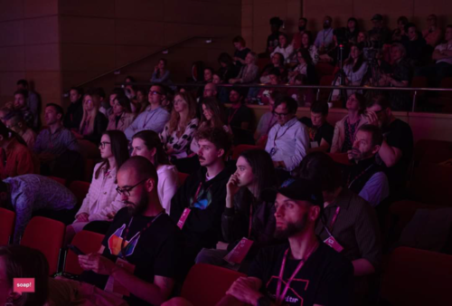](http://techwriter.pl/wp-content/uploads/2023/07/upload_0543.png)

Tym razem tematem przewodnim było _Content Operations_ czyli zestaw założeń i
praktyk, dzięki którym proces dokumentacji przebiega w sposób zwinny, przy
współpracy wszystkich niezbędnych działów w organizacji i przy użyciu narzędzi
pozwalających na automatyzację. Wielu prelegentów podzieliło się swoimi
doświadczeniami na temat tego, jak wdraża się takie podejście. Przeforsowanie
tych rozwiązań nigdy nie jest łatwe i przyjemne. Po wysłuchaniu tych opowieści
mamy lepszą świadomość korzyści jakie może dać stosowanie się do zasad
ContentOps i wiemy jak inne osoby wydeptywały taką ścieżkę.

Oprócz ContentOps poruszono wiele innych ciekawych tematów, zwłaszcza tych
skupiających się na problemach ludzi parających się komunikacją techniczną.
Frapujących wykładów było wiele, dlatego poniżej przedstawiamy ciekawe myśli z
wystąpień, które najmocniej zapadły nam w pamięć. Razem z Julią Dąbrowską, moją
koleżanką z Hitachi Energy, dzielimy się poniżej wrażeniami. Brawa dla Julii za
to, że zgodziła się przelać swoje myśli na papier i opowiedzieć o swojej
pierwszej i – jak zapowiada - z pewnością nie jej ostatniej konferencji soap!

**Zawieszki z programem**

[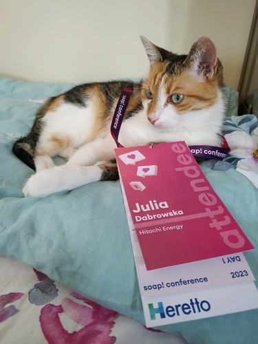](http://techwriter.pl/wp-content/uploads/2023/07/MicrosoftTeams-image-165.jpg)

Chciałem w paru słowach zwrócić uwagę na jeden mały, acz istotny detal,
charakterystyczny dla [soap!](https://soapconf.com/): zawieszka na szyję z listą
wystąpień. Niby to mała rzecz, ale nawet tu organizatorzy dołożyli starań, by
jak najbardziej ułatwić i uprzyjemnić doznania uczestnika. Program wydrukowany
jest do góry nogami, dzięki czemu łatwo możemy go odczytać bez potrzeby
zdejmowania go z szyi. Szata graficzna została opracowana ze smakiem, jest
prosto i funkcjonalnie, oczywiście zgodnie z designem na oficjalnej stronie. Na
froncie wydrukowane jest imię uczestnika, co pomaga w nawiązywaniu kontaktów. To
się nazywa przykładanie wagi do funkcjonalnych detali – myślę, że grono
dokumentalistów i dokumentalistek docenia dbałość o szczegóły. Ktokolwiek to
projektował - dobra robota!

# Warsztaty

## Czego znawca retoryki może nauczyć Cię o zapytaniach dla ChatGPT

## 

[Dr. Lance Cummings](https://www.linkedin.com/in/lance-cummings-phd/) nie po raz
pierwszy gościł na [soap!](https://soapconf.com/). W 2022 roku prowadził
warsztat o generowaniu tekstu za pomocą narzędzi OpenAI. Nie powinno dziwić
nikogo, że w tym roku powrócił z kontynuacją tematu – jego celem było nauczenie
technical writerów jak strukturyzować zapytania (_prompts_) dla ChatGPT tak, by
otrzymywać najlepsze rezultaty. Od dłuższego czasu śledzę profil Lance’a na
LinkedIN, bo prezentuje on bardzo wyważone i dojrzałe spojrzenie na ChatGPT i
inne narzędzia oparte o wielkie modele językowe (_Large Language Models_). Lance
okazał się dla mnie nieocenioną pomocą podczas przygotowań do napisania artykułu
[ChatGPT a sprawa techwriterska](http://techwriter.pl/chat-gpt-a-sprawa-tech-writerska/),
do przeczytania którego zapraszam, zwłaszcza, jeśli temat wydaje Ci się obcy.

Lance podzielił się swoimi metodami strukturyzowania zapytań dla ChatGPT na
bloki tematyczne, które można dostosowywać i podmieniać. Nie powinno dziwić
nikogo, że Lance stosuje klasyczny podział wywodzący się z retoryki:

- **Etos** – wiarygodność – wizerunek autora chcesz zaprezentować
- **Patos** – emocje –  odczucia chcesz wzbudzić u odbiorców, jaką relację
  pragniesz zbudować
- **Logos** – logika, rozumowanie, fakty – kontekst prezentowanego tematu

Przykład promptu:

Kontekst: Potrzebuję podsumowania dla \[Odbiorca\]. Napisz mi podsumowania
długości 40 słów, które pomogą mi podsumować najistotniejsze informacje
wyjaśniające czemu czytelnicy z branży komunikacji technicznej będą
zainteresowani danym artykułem.

Etos: Jestem redaktorem, który szuka najlepszych aspektów artykułów innych ludzi
i chce czytelnikom wyeksponować najlepsze fragmenty.

Patos: Te podsumowania powinny inspirować osoby publikujące w internecie i
tworzyć relację między czytelnikami i osobami piszącymi.

Logos: Każde podsumowanie powinno być tylko jednym akapitem zawierającym:

- Główną myśl artykułu.
- Czemu jest ona ważna.
- Co zyskasz jeśli ją przeczytasz.

Posługuj się imieniem autora. Pisz tytuł artykułu w osobnej linii, następnie
napisz jednoakapitowe podsumowanie.

###

\[Wklej artykuł do podsumowania.\]

Czy sam ChatGPT wymaga układania zapytań w bloki? Nie, ale taka organizacja jest
ważna dla osób, które je tworzą, żeby się w nich nie pogubiły i mogły łatwo
dostosowywać i podmieniać elementy. Taki elastyczny szablon.

Przyznam, że większość moich dotychczasowych _promptów_ była dość chaotycznym
strumieniem świadomości. Jeśli przyszło coś w nich zmienić, trudno było się
połapać w tym, która część odpowiada za co.

Zwłaszcza, jeśli chcemy generować wiele treści, które nieznacznie zmieniamy za
każdym razem, wtedy wysiłek włożony w ustrukturyzowanie zapytań się opłaci, choć
już kwestia korzystania z efektów działania ChatGPT jest dość problematyczna, o
czym pisałem już w
[ChatGPT a sprawa techwriterska](http://techwriter.pl/chat-gpt-a-sprawa-tech-writerska/).

Mimo, że na każdym kroku słychać o tym, że w najbliższej przyszłości nie
zamówisz hot-doga bez znajomości odpowiedniego _promptu,_ to co jeżeli ta
umiejętność za jakiś czas okaże się niepotrzebna?

Lance uspokaja, że zdolność strukturyzowania naszych rozproszonych myśli i
zamykania ich w strategiczne ramy zawsze będzie potrzebna. Przykład: po ponad
dekadzie w tech writingu, robienie wywiadów z ekspertami domenowymi przychodzi
mi naturalnie, zwykle pytania o niezbędne informacje same się cisną na język.
Ale gdybym miał nauczyć kogoś rzetelnie od podstaw jak powinien wyglądać schemat
postępowania, by uzyskać oczekiwane rezultaty, musiałbym się chwile zastanowić i
ubrać w słowa procedurę, którą intuicyjnie znam. Kosztowałoby mnie to odrobinę
wysiłku, by przedstawić ją jako precyzyjny, spójny i przemyślany protokół
postępowania.

Podobnie jest z wiedzą dotyczącą innych tematów. Przypomina nam to o tym, że
spisywanie myśli, strukturyzowanie posiadanej wiedzy i dokumentowanie
pieczołowicie tworzonych modeli mentalnych ma ogromne znaczenie.

Wracając do samych zapytań: pewną łyżkę dziegciu stanowi fakt, że opracowanie
dobrze ułożonego zapytania, które zwraca oczekiwane rezultaty zajmuje często
więcej czasu niż samodzielne napisanie tekstu, o który nam chodziło.

Mimo to i tak uważam, że praktyczna nauka o działaniu algorytmów sztucznej
inteligencji nie pójdzie na marne, a lepsze zrozumienie zalet i ograniczeń tych
rozwiązań będzie wkrótce jedną z kluczowych umiejętności. W tym temacie stawiam
kropkę, a właściwie wielokropek, a sam Lance jeszcze nie raz powróci w kolejnych
częściach tego artykułu.

## Od zera do bohatera – dojrzałość dokumentacyjna projektu i proces przejścia na wyższy poziom

Większość osób parających się komunikacją techniczną ma świadomość poziomu
dojrzałości projektu w jakim się znajduje. Mogą o tym opowiedzieć, ale czy
potrafią to wskazać na precyzyjnej skali? Okazuje się, że tak, jeśli skorzysta
się z modelu dojrzałości informacji.

Podczas warsztatu [Anu Granroth](https://www.linkedin.com/in/anugranroth/) i
[Maaret Henriksson](https://www.linkedin.com/in/maarethenriksson/) podzieliły
się narzędziem, pozwalającym na ocenę modelu dojrzałości dokumentacyjnej zespołu
czy firmy. Tworzone treści i możliwości zespołu czy działu można uszeregować na
skali od 0 do 5. Dzięki temu możemy określić stan obecny i przyszły cel, do
którego aspirujemy. Pomaga to określić czego obecnie brakuje i można opracować
proces przejścia na wyższy poziom, np.: od myślenia w kategoriach całych
dokumentów (0) do skupienia się na ustrukturyzowanych tematach (1).

Dodatkowym, niezbędnym elementem tej metody jest ustalenie ról i obowiązków
pomiędzy uczestnikami procesu dokumentacyjnego. Wymaga to rozmowy z pozostałymi
członkami zespołu. Wspólne uzgodnienie zakresu obowiązków często nie przychodzi
łatwo, pomóc może mówienie w kategoriach ról a nie personalnie. „Sądziłem, że w
naszym procesie obowiązkiem programisty jest sprawdzenie merytoryczne
dokumentacji” brzmi lepiej niż „Wojtek miał sprawdzać dokumentację i nigdy tego
nie robi”.

Pomocne będzie też rozrysowanie diagramu przepływu pracy między uczestnikami.

Podsumowując, jeśli Twoim celem jest wzniesienie procesu dokumentacji na wyższy
poziom, potrzebujesz precyzyjnego planu jak dostać się z A do B. Plan ten wiązać
może się z inwestycją w nowe narzędzia, infrastrukturę czy niezbędne będzie
zatrudnienie dodatkowych specjalistów. Model dojrzałości pomoże Ci uzasadnić
taki wysiłek i przekonać o tym przełożonych.

[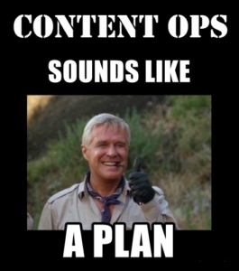](http://techwriter.pl/wp-content/uploads/2023/07/upload_0474-1.png)

# Prezentacje

## Wprowadzenie do Content Operations

[Patrick Bosek](https://www.linkedin.com/in/patrickbosek/) z firmy Heretto
podczas _"Content Operations. What it is, why it's needed, and a high-level
blueprint"_ przybliżył nam podstawowe pojęcia dotyczące Content Operations.
Przedstawił wiedzę w bardzo ustrukturyzowany sposób. Z wykładu wyniosłem wiele
przydatnych informacji. Np.: choć dla wielu Content Ops kojarzy się z techniczną
infrastrukturą niezbędną do tworzenia, recenzowania i publikowania treści to
patrząc na tę koncepcję z lotu ptaka wyróżniamy poniższe elementy składowe:

**Ludzie + Technologia + Procedura**

Do czego potrzebne jest Content Ops? Potrzeba wdrożenia takiego podejścia
występuje wtedy, gdy chcemy tworzyć treści na dużą skalę. Dokumentacja
dostarczana jest dla różnych klientów i powstaje w wielu wariantach. Powyżej
pewnej ilości kombinacji, manualne kroki typu „kopiuj i wklej” nie są w stanie
rozwiązać naszych problemów. Potrzebujemy centralnej bazy treści, ponownego
użycia fragmentów w różnych dokumentach i automatyzacji, gdzie tylko jest to
możliwe.

Okazuje się, że nie każdy produkt wymaga Content Ops. Przy jednorodnej
dokumentacji nie jest to konieczne.

W prezentacji Patricka podstawowym pojęciem jest "doświadczenie" a nie
"dokument". Każda interakcja klienta z jakąkolwiek stworzoną przez nas treścią
stanowi „doświadczenie”, które ma na celu osiągnięcie przez klienta założonego
celu. Im doświadczenie płynniej przybliża kogoś do realizacji celu, tym lepiej.

[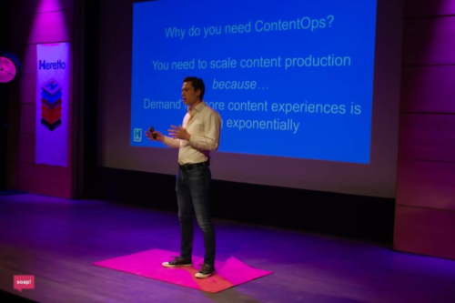](http://techwriter.pl/wp-content/uploads/2023/07/upload_0537.png)

Ciekawym pojęciem jest też _omni experience_ – chodzi o patrzenie na
doświadczenia klientów jak na bardzo indywidualne doznania, zamiast zbierać je w
ogólne kategorie. Dany klient korzystający z dokumentacji pod konkretną
przeglądarką będzie mieć inne doświadczenie od tego, który sprawdza instrukcje
na telefonie komórkowym.

Nie chcąc zdradzać wszystkich smaczków wspomnę tylko o interesującym
przypuszczeniu co do tego, że wraz z rozwojem technologii, wymianę informacji
będą kształtowały systemy komunikujące się jeden z drugim. Doświadczenie
konsultacji z żywym człowiekiem będzie towarem luksusowym, zarezerwowanym dla
szczególnych przypadków.

Serdecznie polecam tę prezentację jeśli chcesz solidnego wytłumaczenia
podstawowych określeń w połączeniu z globalnym spojrzeniem na bardzo
wyrafinowane środowiska dokumentacyjne.

## Plan potrzebny od zaraz

Duet tech writerek [Barbary Czyż](https://www.linkedin.com/in/barbara-szwarc/)
(z Box) i [Edyty Rakowskiej](https://www.linkedin.com/in/edyta-rakowska/) (z
GuideWire) podczas _"There's no ContentOps without a ContentPlan"_ zaprezentował
przykłady wyzwań projektowych wraz z zastosowanymi rozwiązaniami zgodnymi z ideą
Content Ops. Na tapecie były powszechne w branży problemy, których przykłady
znajdziesz poniżej.

**Planowanie release’ów dokumentacji:**

- Mnogość dostarczanych typów dokumentacji
- Duża liczba projektów obsługiwanych przez pięciu tech writerów
- Nieoczywiste priorytety
- Dynamiczne zmiany w terminach dostarczenia produktów
- Doku Zaskoczki! („_Doc Surprises_”)

**Planowanie pracy nad treściami (Content Planning):**

- Treści dostępne na różnych platformach
- Niezdefiniowana grupa odbiorców (materiały dla odbiorów wewnętrznych
  pomieszane z tymi dla zewnętrznych)
- Niespójność
- Te same treści kopiowane w różne miejsca
- Trudne do znalezienia informacje

**Współpraca:**

- Wymagany skoordynowany wysiłek wielu zespołów
- Współzależności między zespołami
- Efekt końcowy stanowi mozaikę wkładów różnych zespołów

Czy te wyzwania brzmią znajomo? Wiele z nich znam ze swojej praktyki. Krzepiące
jest to, że są wśród nas osoby, które opracowały interesujące taktyki radzenia
sobie z nimi i postanowiły się nimi podzielić.  Basia i Edyta w lekki, zabawny
sposób poprowadziły solidną prezentację o okiełznaniu dokumentacyjnej hydry za
pomocą planu i metody. Wielu z nas znajdzie w niej dla siebie użyteczne
wskazówki i pomysły.

## Jaki jest Twój patent na content?

_"Keeping the plates spinning: ContentOps at Dolby"_ to studium przypadku
wymagającego tworzenia i utrzymywania dokumentacji do 200 produktów, a jeśli
uwzględnić ich różne wersje to otrzymujemy łączną liczbę wariantów 800 :-o.

Produktami są licencjonowane patenty wykorzystywane w rozwiązaniach audio i
wideo.

Dokumentacja dostarczana jest w różnych formatach: portal internetowy dla
klientów, offline HTML, statyczne treści w PDF. Autorami materiałów są nie tylko
dedykowani tech writerzy, ale również inżynierowie. I teraz mi powiedzcie, jak
żyć?

[Marta Bartnicka](https://www.linkedin.com/in/marta-bartnicka-713969/),
[Daniel Barrio Fierro](https://www.linkedin.com/in/daniel-barrio-fierro-a95053110/)
i [Jakub Reszka](https://www.linkedin.com/in/jakub-reszka-748841159/) pokazali,
że znają uniwersalne tajniki prezentowania, ponieważ rozpoczęli slajdem z kotem.
Bardzo to szanuję, bo to złota zasada prezentacji i jakiegokolwiek
"_contentu_" - najpierw dodaj kota ;)

Trio w przystępny sposób przedstawiło wyzwania i obraną ścieżkę radzenia sobie z
nimi z pomocą DITA, Markdown i Git. Do tego opowiedzieli też o opracowywaniu
[portalu dla klientów](https://customer.dolby.com/) i o analizie ruchu na
witrynie.

Zdecydowanie warto posłuchać ich wystąpienia.

## Jak sprostać skali

[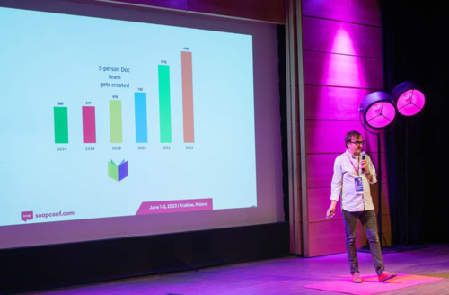](http://techwriter.pl/wp-content/uploads/2023/07/upload_0535.png)

[Jarek Orłowski](https://www.linkedin.com/in/jarek-or%C5%82owski-37aba6115/) w
_"How to scale docs in a fast-growing organization"_ dobrze zarysowuje sytuację,
gdy firma rozwija się w bardzo szybkim tempie, a skala wymagań wobec
dokumentacji gwałtownie rośnie.

Jarosław z dużą dozą szczerości opowiada historię wprowadzania Content
Operations w Dynatrace i tego, jak od pewnego momentu potrzebuje zarządzać 10
osobowym zespołem technical writerów rozrzuconych po różnych szerokościach
geograficznych.

Z prezentacji dowiesz się, jak dostosowano organizację, by zespół dokumentacji
mógł działać jako Content Operations. Poznasz również proces współpracy
dokumentalistów i wykorzystywane przez nich narzędzia. Najważniejsze, moim
zdaniem, jest wytłumaczenie celu, dla którego się ją stosuje i tego czym
charakteryzuje się dobrze zaimplementowane Content Ops w organizacji.

## Jak wydobyć cenne klejnoty z morza treści

[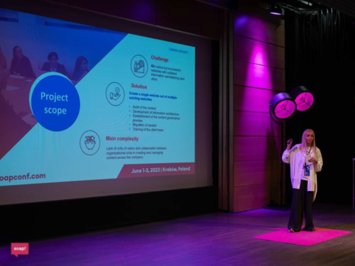](http://techwriter.pl/wp-content/uploads/2023/07/upload_0530.png)

[Daria Boiko](https://www.linkedin.com/in/daria-boiko-2aab3089/) w _"Content Ops
and Content Strategy"_ opowiada o tym, jak w ramach projektu zorganizowała ponad
60 osobnych stron dotyczącej handlu wydobywanymi minerałami.

Jest to historia o tym, jak Daria, krok po kroku, wykonała tytaniczny wysiłek
analizy, tworzenia content planu, weryfikacji, migracji i restrukturyzacji
stron. Kojarzy mi się to z kilkoma migracjami dokumentacji między platformami,
które mam na koncie i tym bardziej szanuję jej dokonanie.

## Jasne, ale i tak przypomnij mi później

Po wielu świetnych prezentacjach o tworzeniu sprawnych machin do zarządzania
dokumentacją, [Denise Marshall](https://www.linkedin.com/in/dnwood/) z firmy 3di
z wielką szczerością podczas _"Sure, but you’ll have to remind me"_ opowiedziała
o codziennych wyzwaniach, jakie stoją przed większością z nas: wielki napływ
informacji, dynamiczne zmiany w projektach, problem z ustalaniem priorytetów i
trzymaniem się planów, trudność w koncentracji na zadaniu.

Myślę, że odczucia takie podziela większość pisarzy technicznych, choć pewnie
mniejszość się do tego przyznaje. Nie umiem czytać w myślach, ale zgaduję, że
większa część zebranych na konferencyjnej sali pomyślała „wreszcie ktoś mówi na
głos to, co często odczuwam”. Oprócz szczerości takiego wyznania, w historii
zaskoczyło mnie też to, jaką rolę odegrał stosujący metodologie zwinne zespół.
Okazał się on dla niej wielkim wsparciem – na każdy zgłaszany problem
proponowali rozwiązanie np.: widget przypominający o podsumowaniu każdego dnia
tego, co danego dnia robiła. Rozwiązania te nigdy nie były ostateczne, a
ważniejsza jest chęć pomocy i wspólnego pochylenia się nad problemem. Warto
również przykładać wagę do higieny psychicznej.

Na długo zapamiętam tę szczerą i budującą opowieść, szczególnie, że Denise ma
dar do spontanicznego wyrażania swoich myśli, ma też świetne poczucie humoru.
Ciekawostka: Denise zna podstawowe słowa po polsku i kilka wyrażeń 😊

Warto pamiętać o tym, że scrum master i zespół agile potrafią świetnie doradzić
w różnych kwestiach. Techno skrybo! Nie jesteś sam! Jeśli coś Cię gnębi, pogadaj
ze swoim zespołem, to potrafi zdziałać cuda!

## Jak odnaleźć się w zwinnym zespole

[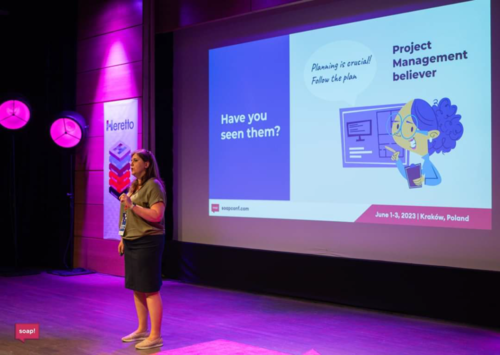](http://techwriter.pl/wp-content/uploads/2023/07/upload_0526.png)

Mimo, że nie każdy z nas odpowiada za budowanie zespołu, to zrozumienie
mechanizmów działania w danej grupie pozwala lepiej się w niej odnaleźć i
osiągnąć sukces. Jeśli Twój zespół stosuje metodologie zwinne, siłą rzeczy
musisz zrozumieć je na tyle, by móc się wpasować i uczestniczyć w życiu zespołu.

[Justyna Wykowska](https://www.linkedin.com/in/justynawykowska/) jest agile
coachem i podzieliła się swoim bogatym doświadczeniem w organizowaniu
współpracy. Polecam serdecznie prezentacje Justyny, bo ze swadą i przystępnie
dzieli się przemyśleniami na bazie obserwacji z życia. Nie chcąc zdradzać
wszystkiego, pozwolimy sobie podkreślić kilka myśli:

- Agile, Kanban, OKR… firmy lubią wdrażać aktualnie popularne rozwiązania, które
  sprawdziły się u konkurencji. Jednak bez zrozumienia sedna problemów, które te
  techniki rozwiązują, naśladowanie nie przyniesie dobrego efektu. Każda firma
  musi rozumieć swoją indywidualną sytuację, by zastosować odpowiednie remedium
  na własne problemy.
- Ciekawym patentem jest „_pair content writing_”, który jest zainspirowany
  techniką z dziedziny programowania: „_pair programming_”. Bardziej
  doświadczony tech writer pracuje w tandemie z nowym członkiem zespołu nad
  jednym dokumentem. Dzięki ścisłej współpracy i szybkim dzieleniu się uwagami
  bardzo szybko przekazywana i budowana jest praktyczna wiedza na temat nowego
  produktu lub narzędzia do tworzenia treści.
- Automatyzacja powinna dotyczyć powtarzalnych i żmudnych aspektów pracy. Nie
  zawsze muszą one być oparte o wymyślne, zaawansowane technologie tworzone na
  zamówienie. Czasem pracę z treścią może automatyzować stosując odpowiednio
  skonfigurowane rozwiązania typu Grammarly.

## Bo do tanga trzeba czworga

[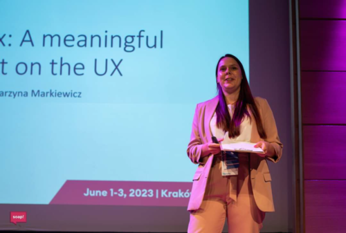](http://techwriter.pl/wp-content/uploads/2023/07/upload_0510.png)

[Katarzyna Markiewicz](https://www.linkedin.com/in/katarzyna-markiewicz18/),
content designer z IBM, w _"4-in-a-box: Content’s meaningful impact on the UX"_
opowiada o udanej współpracy technical writerów, designerów, product managerów i
developerów. Wszystkie cztery frakcje zasiadają razem do stołu począwszy od
najwcześniejszych etapów projektu. Płynie z tego wiele korzyści, np.: możliwość
wprowadzania sugestii pisarzy technicznych w zakresie UX, dzięki czemu aplikacja
jest bardziej intuicyjna i wymaga mniej obszernej dokumentacji. Na początku
niełatwo jest zebrać takie gremium w jednej sali i trudno ustanowić nową świecką
tradycję, jednak naprawdę warto, bo przynosi to dobre rezultaty, które
użytkownik odczuje w całości doświadczenia z produktem i jego dokumentacją.

## Ilu tech writerów naprawdę potrzeba?

Każdy technical writer, czy to pracujący samodzielnie, czy zarządzający takim
zespołem, prędzej czy później staje przed tym problemem: jak przekonać
kierownictwo, że ilość pracy przekracza możliwości zespołu. Czy jest możliwe
przygotowanie odpowiednich danych na poparcie tego, co mówimy? O tym jest _"Is
writer ration to other roles worth measuring? Yes, but do it the right way"_.

[Kristiina Kalaasmaa](https://www.linkedin.com/in/kristiinakallasmaa/) - autorka
wystąpienia - twierdzi, że tak i proponuje następujące rozwiązanie: regularne
pomiary proporcji pomiędzy liczbą technical writerów a liczbą osób, które tech
writerzy wspierają.

Mierzyć można nie tylko przykładową proporcję tech writerów do inżynierów, ale
również, na przykład, do liczby funkcjonalności, liczby produktów czy obszarów
wsparcia dokumentacji. Zbierane dane mogą być też przydatne przy monitorowaniu
wpływu zmian procesowych czy narzędziowych w firmie na pracę zespołu.

Wartość tej prezentacji zawiera się nie tylko w podkreśleniu wagi mierzenia
wspomnianej proporcji. Samo omówienie wielu aspektów funkcjonowania roli tech
writera w szerszym kontekście i wzajemnej zależności na wielu szczeblach
decyzyjnych i technicznych jest inspiracją do przyjrzenia się swojemu środowisku
pracy. W codziennym natłoku pracy niekoniecznie mamy czas i sposobność na
zdobycie szerszego oglądu sytuacji i na zadanie pewnych pytań. Czasem też po
prostu nie przyjdzie nam do głowy, aby je zadać.

## Jak mierzyć fajność dokumentacji?

[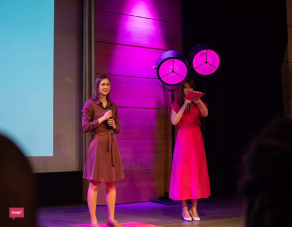](http://techwriter.pl/wp-content/uploads/2023/07/upload_0536.png)

Skąd wiemy, że dokumentacja, którą tworzymy jest tym, czego potrzebują jej
użytkownicy? Czy są w stanie szybko znaleźć informacje, których szukają? Czego
konkretnie w naszej dokumentacji brakuje? Czy faktycznie koty są fajniejsze od
psów? :o)

[Aleksandra Kacperczyk](https://www.linkedin.com/in/aleksandra-kacperczyk-200047180/)
w _"How to effectively measure documentation quality and is it even doable?"_
przetestowała różne metody mierzenia jakości dokumentacji i na szczęście dla nas
postanowiła podzielić się wnioskami, które mogą pomóc odpowiedzieć na te
pytania.

Na przykładzie osobistego rankingu zwierzątek domowych (kot>pies>królik>rybki),
porównała przydatność różnych metod oceny jakości dokumentacji.

Najwyżej ocenionymi metodami w prezentacji (kotem) są nagrywane sesje
użytkowników (w tym przykładzie są to użytkownicy aplikacji), za pomocą
aplikacji takich jak HotJar czy FullStory.

Analiza zapytań w wyszukiwarce również uplasowała się wysoko. Z kolei najsłabiej
w testach Aleksandry wypadły: ocenianie treści bezpośrednio na stronie i analiza
ruchu.

## Jak uczyć pisania znajomych z pracy

Czy programiści i reszta inżynierów, którzy niechętnie angażują się w pisanie
czy recenzowanie dokumentacji to standard? Okazuje się, że niekoniecznie.

[Maria Yermakovich](https://www.linkedin.com/in/maria-ermakovich/) w swojej
uroczo i zabawnie poprowadzonej prezentacji _"Teaching Your Colleagues to Write
(and Learning from Them)"_ twierdzi, że jest wręcz przeciwnie. W trakcie
[soap!](https://soapconf.com/) podzieliła się swoimi doświadczeniami z uczenia
programistów jak lepiej pisać dokumentację. Co ciekawe, swoją przygodę ze
szkoleniami z pisania w swojej firmie rozpoczęła na wniosek współpracowników.
Nikogo nie musiała do tego namawiać, bo ludzie sami się zgłaszają na jej
szkolenia. Zapytani o powody, podają na przykład taki: "koledzy mówią, że moją
dokumentację ciężko się czyta" :-)

Maria ewidentnie lubi uczyć i chętnie dzieli się wskazówkami jak to robić
skutecznie. Dla tych osób, które zastanawiają się nad tym, czy uczenie innych
pisania dokumentacji to dobry pomysł, również ma odpowiedź.

[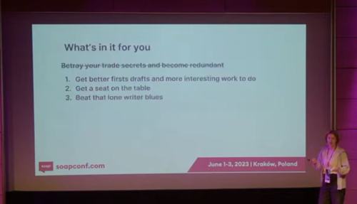](http://techwriter.pl/wp-content/uploads/2023/06/Picture4.png)

Nie wiem jak Was, ale mnie takie powody przekonują.

Poniżej przykłady trafnych wskazówek z takich szkoleń:

- Konwersja ze strony biernej na czynną
- Objaśnianie skrótowców
- Pozbywanie się słów takich jak: "very", "simple", "easy"
- Brak obietnic w dokumentach
- Pisanie zdań wprowadzających
- Ludzie nie czytają tekstu, tylko go "skanują".

Nastawienie Marii na wzajemną, partnerską pomoc jako nadrzędny cel takich
szkoleń jest bardzo inspirujące, a wręcz zaraźliwe. Dla osób, którym angielska
gramatyka sprawia problemy (“a co to właściwie jest ta strona bierna?”),
stworzyła nawet kurs wprowadzający, w którym można wziąć udział przed właściwym
szkoleniem z pisania. Uczy ludzi poprzez to co już znają: odwołania do
prawdziwych dokumentów firmowych, stosowanych technologii, akronimów, a także
zostawia uczestnikom przestrzeń na wyrażenie własnych opinii. Dzieli się tym co
działa i robi to w sposób przyjazny dla laików, z poszanowaniem ich czasu i
zdolności koncentracji. A na koniec pozostawia uczestników z narzędziami, które
pozwolą im rozwijać się samodzielnie.

Niech rzuci kamieniem ten, kto ani razu nie pomyślał, że chciałby na takie
szkolenie wysłać kilka osób ze swojej firmy 😊 A od siebie dodam, że jako
początkująca tech writerka bardzo chętnie wzięłabym w nim udział.

## Syndrom oszusta

[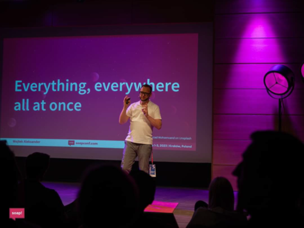](http://techwriter.pl/wp-content/uploads/2023/07/upload_0505.png)

[Wojtek Aleksander](https://www.linkedin.com/in/waleksander/) w swojej
prezentacji _"Imposter Syndrome"_ stawia tezę, że przyczyny dobrze znanego
syndromu oszusta, skądinąd bardzo subiektywnego zjawiska, najczęściej są jak
najbardziej obiektywne, konkretne, i nie mają nic wspólnego z osobą, która tego
syndromu doświadcza.

Mają za to dużo wspólnego z:

- Obroną przed dostępem innych do wiedzy (zasłanianie się odpowiedzialnością za
  jakiś obszar produktu czy wiedzy)
- Starymi nawykami
- Uprzedzeniami i nieprawidłowymi założeniami na temat pracy tech writera (czy
  innego twórcy treści)
- Brakiem obustronnego i regularnego feedbacku
- Problemami w komunikacji
- Byciem “niewidocznym” dla współpracowników
- Presją czasu i wymagań z każdej strony.

Jak z tym wszystkim walczyć? Według Wojtka, możesz zrobić bardzo dużo, ale
potrzebujesz przejąć inicjatywę i “zaktualizować” swoich współpracowników. Jego
rady to: bycie obecnym na każdym etapie projektu, zadawanie pytań i oferowanie
feedbacku, włączanie się w kanały komunikacji powiązane z informacjami, których
potrzebujesz, a przede wszystkim - samodzielne decydowanie o tym czego
potrzebujesz i do czego możesz się innym przydać. Jeśli pozwolisz innym
decydować o swojej przydatności, o tym co możesz wnieść do pracy innych, będzie
to działało raczej na twoją niekorzyść. Wielkie brawa dla Wojtka za niezwykle
celne spostrzeżenia.

To samo tyczy się jego rady udzielonej w trakcie sesji pytań i odpowiedzi już po
samej prezentacji. Syndrom oszusta czyni nas ślepymi na nasze osiągnięcia. Aby
nie upadać na duchu i nie dać się zniechęceniu, Wojtek poleca zapisywanie
wszystkich małych i dużych sukcesów, i regularne wracanie do tych zapisków.
Znam, używam, potwierdzam skuteczność :-)

# **Ciekawostki**

## **Soapbox**

Po raz pierwszy w historii [soap!](https://soapconf.com/) organizatorzy
wprowadzili możliwość wyskoczenia na scenę i wygłoszenia pięciominutowej
opowieści na temat dowolny. Działo się! Oto kilka najbarwniejszych, naszym
zdaniem, wystąpień.

### **District C**

[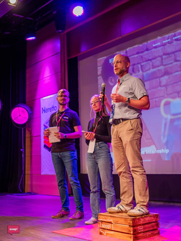](http://techwriter.pl/wp-content/uploads/2023/07/upload_0558.png)

Miałem okazję spontanicznie wskoczyć na scenę (i na skrzynkę po jabłkach!), by
razem z [Lancem Cummingsem](https://www.linkedin.com/in/lance-cummings-phd/) i
[Quinn Williams](https://www.linkedin.com/in/quinn-williams-a72486242/)
podzielić się naszymi wrażeniami z projektu
[District C](https://www.linkedin.com/company/district-c/?lipi=urn%3Ali%3Apage%3Ad_flagship3_detail_base%3Bwv0KZVYQTZG6iJfTVHNEPg%3D%3D).
Planuję napisać o tym szerzej w osobnym artykule. Dodam tylko, że emocje były
spore, wygłosiliśmy nasze naprędce przygotowane podsumowania projektu z trzech
perspektyw. Gratulacje dla studentów uniwersytetu North Carolina Wilmington,
którzy zechcieli przeanalizować wyzwania tech writerów z Hitachi Energy i
zaproponowali rozwiązania dla realnych problemów jakie występują w nowoczesnych
i dynamicznych środowiskach.

Studenci pod opieką Lance’a mieli okazję zastosować swoje umiejętności szukania
rozwiązań i stosownego komunikowania proponowanych sugestii.

Nie mam wielu okazji do wystąpień publicznych, mam nadzieje, że przekaz był
zrozumiały, a jeśli coś powiedziałem za szybko to zawsze mogę dopowiedzieć –
zapraszam do kontaktu na LinkedIn. Dodam jeszcze, że jeśli masz problem z tremą
przed wystąpieniami, to nic nie działa lepiej niż wejście na skrzynkę na jabłka.
Dla mnie będzie to nieodłączny gadżet przy przemówieniach, robi robotę! 😊

### **Wychodźmy z naszych silosów**

[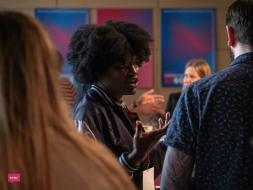](http://techwriter.pl/wp-content/uploads/2023/07/upload_0540.png)

W wielu wystąpieniach przewijały się postulaty dotyczące angażowania różnych
działów i ludzi w procesy dokumentacyjne i wypracowanie technical writerom
należnego „miejsca przy stole”, gdzie toczone są dyskusje projektowe i
produktowe. Prawie każdy na sali popierał takie podejście, choć z jego
realizacją bywa różnie.

[Cynthia Peter](https://www.linkedin.com/in/cynthiapeter/) przypomniała nam o
tym, że jeśli jako technical writerzy chcemy dbać o widoczność, to powinniśmy
takie tematy podnosić również na konferencjach dla programistów, a nie tylko
podczas wydarzeń dla technical writerów, którzy przeważnie i tak są tego samego
zdania. Wychodzenie z silosów w środowisku własnej firmy, jak i poza nią, jest
czymś, o czym należy pamiętać.

Przekaz krótki i celny, a do tego przekazany w zabawny, spontaniczny sposób.

### Gdzie szukać odtrutki w świecie przesyconym fascynacją technologią?

[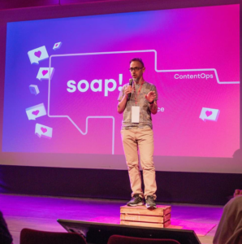](http://techwriter.pl/wp-content/uploads/2023/07/upload_0503.png)

W trakcie konferencji często rozmawialiśmy o ChatGPT i innych wynalazkach z
dziedziny sztucznej inteligencji. Mocno skupiamy się na znalezieniu dla nich
zastosowania w naszych projektach. A gdzie leżą obszary, w których człowiek
wydaje się niezastąpiony?
[Paweł Martin](https://www.linkedin.com/in/pawel-martin/) opowiada o ludzkich
wartościach, o których warto pamiętać i postępować zgodnie z nimi. Należy
akcentować ludzki komponent w równaniu 😉

Żeby łatwiej je zapamiętać, pierwsze litery angielskich wyrazów układają się w
„CHE”:

- **C**uriosity – dociekliwość – zadawaj dodatkowe pytania, zarówno te dotyczące
  projektu, jak i całego świata, podważaj status quo, by dotrzeć do sedna
- **H**umility – pokora – panuj nad swoim ego, komunikuj swoje potrzeby,
  przyznaj się jeśli czegoś nie umiesz, nie rozumiesz i potrzebujesz wsparcia
- **E**mpathy – empatia – staraj się zrozumieć perspektywę innych uczestników
  procesu i użytkowników

### **SOAPUSZKA**

[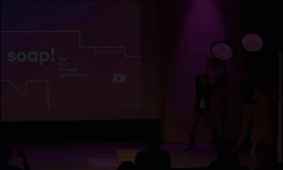](http://techwriter.pl/wp-content/uploads/2023/07/soapusza_mala.gif)

Kolejnym
wydarzeniem, które było na ustach wszystkich, był występ grupy zwanej jako
„Soapuszka Crew”.

Dla niewtajemniczonych: „Soapuszka” to starożytny artefakt, odziedziczony po
Sumerach, którzy organizowali własne eventy poświęcone tworzeniu contentu w
glinianych tabliczkach w piśmie klinowym.

W jaki sposób
[Rafał Pawlicki](https://www.linkedin.com/in/rafa%C5%82-pawlicki/) wszedł w
posiadanie tak cennego rekwizytu – nie wiemy. Podczas swojej prezentacji o wizji
AI w procesie tworzenia dokumentacji (i podróżowania w czasie!) soapuszka
trafiła w ręce ekipy "Soapuszka Crew" z firmy Infor, która przez rok sprawowała
nad nią pieczę. Grupę trzymającą poduszkę tworzą:
[Magda Elias](https://www.linkedin.com/in/magdaelt/),
[Martyna Gatner-Siemieniuch](https://www.linkedin.com/in/martyna-gatner-siemieniuch-549806114/),
[Joanna Sosnowska](https://www.linkedin.com/in/joanna-s-149b98144/),
[Ekaterina Pervezentseva](https://www.linkedin.com/in/ekaterina-pervezentseva-b75767156/),
[Marcin Broda](https://www.linkedin.com/in/marcin-broda-1b6878a6/).

Co
działo się z poduszką przez ten pamiętny rok? Soapuszka chciała być sławna od
samego początku i ekipa we Wrocławiu ciężko cały rok nad tym pracowała, żeby ją
do tej popularności przygotować. Soapuszka podróżowała otwarcie, pokazując swoją
"twarz", jak i incognito (patrz zdjęcie w okularach i kapeluszu). Była na
wycieczce w górach. Odwiedzała często biuro Infor, jadła lunch i pierogi, wypiła
parę kawek, uczestniczyła nawet w szkoleniu z Excela i jest teraz masterem
_pivotów_ (tabel przestawnych). Jednym słowem zasmakowała korpożycia i czekała z
niecierpliwością na swój wielki dzień na tegorocznym soapie i nowego
właściciela.

[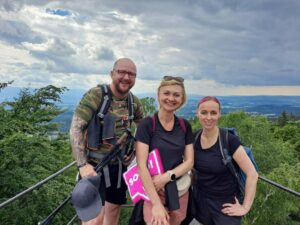](http://techwriter.pl/wp-content/uploads/2023/06/MicrosoftTeams-image-161.jpg)

[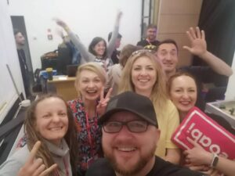](http://techwriter.pl/wp-content/uploads/2023/06/MicrosoftTeams-image-159.jpg)

[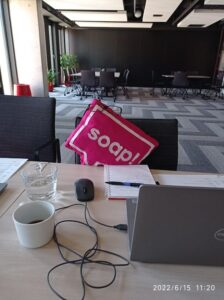](http://techwriter.pl/wp-content/uploads/2023/06/MicrosoftTeams-image-156.jpg)

Po roku szalonych przygód, o których można by było nakręcić lepszy film niż
„Road Trip” czy „EuroTrip” razem wzięte, Soapuszka powędrowała do rąk kolejnego
szczęśliwca, który chwycił ją po tym, jak została rzucona w konferencyjny tłum.

[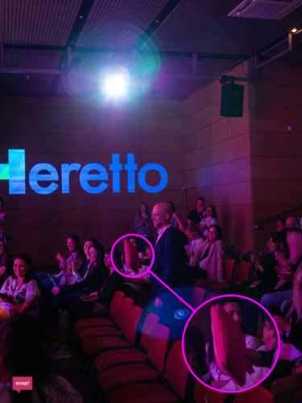](http://techwriter.pl/wp-content/uploads/2023/07/upload_0534.png)

Był nim [Lance Cummings](https://www.linkedin.com/in/lance-cummings-phd/).
Świadom praw i obowiązków przyjął wyzwanie opieki nad rzutką poduszką. Lance i
Soapuszka powrócą w 2024 na kolejną edycję [soap!](https://soapconf.com/)
Organizatorzy docenili jego determinację i dali mu w prezencie bilet wstępu na
wydarzenie.

A więc postanowione! Soapuszka odwiedzi Stany Zjednoczone. Jakie opowieści
przywiezie? Tego dowiemy się już 1.06.2024. I coś mi mówi, że to nie będzie jej
ostatnia przygoda.

### **Panel dyskusyjny**

[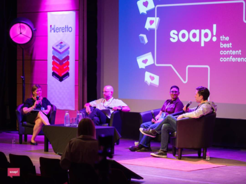](http://techwriter.pl/wp-content/uploads/2023/07/upload_0511.png)

Nową, spontanicznie zrodzoną inicjatywą był panel dyskusyjny składający się z
Lance’a, Patricka, Maaret i Denise, którzy odpowiadali na bardzo wymagające
pytania Soapersów z kanału Slack. Poruszone były różne dokumentacyjne kwestie, w
tym jak zrekrutować pisarza technicznego, a także jak bumerang wracały pytania o
ChatGPT i technologie AI, co pokazuje, że wielu z nas ten temat frapuje i
wszyscy są w trakcie ustosunkowywania się do niego.

### **Losowanie**

[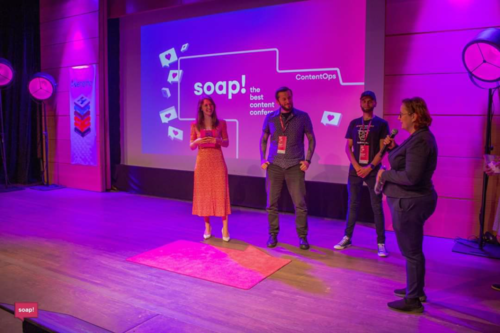](http://techwriter.pl/wp-content/uploads/2023/07/upload_0516.png)

W trakcie konferencji można było wziąć udział w losowaniu nagród dla
uczestników. Warunkiem było podanie swojego imienia i nazwiska oraz obecność na
sali podczas wyczytywania zwycięzców. Jedna z wylosowanych osób, która nie
wygrała nagrody, postąpiła dosłownie zgodnie z instrukcją „enter your name and
surname” podpisała się jako „Your Name, Surname”. Czyżby to napisał Everyman?

Natomiast
jedną z osób do których los się uśmiechnął była współautorka tego artykułu,
Julia Dąbrowska. Nagrodą był powerbank ze świecącym logo ekipy podcastu
„Techwriter Koduje”. Myślę, że w powerbanku zmagazynuje zapas pozytywnej energii
na cały następny rok przed kolejnym [soap!](https://soapconf.com/). Nie powinno
to dziwić, w końcu pracuje w Hitachi Energy :)

Julia jest zachwycona wygraną, bo tak bajeranckiego powerbanku jeszcze nie
miała! A przy okazji odbierania prezentu miała okazję sprawdzić czy wyjście na
scenę jest faktycznie tak przerażające jak w jej głowie. Krótko mówiąc, nie jest
😊 Duża w tym zasługa przede wszystkim naszej wspaniałej konferansjerki Gosi,
ale także innych uczestników, którzy przyczynili się do niesamowitej atmosfery
na [soap!](https://soapconf.com/)

# **Podsumowanie**

Choć
może wydać się to mało wykonalne, to wydaje mi się, że w tym roku poprzeczka
została zawieszona jeszcze wyżej niż zwykle. Z wydarzenia przywieźliśmy solidną
porcję praktycznej wiedzy, która pomoże nam spojrzeć świeżym okiem na to, jak
piszemy, zarządzamy wiedzą, publikujemy treści, jak wchodzimy z interakcje ze
współwinnymi dokumentacji 😉

To, co się nie zmienia to fantastyczna atmosfera, przyjazne środowisko, w którym
każdy czuje się mile widziany i wysłuchany, niezależnie od tego czy jesteś
weteranem czy nowicjuszem, robisz dużą prezentację czy improwizowaną gadkę
prosto z serca. Coś pięknego.

Kiedy piszemy ten artykuł minął już miesiąc od [soap!](https://soapconf.com/), a
idee które tam wybrzmiewały, wciąż się przypominają podczas ustalania pracy
zespołowej czy podczas myślenia o podejściu do dokumentacji. Wiele z tych
wniosków będzie nam towarzyszyć i niektóre zmaterializują się pod postacią
ulepszeń. Doświadczenie [soap!](https://soapconf.com/) pomaga nam w codziennej
pracy :) Jeszcze raz, dzięki [soap!](https://soapconf.com/).

Należy tutaj wspomnieć o tym, że była to **9 edycja**
[soap!](https://soapconf.com/) i niemal minęło **10 lat** od pierwszego
wydarzenia.

[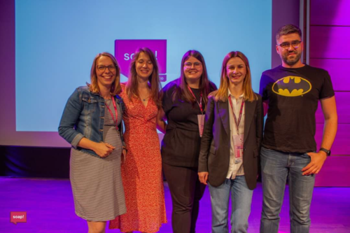](http://techwriter.pl/wp-content/uploads/2023/07/upload_0506-1.png)

Soapers – tak trzymajcie! Jesteśmy pod niesamowitym wrażeniem zarówno
organizatorów, którzy zainicjowali platformę do dzielenia się wiedzą, jak i
uczestników którzy zarażają wszystkich pozytywną energią i dobrym humorem.

[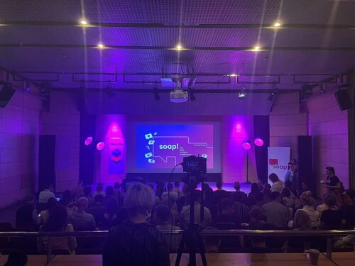](http://techwriter.pl/wp-content/uploads/2023/07/MicrosoftTeams-image-153.jpg)
