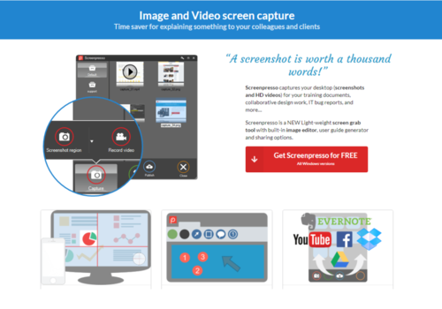

Czy przypadkiem nie szukacie narzędzia do tworzenia zrzutów ekranu, które
usprawniłoby Waszą pracę? Czy chcielibyście zapisywać pliki w różnych formatach
i mieć możliwość ich edycji? Czy zastanawialiście się jak zmniejszyć wagę
Waszych plików nie tracąc na jakości?

<!--truncate-->

Znaleźliśmy dla Was całkiem ciekawe rozwiązanie, dzięki któremu spędzicie mniej
czasu na tworzeniu i edytowaniu obrazów w programach graficznych, a skupicie się
na tworzeniu pozostałych dokumentów do projektu.

Ten artykuł przybliży Wam podstawowe zasady działania Screenpresso i jego
zastosowanie. Resztę na jego temat znajdziecie
[tutaj](https://www.screenpresso.com/). Dostępna jest też instrukcja obsługi
[tutaj](https://www.screenpresso.com/docs/ScreenpressoHelp.pdf).

### Co to za narzędzie?

Screenpresso jest darmowym narzędziem do tworzenia zrzutów ekranu, GIF-ów i
nagrań ekranu oraz prostych dokumentów do Waszych prac projektowych, raportów
czy materiałów szkoleniowych. Po stworzeniu multimediów są one automatycznie
zapisywane i uporządkowane w jednym miejscu.

Screenpresso ma wbudowany edytor, gdzie w szybki sposób można dopracować
stworzone obrazy i generować krótkie instrukcje obsługi. Umożliwia również ich
późniejsze udostępnianie na YouTube, Twitter, Facebook i innych.

### Jak go używać?

Screenpresso działa na wszystkich wersjach Windows. Możecie go zainstalować na
komputerze lub rozpocząć pracę bez konieczności instalacji. Procedura jak to
zrobić znajduje się
[tutaj](https://www.screenpresso.com/support/how-to-install/).

Dla użytkowników chcących, na przykład, edytować stworzone obrazy lub skalować
wideo, dostępna jest wersja Pro - z koniecznością wykupienia licencji.

### Jak to działa?

Zastosowanie jest bardzo proste.

1. Z paska menu lub przez kliknięcie klawisza PrintScreen, wybierz co chcesz
   zrobić.
2. Rozciągnij ramkę wokół treści, którą chcesz przechwycić. Aplikacja umożliwia
   zrobienie zrzutu ekranu tylko z tej części ekranu, która Was interesuje.
3. Kliknij myszką aby uchwycić obraz.

.. i gotowe, Wasze obrazy przechowywane będą w bibliotece. Potem już tylko
dopracowanie szczegółów.

###  Jakie są zalety?

Wybraliśmy dla Was kilka, które mogą być kluczowe przy podejmowaniu decyzji o
użyteczności Screenpresso w Waszych projektach 😊.

Oto one...

- tworzy pliki o małej wadze
- automatycznie kopiuje adres URL Waszego obrazu, GIF-a lub wideo do biblioteki
- daje możliwość dodawania adnotacji do obrazów, edytowania zawartości obrazu,
  dodawanie odnośników
- można w łatwy sposób podglądać organizować, sortować zgromadzone obrazy
- można w łatwy sposób przygotować nagranie wideo czynności wykonywanych na
  ekranie

Naszym skromnym zdaniem używanie Screenpresso do tworzenia zrzutów ekranowych
jest bezproblemowe nawet dla początkujących. Interfejs jest prosty i przyjazny,
można w szybki sposób edytować obraz lub stworzyć instrukcję.

A Wy co myślicie? Czy macie swoje ulubione narzędzie tego typu? Czy takie
rozwiazania sprawdzają się w Waszej pracy? Dajcie nam znać w komentarzach!
