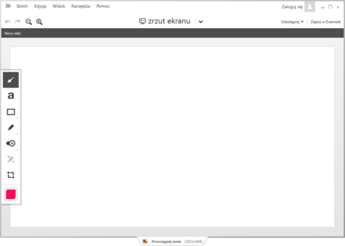
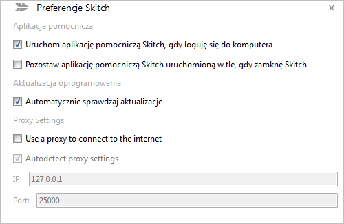

Kolejne narzędzie do robienia zrzutów ekranu. Tym razem bierzemy pod lupę aplikację [Skitch](https://evernote.com/skitch/) od autorów programu [Evernote](https://evernote.com/). Czy jest to propozycja warta rozważenia pod kątem tworzenia dokumentacji?

W momencie pisania artykułu najnowszą dostępną wersją była **2.3.2.173**. Program można zainstalować na systemach operacyjnych takich jak **Windows**, **Mac OS**, **iOS** i **Android**. [Strona aplikacji](https://evernote.com/skitch/) rozpoznaje system operacyjny urządzenia, z którego ją otwieramy i automatycznie daje nam link do ściągnięcia odpowiedniej wersji. Plik instalacyjny dla Windowsa ma rozmiar 34 MB. Właśnie na tej wersji skupimy się w dalszej części artykułu.

## Pierwsze wrażenie

Po uruchomieniu programu naszym oczom ukazuje się całkiem przyjemny dla oka i przejrzysty interfejs. W górnej części okna znajdziemy menu z opcjami, w prawej górnej części okna link umożliwiający zalogowanie się do konta Evernote, a po lewej stronie narzędzia przydatne do obróbki zrzutów ekranu. Opcja zrobienia zrzutu ekranu jest dobrze wyróżniona, więc nie ma problemu z jej znalezieniem. Poruszanie się po aplikacji jest intuicyjne i nie powoduje frustracji u nowego użytkownika.

## Zrzucanie ekranu

Do dyspozycji mamy dwa tryby wykonywania zrzutów ekranu. W pierwszym trybie możemy przechwycić albo wycinek ekranu (w tym celu musimy przytrzymać lewy klawisz myszy i zaznaczyć część ekranu, którą chcemy przechwycić) albo całe okno (w tym celu musimy kliknąć wewnątrz wybranego okna). Jest to dość wygodne rozwiązanie. W drugim trybie możemy wykonać zrzut całego ekranu. Niestety w trybie przechwytywania wycinka ekranu nie mamy okienka z powiększeniem, które ułatwia trafienie we właściwy fragment ekranu. Jest to zaskakujące, ponieważ taka opcja wydaje się być standardem nawet w darmowych aplikacjach tego typu. Jedynym ułatwieniem jest pozycja kursora w pionie i poziomie.

Ponadto zrobienie nowego zrzutu ekranu powoduje zamknięcie obecnie otwartego obrazu. Przez to nie ma możliwości zrobienia zrzutu i dołożenia go od razu do obecnie otwartego obrazu. Może być to spore utrudnienie w sytuacji kiedy chcemy zrobić zrzut całego okna "na raty" przechwytując jego pojedyncze elementy w osobnych krokach.

## Edycja zrzutów

Do przechwyconych elementów ekranu można dodawać elementy takie jak tekst, strzałki, kształty, zakreślenie, wyróżnienie, różne emblematy graficzne czy... pikselozę :) Tak właśnie w programie została przetłumaczona na polski opcja pozwalająca na rozmycie części obrazu.

Podstawowa paleta daje nam do wyboru kilka dobrze wyróżniających się kolorów. W trybie zaawansowanym możemy wybrać już dowolny kolor. Obrazki można łatwo przycinać i skalować. Jednak sama opcja zmiany rozmiaru obrazka jest uboga. Można tylko użyć suwaka, który skaluje obraz z zachowaniem proporcji. Nie można zmienić niezależnie wysokości i szerokości ani wybrać jednostek.

## Zapisywanie i udostępnianie

Aplikacja pozwala zachować wykonane zrzuty ekranu do formatów PNG, BMP, JPG, TIFF i PDF. Jeśli posiadamy konto w Evernote, to możemy też zachowywać nasze obrazki bezpośrednio do tego programu. Wygodną funkcją jest zakładka **"Przeciągnij mnie"** w dolnej części okna, dzięki której można od razu przeciągnąć obrazek w żądane miejsce. Na przykład można go przeciągnąć na pulpit co spowoduje zachowanie go do pliku w formacie JPG lub do programu pocztowego dzięki czemu zostanie on wstawiony od razu do e-maila.

Nasze obrazki możemy też udostępniać na Facebooku, Twitterze czy LinkedIn. Niestety aplikacja nie oferuje możliwości zachowywania warstw, co według nas jest dużym brakiem. Oznacza to, że wszystkie obiekty są "spłaszczane" i nie ma możliwości późniejszej edycji pojedynczych elementów.

## Ustawienia aplikacji

Zestaw dostępnych ustawień jest bardzo skromny. Jedyne opcje jakie mamy do dyspozycji to automatyczne uruchamianie aplikacji w trakcie startu systemu, minimalizowanie okna aplikacji do paska zadań po jej zamknięciu, automatyczne sprawdzanie aktualizacji oraz łączenie się do internetu za pomocą proxy. Próżno szukać ustawień dotyczących łapania kursora czy skrótów klawiszowych.

## Spolszczenie interfejsu

Wiadomo już, że wyboru języka interfejsu nie dokonamy z poziomu ustawień aplikacji. Jednak nie oznacza to, że polska wersja językowa nie jest dostępna. Po prostu język aplikacji jest ustawiany automatycznie na podstawie wybranych ustawień językowych w systemie operacyjnym. Dla jednych może to być ułatwienie, a dla innych ograniczenie.

## Werdykt

Skitch bardziej sprawdzi się jako aplikacja do szybkiego dzielenia się obrazkami ze znajomymi (np. w celu pokazania gdzie na mapie znajduje się restauracja, o której wspominaliśmy podczas ostatniego spotkania) niż jako konkretne narzędzie do tworzenia zrzutów ekranu na potrzeby dokumentacji. Według nas istnieją lepsze i też darmowe narzędzia, chociażby opisywany przez nas [Greenshot](http://techwriter.pl/zrzucanie-ekranu-opis-narzedzi/), które oferują zdecydowanie więcej możliwości. Poza nowoczesnym interfejsem nie dostrzegamy żadnego aspektu, w którym Skitch miałby przewagę nad innymi tego typu aplikacjami. Chyba, że nie rozstajecie się z aplikacją Evernote, to wtedy Skitch wydaje się być oczywistym wyborem :)
