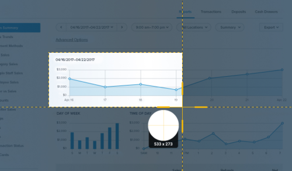
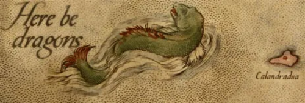
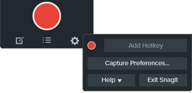
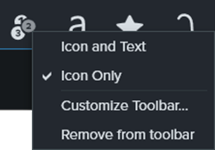
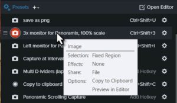
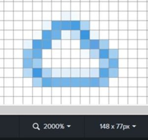
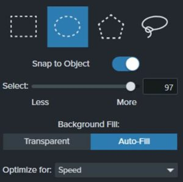
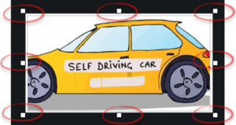
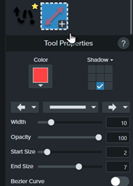

Dzisiejszy artykuł to prawdziwa perełka, zwłaszcza dla osób poszukujących
dobrego, funkcjonalnego narzędzia do obróbki zrzutów ekranu.

Poniżej wyczerpujący materiał Andrzeja, naszego nowego kolegi redakcyjnego. To
się nazywa debiut! Andrzej pobił rekord długości artykułu już w pierwszym
podejściu, dzięki temu powstał prawdziwy poradnik dla początkujących i
doświadczonych techwriterów. Dowiecie się z niego wszystkiego, a może jeszcze
więcej 😉 na temat wielofunkcyjnego narzędzia, jakim jest
[Snagit](https://www.techsmith.com/screen-capture.html?utm_source=influencer&utm_medium=partner&utm_campaign=brandexp&utm_content=techwriterpl).
Pierwsza część artykułu jest ogólna, a potem znajdziecie
[szczegółowe porady](#Snagit2020-max), a w bonusie kilka wartościowych linków od
producenta - firmy TechSmith.

Dobrej lektury!

## Wprowadzenie

Moja przygoda ze Snagitem zaczęła się w 2014 roku, kiedy moja siostra
(„wschodząca gwiazda bankowości inwestycyjnej”), odpowiadająca za projekty
informatyczne, poleciła mi narzędzie do wykonywania zrzutów ekranu, które miało
ułatwić mi pracę. Mamy 2020 a ja wciąż niecierpliwie czekam wydania nowej wersji
tej przydatnej aplikacji. W mojej opowieści spróbuję przybliżyć Wam fenomen tego
cacka i jak wpłynęło ono na sposób w jaki pracuję i komunikuję się.

\[caption id="attachment_9143" align="aligncenter"
width="561"\] „Print screen”, „screen shot”, „screen
capture”, „zrzuty ekranu”, a w języku Polglish „screeny”. Wiele jest określeń
tej prozaicznej, ale niepozbawionej niuansów czynności.\[/caption\]

## Historyczne decyzje

Pracowałem wtedy w dziale dokumentacji w firmie TomTom, w której zresztą nadal
pracuję. Niedługo po usłyszeniu rewelacji od siostry, ściągnąłem wersję próbną i
rozpocząłem przygodę z aplikacją. Pierwsze wrażenia były na tyle obiecujące, że
poprosiłem o zakup licencji dla mnie i reszty zespołu. Żeby uzyskać pełen dostęp
do narzędzia, musiałem przekonać moją bardzo sympatyczną i jeszcze bardziej
skrupulatną szefową o tym, że warto w to zainwestować. Przygotowując się do tego
artykułu, dotarłem nawet do historycznego maila, w którym przedstawiam zalety
narzędzia i uzasadniam zakup licencji. Co ciekawe, na przestrzeni lat, to co
wtedy napisałem po krótkim zaznajomieniu się ze Snagitem pozostaje wciąż
aktualne. Zalety, które dostrzegłem wtedy były następujące:

- Sprytne robienie screenów obszaru, który Cię interesuje
- Możliwość szybkiego dodania podpisów, strzałek, podkreśleń i numerowanych
  kroków
- Specjalne tryby użycia, na każdą okazję
- Możliwość definiowania konfiguracji screen shotów pod konkretny projekt
  (presety)
- Błyskawiczne dodawanie obrazka, np.: do tworzonej wiadomości w Outlook
- Automatyczne katalogowanie screenów w bibliotece, w której dodatkowo można
  ustalać specjalne etykietki dla obrazów z tego samego tematu
- Szybkość z jaka wykonujesz powyższe czynności, prostota użycia
- Niezwykle przystępna cena licencji.

To samo powiedzieć mogę o Snagit 2020, mimo tego, że interfejs przeszedł
gruntowne zmiany, w porównaniu z wersją z 2014 doszło bardzo wiele możliwości.
Na przestrzeni lat, widzę, że poniższe wartości są szczególnie ważne dla firmy
TechSmith:

- Prostota i intuicyjność
- Szybkość
- Skupienie na funkcjach mających największe znaczenie
- Możliwość dostosowania narzędzia do własnych potrzeb.

Choć przedstawiłem wtedy dość przekonujące uzasadnienie, szefowa i tak poprosiła
mnie o porównanie ponad 20 aplikacji o podobnych funkcjonalnościach, oglądałem
też różne edytory graficzne. Po poszerzonej analizie ostatecznie doszliśmy do
wniosku, że na potrzeby tworzenia profesjonalnie wyglądających ilustracji
interfejsów Snagit zupełnie wystarczał. I okazało się szybko, że nie tylko
„dawał radę”, ale wręcz podbił nasze serca.

## Przygoda ze Snagitem

Robiąc zrzuty ekranu przed 2014 niewiele przykładałem wagi do sposobu w jaki je
wykonywałem. Powtarzałem te same czynności: wciśnięcie PRINT SCREEN na
klawiaturze, wklejenie do Ms Paint (tak, i nie wstydzę się tego 😉), dorysowanie
strzałki, wycięcie namiarowego obszaru, następnie zapisanie obrazu tam, gdzie
potrzebowałem. Proces bywał żmudny, a jego efekt nie robił furory. Było to też
na tyle czasochłonne, że robienia screen shotów podejmowałem się tylko, jeśli
faktycznie potrzebowałem ilustracji w tool manualu lub e-learningu. Problemem
było też zarządzanie bałaganem jaki szybko się tworzy, kiedy zaczynasz robić
wiele screen shotów. Mając kilka podejść do przedstawienia jednej rzeczy, liczba
wersji danego obrazka rośnie, razem z ryzykiem, że zapodziejesz ten jeden
obrazek, który finalnie chcesz umieścić w dokumencie. Na scenę wkracza Snagit.
Nawet w wersji 2014 narzędzie było bardzo intuicyjne. Każdy szybko, samodzielnie
i bezboleśnie się w nie wdrożył. W krótkim czasie wszyscy znali już podstawowe
funkcje. Online help czy tutoriale nie były potrzebne. Oprócz prostoty użycia,
role odegrał też dobry „onboarding” pod postacią podpowiedzi na ekranie,
pomocnych, kiedy stawiasz pierwsze kroki.

### Wartość dodana

Ilustracje tworzone przez zespół zaczynały wyglądać coraz bardziej
profesjonalnie i miały ujednolicony wygląd. Dzięki bibliotece (patencie, którego
u konkurencji nie uświadczyłem) zarządzanie większą ilością screenów stało się
prostsze. Dostaliśmy potężne narzędzie z możliwością szczegółowego filtrowania
po datach, etykietach, witrynach lub aplikacjach, których dotyczyło wypstrykane
zdjęcie. Uwolniona została kreatywność w zespole. Okazało się, że większość z
nas potrafiła wyprodukować dobrze wyglądające obrazki i mieć z tego frajdę.
Niespodziewanym aspektem było usprawnienie komunikacji. Sam jestem osobą myślącą
w dużej mierze obrazami. O niebo łatwiej było wysłać zdjęcie fragmentu
dokumentacji z żółtym zakreśleniem i strzałką niż użyć iluś zdań, by
wytłumaczyć, gdzie znaleźć błąd w dokumentacji, na czym on polega i jak go
naprawić. Niektóre z moich maili nie zawierały tekstu, tylko obrazek, który
oddawał wszystko o co mi chodziło. W tamtym okresie trudniej było tworzyć
bezpośrednie odnośniki do treści i możliwość pokazania wirtualnym palcem
interesującego nas fragmentu wirtualnej rzeczywistości była prawie tak dobra,
jak podejście do kolegi czy koleżanki i wskazanie na ich monitorze. Opcja z
użyciem Snagita była nawet lepsza, bo nie pozostawały odciski palca na monitorze
😉 Narzędzie to było bardzo pomocne przy wskazywaniu wizualnych niedoróbek w
prezentacjach e-learning i odgrywało rolę w procesie recenzowania tworzonych
treści. Nawet tworzenie i udostępnianie memów stało się prostsze 😉

### Kto powinien się zainteresować

Narzędzie jest przede wszystkim adresowane do tech writerów i specjalistów od
e-learningu. Nawet jeśli Twoja rola nie dotyczy tworzenia treści, to niezależnie
od tego czy jesteś szeregowym pracownikiem czy managerem, Snagit może być
nieocenionym narzędziem do skutecznej komunikacji wizualnej, robienia notatek. O
dodatkowych zastosowaniach piszę później.

### Ewolucja Snagita – kamienie milowe

Twórcy Snagita unikają stagnacji, więc z biegiem czasu aplikacja zaczęła
obrastać w piórka. Muszę przyznać, że mają tam świetnych speców od user
experience, którzy wprowadzają odważne ulepszenia, których słuszność nie jest
zawsze widoczna od razu. Opowiem o kilku godnych uwagi „game changerach”. Nie
wymieniam tu każdej opcji, bez której nie mogę żyć, ale kilka bardzo
interesujących kierunków, jakie TechSmith obrał.

#### Od wstążki do przycisków

W początkowej wersji jaką dostałem, przyciski były pogrupowane podobnie jak we
flagowych aplikacjach Ms Office (ribbon). Dostęp do konkretnej funkcji w pasku
narzędzi wymagał przełączenia się na odpowiednią zakładkę grupującą przyciski.
Choć dobrze poznałem układ przycisków, czasem spiesząc się i nie mogąc wyszukać
odpowiedniej funkcji kilkakrotnie przełączałem się między grupami przycisków, aż
znalazłem to czego szukałem. Jako użytkownik byłem na tyle zadowolony z
programu, że nie zauważałem problemu. Na szczęście, eksperci od user experience
kwestię namierzyli i naprawili, zmieniając interfejs tak, by wszystkie przyciski
były widoczne równocześnie. I bardzo mi się to podoba.

#### Dodatkowy krok przy domyślnym robieniu screena

W pierwotnej wersji, domyślny tryb pozwalał na szybkie zaznaczanie ekranu i
natychmiastową edycję obrazu. Od pewnej aktualizacji, po zaznaczeniu, należało
jeszcze kliknąć duży, dogodnie umieszczony na ekranie przycisk, by zatwierdzić
zrobienie zdjęcia. Bardzo zdziwiła mnie ta decyzja, bo jeśli zależy nam na
szybkości a potrzebujemy kliknąć dodatkowy przycisk to wyglądało to na krok w
tył w porównaniu z wcześniejszą wersją. Dopiero po jakimś czasie zrozumiałem
kontekst tego usprawnienia. W trybie domyślnego robienia screenów dodatkowy krok
pozwala dostosować pierwotne zaznaczenie obszaru, który nas interesuje. W
przeciwnym wypadku, w razie niedoskonałego zaznaczenia, użytkownik nie ma szansy
na poprawienie zakresu robionego screena i musi rozpocząć procedurę od nowa.
Dzięki temu rozwiązaniu zaoszczędzany jest czas. Wspomnieć należy, że użytkownik
ma też wtedy możliwość wyboru, czy chce wykonać zdjęcie, film, lub zdjęcie
panoramiczne, przez co zyskujemy dużą elastyczność działania. Poza tym, jeśli
użytkownik chce natychmiastowego robienia screena, bez kroku drugiego, wystarczy
skorzystać ze zdefiniowanego presetu wywoływanego skrótem na klawiaturze lub
wybierając go z listy. Jak widać, każda zmiana poprzedzona jest dogłębną analizą
problemu, którego większość użytkowników może nie dostrzegać. Aktualizacja
skutkuje ułatwieniem pracy i usprawnieniem działania. Czasem potrzeba trochę
czasu, by pokonać wcześniejsze przyzwyczajenia, ale warto się przekonać.

#### Autofill – automatyczne wypełnianie

Tu również mamy genialne usprawnienie. Powiedzmy, że edytujesz interfejs
użytkownika na obrazku i wycinasz przycisk. Pozostaje przezroczysty obszar, po
czym musisz dobrać odpowiedni kolor i wypełnić tę przestrzeń. Możesz załatać to
na inne sposoby, z których każdy jest dodatkową czynnością, która zabiera czas.
Włączenie opcji „Autofill: Speed” daje automatyczne wypełnianie kolorem zgodnym
z pobliskimi obszarami. Funkcja gorzej radzi sobie z dużą gamą kolorów. Z
pewnością nie polecam jej do wycinania obszarów na zdjęciach z wakacji, choć tam
można spróbować alternatywnej opcji „Autofill: Photo Quality”, która w
niektórych sytuacjach radzi sobie dobrze.

#### Batch Conversion – operacje na wielu plikach

Snagit pozwala zapisywać wybrane pliki pod automatyczną, nową nazwą i w wybranym
formacie. Można też dodać efekty takie jak: zmiana wymiarów, przycinanie, ramki,
znak wodny i wiele, wiele innych.

#### Projekty z edytowalnymi obiektami

Absolutnie nie do przecenienia jest możliwość zapisu obrazów do formatu \*.snag,
co pozwala zachować każdy dodany element jako edytowalny obiekt, który w
przyszłości możesz zaktualizować, przesunąć lub wykasować. Do publikacji
potrzebne są statyczne obrazy w formatach takich jak \*.jpg czy \*.png, ale to w
formacie \*.snag Twój projekt graficzny żyje i się rozwija.

#### Video

Nagrywanie i edycja wideo pozwalają na stworzenie filmu demonstrującego
wykonanie czynności na ekranie. Taki prosty film można użyć w e-learningu.
Świetnym wykorzystaniem filmu jest wyciągnięcie z niego pojedynczych klatek.
Czasem, by uzyskać większą liczbę screenów, lepiej tak zaatakować problem
zamiast pstrykać każde zdjęcie z osobna.

#### Tworzenie gifów

Wyjątkowo krótkie filmy można zapisać jako animowany \*.gif do użycia w
materiale e-learning czy w online help. Czasem kilka zapętlonych klatek wyjaśni
więcej niż cztery zdania tekstu.

#### Themes

Sporą zaletą Snagita jest to, że można zdefiniować kolory zgodne z „brand style
guide”, dzięki czemu uzyskamy wizualną spójność. Tak ustawione kolory można
udostępnić reszcie zespołu, co zaoszczędzi czas jaki spędziłaby każda z osób na
ręcznym ustawianiu kolorów.

#### Dostosowywanie paska narzędzi

Użytkownik może zdecydować jakie przyciski chce mieć na widoku. Najważniejsze z
nich są pod ręką, kiedy tylko ich potrzebujesz.

#### Blur

Możliwość ukrycia wrażliwych danych na screenie, poprzez dodanie rozmytego
obszaru. Przydatna opcja, zwłaszcza w świecie po wprowadzeniu RODO.

#### Quick Styles, Favorites

Specyficzne kombinacje parametrów dla obiektów (np.: czerwona strzałka o
wybranej grubości i stylu) można zapisywać do galerii stylów. Dla zgrupowania
tych najbardziej przydatnych stylów możemy wykorzystać **Favorites**.

#### Templates

Szablony pozwalają na szybkie stworzenie wizualnej instrukcji „krok po kroku”.
Wystarczy zaznaczyć potrzebne grafiki, wybrać szablon i dodać podpisy.

#### Zdjęcia panoramiczne

Korzystam z tego każdego dnia, gdy chcę pokazać obraz nie mieszczący się na
ekranie. Wystarczy włączyć nagrywanie, przewinąć zawartość strony by uzyskać
zapisanie całości. Narzędzie działa też w poziomie, więc można pokazać duże
obszary mapy jako całość, np.: trasę autostrady jadącej na południe, a potem na
zachód.

#### Tłumaczenie Callouts

Jeśli potrzebujesz ilustracji w różnych językach, użyj przycisku **Translate** w
**Library**. Powstanie wtedy plik, który można otworzyć w programie open source,
który wspomoże Cię w tłumaczeniu podpisów i **Callouts** (dymków).

#### Nagrywanie narracji i wideo na bazie zachowanych obrazów

Ciekawym rozszerzeniem możliwości wideo jest nagrywanie narracji dla wybranych
obrazów między którymi można się przełączać i po nich rysować. Najczęściej
pomocne przy nagrywaniu filmu z prezentacją.

#### Grab Text

Funkcjonalność pozwala na szybkie rozpoznanie tekstu w obrazie, jego skopiowanie
i edycję.

#### Simplify

Narzędzie pozwala automatycznie zamienić screen shot pokazujący interfejs
aplikacji w uproszczoną grafikę, której tylko wybrane fragmenty pokazują
potrzebne informacje. Świetna metoda, by nie obciążać odbiorcy nadmiarem
niepotrzebnych informacji wizualnych. Taki obraz pozostanie aktualny na długo,
bo będzie pokazywać ograniczoną liczbę przycisków i elementów interfejsu.

## Ciekawe zastosowania

#### Robienie notatek

Snagit pozwala na błyskawiczne rejestrowanie fragmentów maili i stron. Powiązane
informacje można obejrzeć obok siebie, zastosować zakreślenie, wkleić ikonę
(**Stamp**), rysować linie i strzałki. Ponadto, biblioteka Snagita (**Library**)
automatycznie zapisze adresy stron, na których robione były screeny.

#### Lista rzeczy do zrobienia

Panel **Recent Captures Tray** pokazuje miniatury ostatnio wykonanych zdjęć.
Może nie brzmi to spektakularnie, ale jest to niezwykle pomocne przy tworzeniu
listy rzeczy do zrobienia. Możesz przygotować sobie serię wizualnych notatek,
która jest zawsze na widoku z poziomu **Edytora**. W miarę wykonywania kolejnych
punktów zamykasz następujące po sobie miniatury i przechodzisz do pozostałych
zadań.

#### Zbieranie przykładów

W mojej codziennej pracy w Specyfikacji mapy, często potrzebuję zebrać dużo
zdjęć przedstawiających sytuacje drogowe, których dotyczą funkcjonalności, np.:
skrzyżowania. Do szeroko zakrojonych poszukiwań stosuję **Presets**. Definiuję
parametry zdjęć jakie chcę zrobić. Moim priorytetem jest minimalizowanie
ręcznych czynności. Wystarczy, że zaznaczę obszar, a on automatycznie zapisywany
jest w wybranym katalogu, z domyślną nazwą, dzięki czemu się w tym nie pogubię.
Po wstępnym zebraniu zdjęć, niepotrzebne usuwam, a jeśli trzeba, korzystam z
**Tags** – etykiet, dzięki którym mogę podzielić znaleziska tematycznie.

#### Analiza porównawcza

W Snagicie często porównuję różne wersje specyfikacji, stosując rozmaite
narzędzia do podkreślenia kluczowych różnic. W obrębie panelu **Recent Captures
Tray** przeciągam screen shoty na obszar roboczy, by połączyć je w jeden obraz.

#### Rysowanie schematów

Mam bazę stworzonych ilustracji w formacie \*.snag. Wszystkie składają się z
edytowalnych elementów. Mogę tworzyć nowe kopie i je dostosowywać lub wyciągać
pojedyncze elementy (np.: legendy pod schematem), żeby zastosować je w obecnym
projekcie.

#### Proste demonstracje video

Chcesz coś komuś szybko wyjaśnić, ale nie masz czasu na telekonferencję? Nagraj
swój ekran (pamiętaj by włączyć nagrywanie kursora), udostępnij film za pomocą
jednej z wielu dogodnych opcji. Załatwione.

#### Dokumentowanie błędów aplikacji

Możesz jasno wskazać na screenie, gdzie występuje błąd. Możesz go zaznaczyć
ikonką czerwonego owalu (**Stamp**), narysować własny kształt, użyć narzędzia
**Spotlight and Magnify**, dodać półprzezroczysty dymek z komentarzem, który nie
przesłoni wszystkiego. Możesz użyć narzędzia **Capture Info**, które wstawia
pole z dowolnym tekstem, datą, godziną, systemem operacyjnym, nazwą aplikacji,
którą pokazujesz na screenie.

#### Wyciąganie koordynatów z obrazu

Pracując w branży nawigacji często wymieniamy się koordynatami miejsc do
obejrzenia, np.: 51.759324, 19.448562. Pracując w narzędziu
[QGIS](https://qgis.org/pl/site/), często robię screen z widocznymi
koordynatami. Kiedy później wracam do zdjęcia, stosuję komendę _Grab Text_ i już
mogę wklejać koordynaty w narzędzie, by kontynuować analizę.

#### Wygodne udostępnianie do Ms OneNote

W przypadku udostępniania do Ms OneNote, można wysyłać screeny nowych notatek w
wybranej sekcji albo tam, gdzie aktualnie znajduje się kursor w OneNote. Dobrze
działa to w połączeniu z presetem zmieniającym wymiary obrazów tak, by zmieściły
się na stronie notatki.

#### Naprostowywanie krzywego zdjęcia

Nie mam skanera i czasem robię zdjęcia dokumentów telefonem. Nieważne jak się
staram, zawsze jest trochę krzywo. Za pomocą **Perspective** mogę zrobić mały
retusz obracając zdjęcie w trójwymiarze. Dodam jeszcze, że _Grab/Edit Text_
potrafi rozpoznać tekst prawdziwego dokumentu na zdjęciu.

#### Wycinanie niechcianych elementów z obrazu

Czasem potrzebujesz zaznaczyć i usunąć element ze zdjęcia przedstawiający
prawdziwą sytuację. Masz np.: niepotrzebny znak drogowy na tle nieba, którego
nie chcesz mieć na rysunku. Użyj dowolnej opcji by je szybko usunąć (**Magic
Wand** albo **Selection** + „Snap to Object”) i automatycznie wypełnić kolorem
(„Autofill: Photo Quality”). Nie jest to metoda w 100% skuteczna, ale wiele razy
wycinałem rzeczy na tle nieba lub jezdni i uzyskiwałem zadowalające efekty.

#### Sprytne rejestrowanie menu

Za pomocą kombinacji opcji w **Capture Window** lub korzystając z **Presets**
możesz znacznie ułatwić sobie zadanie. Przeklikaj wszystkie menu, które chcesz
uwiecznić. Zatrzymaj nagrywanie. Masz zapisane każde menu i nic więcej. To się
nazywa chirurgiczna precyzja.

#### Jak zapisać tablice drogowe i nic więcej

Użyj opcji „Selection: Multiple Areas”, żeby zaznaczyć kilka prostokątnych czy
kwadratowych obszarów, które potem będą na jednym obrazie.

#### Uporządkowanie hierarchii nagłówków

Pracujesz na dokumencie lub stronie i sekcja nagłówków zaczyna Cię przerastać?
Zrób zdjęcie wszystkich nagłówków, wspomagając się **Panoramic Capture**.
Następnie włącz opcję „Smart move” dla **Move**. Teraz możesz przesuwać
nagłówki, a oprócz tego zakreślać je, przekreślać albo łączyć strzałkami, co
pomoże Ci uporządkować temat.

#### Odszukaj adres strony internetowej

Jeśli szukasz strony, na której był robiony screen, możesz użyć wyszukiwarki,
poszukać po dacie lub nazwie witryny. Gdy odnajdziesz screen, użycie komendy
_Details_ da Ci dostęp do zapisanego adresu internetowego.

#### Szybkie podmienianie obrazu w Ms Word

Pracując nad plikami Word z obrazami do aktualizacji, stosuję następującą
sztuczkę, by szybko aktualizować obrazy. Mam stworzony folder, do którego za
pomocą presetu uruchamianego skrótem klawiszy wysyłam obraz ze schowka. W Word
korzystam z komendy _Change Picture_ i udaję się do folderu, do którego mam
ustawiony szybki dostęp, a pliki sortowane są po dacie modyfikacji, więc
pierwszy z góry jest zawsze tym, który ostatnio dodałem. Otwieram plik i zdjęcie
podmienione. Przeczytanie tego akapitu zajmuje więcej niż cała akcja.

## Snagit obecnie – podsumowanie części ogólnej

Po wielu latach, korzystanie z tego elastycznego narzędzia weszło mi w krew, i
to nie tylko w czasie pracy. Kiedy tylko widzę przydatną informację, moje palce
odruchowo wędrują w kierunku skrótu uruchamiającego Snagit. Rysuję w nim mapkę
dojazdową do agroturystyki. Przycinam w nim na szybko zdjęcia ściągnięte z
komórki i zmieniam ich rozmiary. Możliwość szybkiego zapisania obrazu i
podzielenia się nim wydaje mi się już nieodzowna. Liczba screenów zapisanych w
**Library** z roku na rok się zwiększa, a ja dalej znajduję nowe sposoby na
efektywne przechwytywanie obrazu. I wciąż mam z tego frajdę.

Choć nie jestem ambasadorem firmy [TechSmith](https://www.techsmith.com/), lubię
opowiadać o tym narzędziu i dzielić się trikami na jakie wpadam. Zrobiłem kilka
sesji szkoleniowych i odpowiedziałem na wiele pytań początkujących użytkowników.
Cieszy mnie, kiedy nowi ludzie wypróbowują to narzędzie i okazuje się, że
rozwiązuje ono ich problemy. I błyskawicznie zaczynają obmyślać własne sztuczki.
Co przyniesie przyszłość, jeśli chodzi o samą aplikację? Nie znam drugiego
dostawcy oprogramowania tak skupionego na usprawnianiu procesu zapisywania
zawartości ekranu. Jestem pewien, że twórcy nie powiedzieli ostatniego słowa i
jeszcze nie raz zaskoczą nas nowymi funkcjami, a tech writerzy i specjaliści od
e-learningu dostaną jeszcze lepsze narzędzie do wizualnej komunikacji.

## Snagit 2020 - wyciśnij najwięcej jak się da

Dalsza część artykułu to propozycja dla osób, które już miały styczność ze
Snagitem i poszukują pomysłów na wykorzystanie jego pełni możliwości.

Ostrzegam, że będzie dość szczegółowo. I możesz nie obyć się bez kawy 😉. Z
aplikacji korzystałem pod Windows 10. Postaram się nakreślić najbardziej
przydatne funkcje i kilka nieoczywistych detali z nimi związanych. Będzie też
trochę kwestii podstawowych. Z pewnością nie wyczerpię tematu, szczególnie, że
każdy może korzystać z aplikacji inaczej. Znajdziesz tu wiele przykładów użycia,
które wypracowałem podczas pracy nad dokumentacją wewnętrzną opisującą narzędzia
do tworzenia map dla nawigacji samochodowej i autonomicznych pojazdów. Narzędzie
testowane pod Windows 10.

Przykłady użycia będą oznaczone taką ikoną w tekście:

Prostsze triki znajdziesz koło ikony deskorolki:

Najistotniejsze kwestie będą oznaczone tak:

Większe części interfejsu są zaznaczone **wytłuszczoną** czcionką, opcje -
znakami „”, a komendy widoczne po kliknięciu prawym przyciskiem i w menu Edit,
Image są zapisane *kursywą.*

Może zaadaptujesz te sposoby do swojego kontekstu albo zainspirują Cię do
znalezienia własnych, pomocnych w Twojej branży trików. Po przebrnięciu przez
artykuł (pewnie nie za jednym posiedzeniem) i po eksperymentach praktycznych w
narzędziu, będziesz mógł/mogła z dumą powiedzieć:

### Ustawienia na dobry początek

Pierwsze kroki warto skierować do ustawień i preferencji. Nie chcę powtarzać
treści online helpu Snagita, a zwrócić uwagę na niezwykle istotne opcje.

#### OneClick: Ikona koła zębatego => Capture Preferences

Warto ustawić skrót dla „Repeat last capture”, który pozwoli powtórzyć robienie
zdjęcia na ostatnio zaznaczonym obszarze.

Przykład użycia tej opcji. Po zrobieniu pierwszego
screena z fragmentem mapy chcesz ponownie zrobić zdjęcie tego samego obszaru
ekranu po przesunięciu mapy i pokazaniu innego miejsca. Bo po co zaznaczać
jeszcze raz ten sam obszar, który Snagit ma już w pamięci?

#### Snagit Editor: Menu Edit => Editor Preferences

Polecam włączyć opcję „Automatically expand the canvas to fit objects” bo dzięki
temu po wklejeniu większego obiektu obszar roboczy automatycznie dostosuje się
do niego. Przeciągnięcie obiektu (np.: strzałki) poza granice przesunie je, co
zaoszczędza kilka kliknięć i przeciągnięć myszą.

Proponuje wyłączyć „Show toolbar labels” bo dzięki temu zyskujemy więcej miejsca
w pasku narzędzi, co ma znaczenie, jeśli umieścisz tam dużo narzędzi.

„Prompt before deleting” – zdecydowanie polecam włączyć, bo
inaczej łatwo usunąć przez przypadek coś z biblioteki lub z panelu **Recent
Captures Tray**.

Kliknij prawym przyciskiem na pasku narzędzi, żeby ustawić które ikony będą
widoczne.

„Spacer” pozwala wstawić przerwy rozdzielające grupy przycisków.

### Zarządzanie plikami \*.snag

Świadomość tego jak zarządzać plikami w formacie \*.snag ma
kluczowe znaczenie. Przede wszystkim, jeśli chcesz tworzyć obrazki z dodawanymi
obiektami, takimi jak podkreślenia, podpisy, rysowane kształty to, oprócz zapisu
do wybranego formatu graficznego (np.: \*.png), należy też zapisywać kopie w
formacie \*.snag. Pozwoli to na późniejszą edycję i przesuwanie obiektów na
obrazie. W razie zapisu tylko do \*.png, po następnym otwarciu aplikacji obraz
będzie „spłaszczony” i nie będzie już w nim osobnych, edytowalnych obiektów.
Ponieważ czasem nie da się przewidzieć, do którego obrazu będziesz wielokrotnie
wracać, by nanosić poprawki, stanowczo zalecam zapisywanie do \*.snag. W ten
sposób masz plik projektowy, który możesz później dostosować. Jeśli na wspólnych
projektach pracuje kilku tech writerów, warto stworzyć współdzieloną lokalizację
„Image_Bank” ze strukturą folderów tematycznych umożliwiającą łatwe wyszukiwanie
stworzonych wcześniej obrazów. Dzięki temu, można bezkarnie wykorzystywać części
istniejących już ilustracji innych autorów (zwłaszcza mam tu na myśli schematy z
linii i kształtów). Pozwoli to wykorzystać przydatne elementy z innych
ilustracji i nie tworzyć ich od zera za każdym razem.

Można stworzyć jeden zbiorczy folder w chmurze (w moim
przykładzie będzie to OneDrive) na szybki backup plików \*.snag, które w dalszej
kolejności będą ręcznie umieszczane w odpowiednich folderach. Należy kliknąć
przycisk **Share**, żeby ustawić lokalizacje docelową w obrębie OneDrive.
Dostosuj pasek narzędzi, by ikona OneDrive pojawiła się na widoku. Teraz, po
zapisaniu pliku \*.snag na dysku, wystarczy kliknąć ikonę OneDrive, a edytowalny
plik \*.snag pojawi się w wybranym katalogu w chmurze.

### Instalacja nowej wersji a istniejąca biblioteka obrazów

Nie obawiaj się, że po instalacji nowej wersji stracisz
dotychczasowe screeny. Po prostu odinstaluj starą wersję używając opcji „keep
files”, zainstaluj nową i możesz już wykorzystywać nowe funkcjonalności na
wcześniejszych plikach.

### Instalacja pieczątek z wersji 12

Dla fanów zestawu pieczątek tej wersji. Ściągniecie je
ze strony TechSmith. Tutaj instrukcja:
[https://support.techsmith.com/hc/en-us/articles/220456508-Snagit-Windows-Install-Old-Stamps](https://support.techsmith.com/hc/en-us/articles/220456508-Snagit-Windows-Install-Old-Stamps)

### Podstawowy proces użycia

Choć prostota jest dla twórców aplikacji jednym z priorytetów, nie można
powiedzieć, że program jest ubogi w funkcjonalności. Jeśli przyjrzeć się tym
wszystkim opcjom i trybom w krótkim czasie, można dostać małego zawrotu głowy.
Prostota Snagita jest jego siłą, ponieważ dla kluczowych czynności TechSmith
wymyślił, jak ograniczyć liczbę zbędnych kliknięć do minimum. Aplikacja
dostarcza najpotrzebniejszych narzędzi do wykonania zadania. Z tego też powodu,
Snagit nie może konkurować z zaawansowanymi edytorami graficznymi. Nie jest on
wszechpotężny, ale zaskakująco błyskawiczny i sprytny dla wybranych czynności.

Podstawowy proces użycia wygląda tak:

1. Włączenie **All-in-One** poprzez użycie przycisku na klawiaturze (lub
   kombinacji przycisków). Można też kliknąć czerwony przycisk **Capture**.
2. Wybór interesującego Cię obszaru.
3. Ewentualna korekta zaznaczenia, wybór odpowiedniego trybu i zatwierdzenie.
   **Jeden sposób** to kliknięcie i przeciągnięcie ramki zaznaczenia. **Drugi**
   to nakierowanie kursora na interesujące okno, panel czy przycisk. Snagit
   zasugeruje rozpoznane obszary, które zatwierdzisz pojedynczym kliknięciem.
   **Możesz też** kliknąć przycisk **Fullscreen** na górze ekranu.
4. Natychmiastowa edycja obrazu w połączeniu z rysowaniem i efektami; przycięcie
   filmu.
5. Udostępnienie obrazu/filmu, zapis do wybranego formatu i \*.snag.

Stosując presety można zautomatyzować ten proces i ograniczyć kroki manualne, o
czym przeczytasz w dalszych sekcjach.

W kilku miejscach będę się odnosił do wypisanych powyżej kroków.

### Rejestrowanie ekranu – najbardziej kompleksowy zestaw trybów

#### All-In-One - domyślny tryb robienia screenów

Wystarczy wcisnąć ustawiony klawisz, ich kombinację albo czerwony przycisk
**Capture** występujący w **OneClick**, **Capture Window**, a nawet w
**Edytorze**. Użycie tych funkcji jest bajecznie intuicyjne, a dzięki opcji
„onboarding” można zobaczyć wskazówki w kontekście obecnie wykonywanej
czynności. Zwrócę uwagę na kilka mniej oczywistych niuansów.

Podczas kroku **2.**, kiedy przytrzymujesz wciśnięty
przycisk myszy możesz uzyskać precyzję na poziomie piksela wciskając strzałki na
klawiaturze. Bardzo przydatne do dokładnego zaznaczenia ramki okna na zdjęciu.
Lupa jest pomocna w bezbłędnym zaznaczeniu i przy okazji pokazuje obecną liczbę
pikseli.

Jeśli potrzebujesz szybko zmierzyć element interfejsu, okna, tabeli czy zdjęcia,
w kroku **2.** zobaczysz liczbę pikseli pod lupą. Czyli linijkę masz zawsze pod
ręką.

 Podczas kroku **2.** możesz użyć skrótów
klawiszowych. **SHIFT** – zaznaczanie kwadratowego obszaru. **CTRL** – proporcje
16:9. **CTRL+SHIFT** proporcje 4:3. Wciśnij **ENTER**, by zaakceptować
zaznaczenie i przejść od razu do edycji.

 Podczas kroku **3.** można rozsunąć stworzoną ramkę
pociągając za uchwyty na prostokącie. Można przeciągnąć cały obszar klikając w
jego środek i przeciągając go (kształt wtedy się nie zmienia). Można wpisać
wymiary ręcznie. Jeśli efekt jest niezadowalający, można wrócić do kroku **2.**
klikając **Redo** lub zrezygnować klikając **Cancel**.

Na etapie **3.** możesz zadecydować, czy zarejestrujesz statyczny obraz, film
albo zdjęcie panoramiczne, o których więcej dowiesz się z dalszych sekcji.

#### OneClick

Zawsze dostępny jako cienka linia w wybranym miejscu na brzegu ekranu.
**OneClick** pozwala na błyskawiczne przywołanie trybu **All-In-One**. Wystarczy
naprowadzić tam kursor by przywołać panel i kliknąć czerwony przycisk
**Capture**.

Przycisk trzech kresek służy pokazywaniu i ukrywaniu listy presetów na
**OneClick**. Kliknięcie nazwy widocznego presetu skutkuje jego natychmiastowym
uruchomieniem. Pierwsza ikona z lewej pozwala otworzyć **Edytor**. Zgodnie z
nazwą, wystarczy tylko jedno (sic!) kliknięcie, by manufaktura screenów ruszyła.
Już łatwiej się nie da zacząć. Prawdopodobnie najczęściej używany sposób
robienia screenów przez osoby, które dopiero co zainstalowały Snagita.

#### Capture Window: All-in-One

Gdy domyślne ustawienie trybu **OneClick** ograniczają Cię, z pomocą przychodzi
**Capture Window** z możliwością zmiany opcji w locie. W Capture Window, który
pod Windows znajduje się w prawym dolnym rogu ekranu (Taskbar), można na biegu
dostosować kilka kluczowych ustawień dla domyślnego trybu **All-in-One**.

Dla wygody, warto ustawić taskbar tak, by ikona
**Capture Window** była stale widoczna.

Kliknięcie prawym klawiszem na ikonę **Capture
Window** daje dostęp do listy presetów do uruchomienia. Można też zrobić zrzut
ekranu zgodnie z obecną konfiguracją Capture Window.

Wyłączenie „Preview in Editor” oznacza, że po kroku **3.** nie przejdziesz do
obróbki zdjęcia w **Edytorze**, a będziesz mógł/mogła powtórzyć kroki **1-3.**
Czasem potrzebujesz najpierw skupić się na zarejestrowaniu dużej liczby
przykładów, a do edycji zasiądziesz później. Zapisane obrazy odnajdziesz z
łatwością w **Library** i **Recent Captures Tray**. Włączenie „Copy to
Clipboard” jest wygodne, gdy chcesz zapisać obraz od razu do schowka, co
zaoszczędza dodatkowe kliknięcie w Edytorze.

Typową kombinacją opcji jest wyłączenie „Preview in
Editor” i włączenie „Copy to Clipboard” gdy chcesz zaznaczyć coś konkretnego, co
bez edycji można wkleić bezpośrednio do maila.

„Capture Cursor” pozwoli zdecydować, czy chcesz by kursor był widoczny na
obrazku. Kursor zapisywany jest jako edytowalny obiekt, więc w trakcie edycji
można go przesunąć lub wykasować. Ostatnią z szybkich opcji to „5 Second delay”.

Opcja jest przydatna, gdy fotografowany obiekt musi
być najpierw kliknięty, żeby stał się widoczny, albo musisz zatrzymać kursor
jakiś czas nad ikoną, żeby pokazać wyświetloną etykietkę. Wtedy pięć sekund w
zupełności wystarcza, by wywołać sytuację, którą chcesz uwiecznić.

Powyższe cztery opcje-przełączniki są w stanie obsłużyć lwią cześć sytuacji.

Żeby dostać się do dwóch ukrytych opcji, kliknij znak
**\>** (zaznaczony na czerwono na obrazku powyżej). Znajdziesz dodatkowe opcje.

Domyślnie, **All-in-One** daje możliwość ręcznego zaznaczenia, wyboru
automatycznie rozpoznanego obszaru lub rejestrację pełnego ekranu. Drop-down
menu przy „Selection” pozwala ograniczyć wybór do jednej z trzech wymienionych
możliwości.

Co ciekawe, „Selection: Fullscreen” nie równa się opcji
„Fullscreen” z kroku **2.**, który tylko zaznaczy zawartość bieżącego monitora.
Użycie opcji z „Selection” da zaznaczenie obszaru wszystkich podłączonych
monitorów. Osoby pracujące na większej liczbie monitorów mogą szybko zapisać
wszystko, co jest widoczne bez potrzeby ręcznego zaznaczania całości. Ja często
tak robię, gdy na jednym monitorze mam wyświetlone dane mapy w aplikacji QGIS, a
na drugim wyświetlam sytuację drogową pokazaną w wewnętrznym narzędziu TomTom. W
ten sposób można trzymać razem powiązane obrazy.

„Selection: Region” => koło zębate pozwala ustawić obszar zaznaczenia na
sztywno. Może być on przesuwalny albo umiejscowiony w konkretnym miejscu.

Jest to dobra opcja, jeśli masz dobrze zdefiniowany
obszar aplikacji ze zmieniającą się zawartością, np.: panel do wyszukiwania obok
aktualizującego się obszaru mapy. W ten sposób możesz szybko stworzyć obrazy tej
samej wielkości, pokazujące tak samo zaznaczony panel i mapę.

Ostatnią „ukrytą” opcją jest „Share”, pozwalająca
włączyć natychmiastowe udostępnianie. Można udostępniać do kilku miejsc na raz.

Można wyłączyć wszystkie główne opcje-przełączniki
(„preview”, „clipboard”, „cursor”, „delay”) i włączyć udostępnianie do chmury,
np.: OneDrive. Ponieważ jest to **All-In-One** to krok **3.** będzie występował,
a po nim plik \*.snag zostanie zapisany na udziale w wybranym miejscu.

Po tych wszystkich kombinacjach, możesz wrócić do domyślnych ustawień klikając
strzałkę:

Strzałka ta występuje dla każdej z zakładek: **All-In-One**, **Image**,
**Video**.

#### Capture Window: Image

Po wyczerpaniu wszystkich możliwości trybu **All-In-One**, warto przejść do
następnej zakładki **Image**. W tym trybie część opcji pokrywa się z tymi z
**All-In-One**, więc opowiem o tych odróżniających się. Drop-down dla
„Selection” też zawiera opcje „Region”, „Window”, „Fullscreen”, ale to dopiero
preludium. Wymienię te najciekawsze:

- „Scrolling window” służy do automatycznego przewijania i nagrywania okien
  dłuższych niż jeden ekran. O „Panoramic” będzie w następnej sekcji.
- „Grab text” pozwala na zaznaczanie fragmentów tekstu, próbę odczytania go
  przez wbudowaną funkcję OCR i skopiowanie rezultatu. OCR ma czasem problem z
  odczytaniem pewnych czcionek albo myli 0 z O itp. Ogólnie mogę powiedzieć, że
  dobrze czytelny tekst będzie w stanie rozpoznać.

W mojej firmie opcja „Grab text” przydaje mi się, gdy
chcę szybko skopiować koordynaty lokalizacji wyświetlane na mapie w czasie
telekonferencji screen sharing. Zaznaczam obszar, kopiuję z niego tekst i
wklejam potrzebne koordynaty do innej aplikacji, żeby szybko zapoznać się z
danym miejscem w trakcie rozmowy. Inaczej musiałbym albo przepisać ciąg cyfr
ręcznie albo przerwać rozmówcy i poprosić o koordynaty. Jako, że w Snagit
zajmuje to kilka sekund, to czasem idę na skróty w ten sposób.

Żeby dostać się do dalszych opcji, trzeba wybrać opcję „Advanced”.

„Object” – niezwykle przydatny tryb, jeśli zależy Ci na złapaniu poszczególnych
przycisków z interfejsu, który fotografujesz.

Chcesz zrobić zdjęcie przycisków, ale bez otaczających je
ramek? Użyj opcji „Fixed region” z „Region” i wpisz wysokość przycisku w
pikselach bez uwzględnienia ramki. Uzyskasz obszar do robienia screenów nie
większy niż zdefiniowana wysokość pikseli, a precyzję umiejscowienia uzyskasz
korzystając ze strzałek na klawiaturze. Zatwierdzaj enterem.

„Clipboard” – można w tym trybie przechwycić do Snagita obraz, który jest
obecnie w schowku.

„Freehand” – ręczne zakreślanie obszaru.

„Menu” służy do automatycznego wykrywania otwartych menu. Żeby móc z tego
skorzystać, trzeba włączyć „Time Delay”.

**Effects** – tutaj robi się ciekawie, bo można z góry ustalić efekt jaki ma być
zastosowany na robionym zdjęciu, taki jak: przycięcie, dodanie ramki, obrót,
formatowanie krawędzi, znak wodny z logo Twojej firmy, zmiana wymiarów,
dostosowanie koloru, nałożenie filtra, cienia czy „Capture info”. W ten sposób
możesz równocześnie robić zdjęcie i zaoszczędzić jeden krok manualny, dzięki
czemu będziesz mieć spójne wizualnie obrazy. Zaoszczędzisz nawet kilka kroków,
jeśli zastosujesz kilka efektów na raz. Opcja **Share** wygląda tak samo jak dla
**All-In-One**. Potężną opcją okazuje się być „Time Delay” bo można ustawić za
ile sekund ma nastąpić zapis. Za pomocą opcji „Interval” uzyskasz serię screenów
robionych co wyznaczoną liczbę sekund. Warto wtedy włączyć „Discard identical”.
Można też ustawić robienie zdjęcia o ustalonej porze.

Podczas telekonferencji z udostępnianiem ekranu, gdzie
pokazywane jest demo skomplikowanej akcji na ekranie, można ustawić taką
kombinację (oczywiście za zgodą rozmówcy): zapis obrazu z wybranego monitora w
interwale co 5 sekund, z włączeniem „Discard identical”; opcja „Preview in
Editor” wyłączona. Wtedy zapisze się wiele plików, ale nic godnego uwagi Ci nie
umknie. Niepotrzebne obrazy można później usunąć.

Inna opcją byłoby nagrać film a potem wyciągać z niego klatki.

#### Zdjęcia panoramiczne

Robienie zdjęć panoramicznych jest dostępne w większości trybów. Pozwala zapisać
więcej niż można pokazać na jednym ekranie bez przewijania. Często stosuję ten
tryb, by zrobić zdjęcie tekstu w Ms Word, który znajduje się na dwóch stronach.
Wystarczy przewinąć stronę a Snagit wykona serię zdjęć z których sklejony będzie
jeden obraz i zostanie poddany obróbce. Nagrywania można dokonać zarówno w
poziomie jak i w pionie, np.: przesuwając mapę kawałek po kawałku, by nagrać
autostradę jadącą najpierw na południe i potem skręcającą na zachód. Należy
pamiętać o tym, by nie przesuwać mapy zbyt szybko, bo Snagit będzie mieć problem
ze sklejeniem obrazów. W post produkcji, nadmiar zarejestrowanej przestrzeni
można przyciąć narzędziem **Cut Out**.

#### Video

Snagit pozwala nagrywać proste filmy przedstawiające to, co dzieje się w
wybranej części ekranu. Może też nagrać obraz z wbudowanej kamery do laptopa.
Można nagrać narrację i dźwięki systemowe. Niepotrzebne fragmenty filmu łatwo
usunąć za pomocą suwaka:

Na podstawie filmu wideo da się stworzyć animowany \*.gif.

Jeśli potrzebujesz screen shotów panelu z wieloma
zakładkami, możesz zrobić zdjęcie dla każdej aktywnej zakładki osobno. O wiele
łatwiej jednak nagrać film pokazujący panel z kolejno aktywowanymi zakładkami, a
następnie wyciągnąć statyczne obrazy z filmu za pomocą poniższych przycisków:

\-
wybór klatki

\- zapis klatki.

Możesz w ten sposób nagrać serię czynności na ekranie, a następnie zapisać tylko
potrzebne klatki jako screen shoty. Nie warto zatrzymywać się po każdym kroku na
robienie zdjęcia.

#### Capture Window: Video

Większość opcji **Capture: Video** pokrywa się z tymi, które występują w
**Capture: Image**, **Capture: All-In-One**. Nagrywanie kursora na filmie jest
ważną kwestią i tylko tu da się ją ustawić. Jeśli chodzi o typowo filmowe opcje:
„Webcam”, „Microphone” i „System Audio” to te rzeczy możesz też dostosować po
uruchomieniu komendy _Capture_.

#### Capture Window: Presets

Świeżo upieczony użytkownik Snagita korzysta głównie z **OneClick**. Po
zaznajomieniu się z trybem **All-In-One** zaczynają się eksperymenty z głównymi
przełącznikami w **Capture Window** dla aktywnej zakładki All-In-One. Potem
zaczyna się eksploracja pozostałych zakładek **Image** i **Video** ze wszystkimi
dostępnymi opcjami. Kiedy znasz już różne kombinacje opcji, czas ułatwić sobie
pracę. Zamiast rozwijać rozmaite opcje i pamiętać, gdzie którą znaleźć, możesz
zdefiniować preset, który można uruchomić jednym kliknięciem albo skrótem
klawiszowym. Zmiany opcji w **Capture Window** są zwykle robione ad hoc. Jeśli
chcesz zautomatyzować sobie różne aspekty pod konkretny projekt to **Presets**
jest jedynym słusznym kierunkiem. Warto poświęcić kilka chwil, by dobrze ustawić
manufakturę produkującą screeny tak, by uchwycić to co trzeba i ograniczyć post
produkcję.

Jeśli lista presetów nie jest widoczna, kliknij przycisk z kołami zębatymi.
Przycisk „+” pozwala stworzyć preset z obecnymi ustawieniami **Capture Window**
lub zacząć od zera.

Znajdziesz przykładowe presety, na bazie których możesz utworzyć duplikaty,
które zmodyfikujesz. Zależnie od użytej zakładki (**Image**, **Video**,
**All-In-One**) presety mają inne ikony. Najeżdżając kursorem na preset,
zobaczysz podsumowanie opcji na wyświetlonej etykietce. Pełny obraz uzyskasz
klikając na komendę _Edit_, dostępną po kliknięciu koła zębatego presetu. Możesz
użyć komendy _Duplicate_, by zapisać kopię istniejącego presetu. Warto nadawać
nazwy dobrze oddające działanie i cel. Skróty klawiszowe można ustawiać na
poziomie listy presetów, wystarczy kliknąć skrót i wpisać nowy.

Presety mogą być bardzo proste. Ustawiłem skrót
pozwalający, by to co zaznaczę na ekranie od razu trafiało do schowka, bez
otwierania Edytora. Czasem po prostu chcę coś szybko wkleić do maila albo na
komunikatorze i wciśnięcie skrótu jest najszybszą drogą, by to osiągnąć.

Inne presety mogą być bardziej złożone, np.: **Image**;
„Selection: Fixed Region”, „Effects: Scale Image”; „Share: File”.

Klikając koło zębate wybierzesz format dla pliku, który
zapisany zostanie w katalogu, który ustawisz (najlepiej nazwany tak jak
projekt).

Co więcej, możesz ustawić automatyczną nazwę dla
zapisywanego pliku np.: nazwa_projektu_001 itp. Nazwa też składać się może z
przedrostka, zarostka, daty, godziny, miesiąca, dnia tygodnia, nazwy użytkownika
itp.

Podsumowując: po wciśnięciu kombinacji klawiszy obraz z wybranego monitora może
zostać zapisany z automatyczną nazwą i liczbą porządkową do odpowiedniego
katalogu, ze zmniejszonymi wymiarami. Kiedy raz użyjesz takiego presetu, już nie
będziesz chcieć robić tego wszystkiego ręcznie. Ważne jest to, żeby wybrać
zakładkę **Image**, bo wtedy, po wciśnięciu skrótu krok **3.** nie wystąpi, co
ograniczy Twoją interakcję z narzędziem do minimum. Takie presety służą często
do stworzenie dziesiątek, jeśli nie setek screenów.

Kolejność presetów można dostosować, klikając na ikonkę trzech kresek i
przeciągając. Kolejność ta będzie odzwierciedlona również na liście presetów na
**OneClick**. Na koniec, warto przetestować działanie presetu, bo w przypadku
tych bardziej skomplikowanych można się pomylić, np.: wybierzesz zły katalog do
zapisu pliku. Dla przetestowania użyj skrótu lub kliknij na ikonę presetu, by go
aktywować.

#### Nawigacja pomiędzy elementami interfejsu

Każdy z elementów układanki Snagit jest dobrze skomunikowany z pozostałymi.
Będąc w **OneClick**, **Capture Window**, **Library** jednym kliknięciem
przedostaniesz się do **Edytora**. Wszędzie znajdziesz czerwony przycisk do
rozpoczęcia nagrywania. **Presets** możesz uruchomić klikając je w **Capture
Window** lub w **OneClick**.

### Edycja obrazu – szybkość i wydajność

#### Recent Captures Tray

Są to miniatury ostatnio otwartych i edytowanych plików, dające do nich szybki
dostęp.

Kliknięcie na przycisk **Recent** ukrywa panel. Kliknij prawym przyciskiem obok
miniatury, by dostosować rozmiar miniatur. Kliknięcie prawym przyciskiem na
miniaturę daje dużo szybkich opcji, takich jak _Close, Duplicate, Delete,_
dostęp do metadanych w _Details_. Pewne komendy takie jak _Delete_ można wykonać
na kilku plikach na raz, jeśli zaznaczysz wiele plików klikając z wciśniętym
SHIFT. Zaznaczenie kilku plików na raz pozwala połączyć kilka plików w
specjalnym szablonie. Miniatury można przeciągać i zmieniać ich kolejność, żeby
zgrupować obok siebie te, nad którymi pracujesz.

Mając otwarty do edycji obraz, możesz przeciągnąć do
niego miniaturę innego obrazu, co zaoszczędza przełączanie się między nimi,
zaznaczanie i CTRL+C, CTRL+V. Obrazy zostaną połączone.

Przeciągnięcie do obszaru roboczego miniatury obrazu,
który edytujesz skutkuje dodaniem obiektu będącego kopią tego samego obrazu.

Można przeciągać pliki z pulpitu do **Recent Captures Tray**, żeby je otworzyć i
dodać do biblioteki. Przeciąganie w drugą stronę też jest możliwe. Za pomocą
przycisku **Tag** można zarządzać etykietkami, dla lepszego katalogowania
obrazów.

#### Powiększenie i zmiana rozmiaru

Nad miniaturami znajdziesz przycisk do zmiany rozmiaru obrazu.

#### Pixel grid

Przydatna funkcja, jeśli potrzebujesz przyjrzeć się pojedynczym pikselom, by coś
precyzyjnie narysować lub zaznaczyć. Włączysz ją poprzez skrót CTRL+G albo przez
menu **View**. Siatka pikseli pojawia się przy dużym powiększeniu. Dla szybkiego
zoomu użyj CTRL + obrót kółka myszy. Przy dużym powiększeniu możesz przesuwać
widok obrazu w lewo i prawo.

#### Selection

Funkcję tę znasz z innych edytorów graficznych, podam parę godnych uwagi
szczegółów.

Możesz narysować wiele osobnych obszarów zaznaczenia
przytrzymując SHIFT. Obszary mogą się stykać i na siebie nachodzić. Możesz
zaznaczyć wiele obszarów o różnych kształtach na raz, przytrzymując SHIFT i
przełączając się między kształtami zaznaczenia.

Którykolwiek kształt wybierzesz, możesz włączyć **Snap to Object**, by
automatycznie otoczyć piksele na obrazku stanowiące jedną całość np. ramkę
przycisku. Użyj suwaka, aż zaznaczone będzie to, o co Ci chodziło. Jeśli
potrzebujesz coś wyciąć, możesz wybrać wypełnienie przezroczystością lub
automatyczne na bazie koloru występującego w pobliżu. Opcja „Speed” sprawdza się
najlepiej przy oknach interfejsu a „Photo Quality” przy zdjęciach.

Moją ulubioną opcją jest możliwość zaznaczenia
fragmentu obrazu, kliknięcie prawym przyciskiem, komenda _Save Selection as_ i
zapis fragmentu jako osobny plik.

#### Move – zaznaczanie obiektów

Przycisk służy do zaznaczania obiektów w obszarze roboczym. Czym są obiekty? To
narysowany kształt, dymek z napisem, wycięty fragment obrazu. Możesz je
przeciągać i obracać. To właśnie te elementy możesz dostosowywać później, jeśli
skorzystasz z formatu \*.snag. Obiekty rozpoznasz po tym, że gdy najedziesz na
nie kursorem podświetlą się białe punkty, których nie zobaczysz dla **Select**.

Jeśli masz wiele blisko położonych lub częściowo
nakładających się obiektów, zdarzy się, że zaznaczysz zły obiekt. Wtedy białe
punkty zostaną wyświetlone na stałe i dla innych obiektów białe punkty nie będą
się podświetlać, gdy najedziesz na nie kursorem. Możesz zlikwidować zaznaczenie
obecnego obiektu klikając gdzie indziej w obszarze roboczym, choć ryzykujesz, że
zaznaczysz jeszcze inny obiekt. Ja w tej sytuacji klikam kolejno przyciski
**Select** i **Move**, co likwiduje zaznaczenie i wraca możliwość wyświetlania
pomocnych białych punktów identyfikujących obiekty.

Klikając prawym przyciskiem w obszarze roboczym, w menu kontekstowym znajdziesz
komendę _Select all objects_. Taką samą znajdziesz w menu **Edit**. Jednak
najbardziej intuicyjne jest użycie narzędzia **Move**. Możesz nim narysować
ramkę, a każdy obiekt przez nią dotknięty zostanie zaznaczony. Pozwala to
przenieść grupę obiektów, skopiować je, by stworzyć nowy obraz, itp. Możesz też
zaznaczyć kilka obiektów, klikając je z wciśniętym SHIFT. Jeśli chcesz zachować
ten szyk na dłużej, kliknij prawym i wybierz komendę _Group_.

Dla kilku obiektów zaznaczonych razem można zastosować
komendę _Flip horizontal_ i _Flip vertical_ dostępną po kliknięciu prawym
przyciskiem. Powstanie odbicie lustrzane całego szyku.

Dla kilku obiektów zaznaczonych razem można zastosować
komendę _Arrange => Align_ dostępną po kliknięciu prawym przyciskiem.
Wyrównywanie w pionie: _Left, Center, Right._ Wyrównywane w poziomie: _Top,
Middle, Bottom._

Niezależnie od tego czy masz włączony **Move** czy
**Select**, bezpośrednie kliknięcie w obiekt, zaznaczy go i można go przesunąć.
Jednak, jeśli zaznaczysz obszar, a w jego obrębie – obiekt, zależnie od
narzędzia uzyskasz inne efekty.

Nie przesuniesz obiektu zaznaczając ramką **Select**. Zaznaczy się tylko bitmapa
pod spodem. Skopiowanie i wklejenie skutkują wklejeniem obiektu razem z osobnym
obiektem - fragmentem tła. Ramka narzędzia **Move** przesunie same obiekty i
pozwoli je wkleić, dokąd chcesz.

Możesz użyć przycisku **New
from Clipboard**, by z zaznaczonych obiektów narzędziem **Move** utworzyć nowy
obraz z edytowalnymi obiektami.

Jeśli klikniesz prawym przyciskiem na obiekt i użyjesz komendy _Flatten_, wtedy
obiekt zostanie spłaszczony i scali się z tłem – bitmapą.

Komenda _Flatten All_ spłaszczy każdy obiekt i manipulacje
na obiektach nie będą już możliwe. Ma to szczególne znaczenie dla późniejszej
edycji. Jeśli planujesz użyć tej opcji, a ilustracja składa się z wielu
obiektów, zapisz kopię „przed spłaszczeniem” do „Image_Bank”. Twoje przyszłe
„ja” podziękuje Ci, gdy okaże się, że dalsza modyfikacja obrazu będzie potrzebna
i zaoszczędzi Ci odtwarzania tego samego.

Choć wypadki przy pracy się zdarzają i w dalszej sekcji dowiesz się, jakie
narzędzia mogą Cię poratować po niefortunnym spłaszczeniu obiektów.

Ostatnia kwestia przy **Move** to opcja „Smart Move”.
Włączasz przełącznik, by odpalić funkcję na obrazie bez obiektów a aplikacja
rozpozna w nim elementy interfejsu takie jak przyciski, etykietki, elementy
grafiki. Jeśli efekt detekcji jest niezadowalający, dostosuj czułość na suwaku
„Detail”. W ten sposób można łatwo przesunąć elementy, a puste miejsca zostaną
wypełnione automatycznie.

Wszystkie komendy z menu kontekstowego znajdziesz w menu **Edit** i **Image**.

#### Niefortunne spłaszczenie obiektów

Jak odzyskać edytowalny obiekt? Po użyciu komendy _Flatten_ jest kilka rzeczy,
które można zrobić, oprócz oczywistego CTRL+Z. W menu **Edit** jest komenda
_Revert to Original_, która cofnie obraz do stanu z początku sesji edycyjnej.
Jeśli spłaszczeniu uległ dymek albo przycisk, możesz spróbować **Move** + „Smart
Move”, **Selection** + ”Snap to Object”, albo **Magic Wand**. Jeśli spłaszczony
został tekst, zaznacz obszar i użyj komendy _Edit Text_. Jeśli Twoje projekty
\*.snag leżą w wersjonowanej lokalizacji takiej jak OneDrive, każdą zapisaną
wersję odzyskasz z historii pliku.

#### Canvas Snapping

Kiedy przemieszczasz obiekty możesz włączyć **Canvas Snapping**. Aplikacja
będzie wyświetlać niebieskie linie przez środek i krawędzie kształtu, który
przeciągasz, próbując pomóc Ci w ustawieniu obiektów w jednej linii. Obiekt
będzie wskakiwał na pozycję, w której będzie ustawiony w jednej linii z innymi.
Opcja bywa pomocna przy pewnych ilustracjach i rysunkach. W innych przypadkach
włączony **Snapping** może utrudniać ustawienie obiektu zgodnie z Twoją
intencją.

Dla pełnej kontroli, wyłącz **Snapping** stosując
skrót CTRL+; lub klikając prawym przyciskiem myszy. Dla bardzo precyzyjnych
akcji, możesz włączyć **Pixel Grid** i mocno przybliżyć obszar roboczy.
Zaznaczony obiekt możesz przesuwać strzałkami na klawiaturze, dla pikselowej
precyzji wciśnij strzałki i SHIFT.

#### Magic Wand – czy zdziała cuda?

**Magic Wand** znasz pewnie z innych edytorów grafiki. Klikasz w obszar a
aplikacja zaznacza obszar o podobnym kolorze. Przypomina nieco opcję „Snap to
object” z **Select**. Jeśli użyjesz opcji „Global color selection” Snagit
spróbuje zaznaczyć wszystkie obszary na bazie dominującego koloru w klikniętym
miejscu. **Wand** jest dobrym narzędziem by zaznaczyć
jednolite tło wokół elementu graficznego na obrazku i zastąpić je
przezroczystością. Kliknij tło i wytnij je wokół elementu.

To samo można osiągnąć zaznaczając element graficzny
za pomocą **Wand** albo **Select** + „Snap to Object” i stosując komendę _Invert
selection_.

#### Uchwyty, Cut out, Auto Trim

Podstawową funkcją, która zaoszczędza mi wiele czasu,
jest błyskawiczne przycinanie niepotrzebnych fragmentów obrazu. Wystarczy
przesunąć „uchwyty” by przyciąć obraz z wybranej strony. Dlatego też przy
krokach **2.** i **3.** można pozwolić sobie na niefrasobliwość. Nadmiar można
zniwelować w milisekundy.

Jedno z najlepszych narzędzi Snagit. Z pomocą **Cut Out**
można wycinać środkowe części obrazu, np.: gdy masz screen ze zbyt szerokim
oknem, w wielu przypadkach możesz je „odchudzić” jeśli wybierzesz styl wycięcia
bez zaznaczonych poszarpanych krawędzi. W innym wypadku, możesz zasygnalizować
wycięcie pionowego lub poziomego pasa.

**Cut Out** bywa wygodny, gdy potrzebujesz szybko
ściąć brzeg obrazu o jeden lub kilka pikseli, „uchwyty” nie mają takiej
precyzji, a **Cut Out** – owszem.

Gdy masz element graficzny otoczony jednolitym tłem,
wystarczy jedno kliknięcie, by pozbyć się nadmiaru wolnej przestrzeni. Granice
obszaru roboczego będą przesunięte aż zatrzymają się na elemencie graficznym lub
obiekcie.

#### Callout

Niektóre kształty nie posiadają regulacji szerokości strzałki dymka. Te poniższe
mają tę opcję:

Pamiętaj o sporym wyborze kształtów, od tradycyjnych dymków, przez duże
strzałki, kształty bez wskaźników, ikona pliku.

Jeśli masz zaznaczony obecny kształt i najedziesz
kursorem inny kształt z „Shape” zobaczysz podgląd zmiany przed jej
zaakcentowaniem poprzez kliknięcie.

Opcja przezroczystości jest szczególnie przydatna, gdy
masz dać dłuższy komentarz na obrazku w ramach recenzji, a chcesz by dymek nie
przesłaniały wszystkiego i by kontekst pozostał widoczny.

#### Text

Warto zwrócić uwagę na opcję „Padding” i szerokość ramek, bo gdy masz włączony
„Snap to Canvas” to nadmierna szerokość utrudnia dobre pozycjonowanie obiektu,
bo brany pod uwagę jest nie tylko środek, ale i brzegi ramki. Minimalizacja
ramki i paddingu tu pomogą.

#### Shape

Narzędzie jest bardzo intuicyjne. Po narysowaniu kształtu,
można go zmienić przez drop-down „Shape”.

Klikając napis „Shadow” można dostosować opcje cienia.
Można nawet zrobić kolorową poświatę wokół kształtu.

#### Pen, Line, Arrow

**Pen** posiada opcję „Antialias”, która wygładza brzegi namalowanych linii.
Opcja „Create as vector” utworzy to, co namalujesz jako obiekt, który możesz
przesuwać. **Line** – użyj opcji „Bezier curve”, żeby pojawiły się kropki
służące do zaginania linii.

Warto pamiętać, że jeśli masz symetryczną ilustrację i
potrzebujesz podobnej krzywej dla innej strony, skopiuj linię i użyj komendy
_Flip horizontal_ i/lub _Flip vertical_.

Zaznacz obiekt tego samego typu np.: strzałki, żeby równocześnie zmienić
parametry dla wszystkich na raz. **Arrow** ma do wyboru różne początki i
końcówki linii. Jeśli użyjesz zakończeń typu „strzałka” możesz dostosowywać ich
wielkość opcją „Start/end size”. Początek i koniec mogą mieć różną wielkość.

Czasem, żeby zobaczyć wszystkie opcje, musisz podciągnąć pasek **Tool
Properties** do góry, bo pewne opcje będą ukryte.

#### Fill

Posiada funkcję „zakraplacza” którą można pobrać kolor nie
tylko w obrębie **Edytora**, ale i z dowolnego miejsca na każdym z Twoich
monitorów. Wypełnienie może być półprzezroczyste, dzięki opcji „Opacity”.

#### Spotlight and magnify

Bardzo przydatne narzędzie dla uwydatnienia fragmentu
obrazu. Można powiększyć fragment i zaciemnić resztę.

Działa na każdym kształcie zaznaczenia, nie tylko na
prostokątnym.

#### Quick Styles, Themes

Każdy unikalnie formatowany obiekt (linia, kształt, tekst, dymek, kolor
wypełnienia) sprawia, że propozycja nowego stylu staje się widoczna w galerii
stylów.

Można dodać ją na stałe klikając „+”. Dla zaznaczonego obiektu danego stylu
jednym kliknięciem możesz wybrać inny styl i efekt zobaczysz od razu. Zestaw
kolorów, które będą Ci sugerowane dla każdego rysowanego obiektu zdefiniujesz
przez „Theme:”. Jeśli w Twojej firmie obowiązuje „brand style guide”, możesz
zdefiniować zestawy kolorów i udostępnić je w zespole.

#### Favorites

Użyj gwiazdki na zaznaczonym stylu, by zgrupować razem wybrane, najbardziej
potrzebne style. Po kliknięciu na przycisk:

zobaczysz zgrupowane wszystkie najpotrzebniejsze style. Możesz zmieniać ich
kolejność.

#### Steps, Stamps

Genialne narzędzie do szybkiego dodawania numerowanych
kroków. Możesz dostosować ich przezroczystość.

Niezastąpione narzędzie do dodawania szybkich ikon takich
jak krzyżyk, owalne zakreślenie, kursory i setki innych. Można dostosować w nim
cień i przezroczystość.

Można tworzyć własne zestawy ikon lub załadować gotowy
zestaw. Wystarczy do katalogu „TechSmith\\Snagit 2020\\en-US\\Stamps\\”
załadować obrazy z przezroczystością. Jest też komenda _Add Stamp_ dostępna po
kliknięciu „Organize Stamps”.

#### Capture Info

Służy do dodawania ramki z informacjami takimi jak: data,
godzina, aplikacja, system operacyjny. Można też dodać dowolny tekst, np. nazwę
projektu. **Capture Info** figuruje jako narzędzie w edytorze i również jako
dostępny efekt dla presetów na bazie zakładki **Image**.

#### Filters

Ciekawym filtrem jest „Opacity” który nadaje półprzezroczystość obrazowi. Możesz
go potem nałożyć na inny obraz i wtedy oba będą widoczne.

### Share – wygodne udostępnianie

Przycisk **Copy All** służy do skopiowania wszystkiego co masz w obszarze
roboczym: zarówno tła jak i obiektów. Czasem CTRL+C skopiuje jeden z obiektów z
aktywnym zaznaczeniem, więc **Copy All** jest skuteczniejszy. Można udostępniać
do swojej ulubionej lokalizacji czy aplikacji, np.: obecnie otwarty Ms Word.
Można też utworzyć nowy email z obrazem lub ich większą liczbą. Pojedyncze
zdjęcie wrzucane jest do treści maila w formacie HTML, co może skutkować
pogorszeniem jego jakości. Większa liczba screenów staje się załącznikami. Można
zdefiniować serwer FTP, na który załadujesz pliki.

Da się dodać aplikację akceptującą obrazy z poza listy,
np.: bardziej zaawansowany edytor graficzny.

### Library – automatyczne katalogowanie obrazów

#### Filtrowanie i wyszukiwanie

W **Library** możesz przeglądać zrobione screen shoty i filmy rozwijając
rozmaite kategorie.

Pamiętaj, że rozwijając kategorię taką jak „zdjęcia z
całego roku” załadowanie takiej liczby obrazów może chwilę zająć.

Włącz widok „Details view”, żeby widzieć wszystkie
informacje o plikach w formie tekstowej. Możesz wtedy sortować np.: według
tagów. Widok „Thumbnail view” pokazuje miniatury.

Dla szybkiego odnalezienia obrazu, wyświetl interesującą
Cię grupę obrazów np.: te stworzone w ciągu ostatniego tygodnia. Użyj przycisku
lupy na dole ekranu, żeby ustalić wielkość wyświetlanego obrazu. Szybkie
przewinięcie rezultatów pozwoli Ci szybko namierzyć potrzebną grafikę.

Komenda _Remove from Library_ usuwa zapisany plik z
biblioteki, ale pozostaje on na dysku. Komenda _Delete_ usuwa plik na dysku.

#### Tags

Domyślne katalogowanie w **Library** jest niezwykle pomocne, ale czasem
potrzebujesz większej granulacji kategorii. Przycisk **Tags** występuje zarówno
w **Recent Captures Tray** jak i w **Library**. Najpierw zaznaczasz plik lub ich
większą liczbę. Możesz kliknąć istniejący tag na liście lub wpisać nowy, tworząc
go poprzez kliknięcie „Create”. Każdy obraz może mieć wiele tagów. W grupie
**Tags** w **Library** znajdziesz wszystkie utworzone tagi i obrazy nimi
oznaczone.

Robiłem kiedyś porównanie jakości opublikowanych kursów
e-learning zależnie od ustawionego parametru i rozmiaru okna. Stworzyłem tagi:
„parametr A”, „parametr B”, „wymiar 1”, „wymiar 2”. Tagi pomogły mi pogrupować
obrazy razem, by łatwiej je porównać.

Klikając przycisk **Tag** dla wybranego pliku, zobaczysz jego listę tagów. Jeśli
przeglądasz **Library** w trybie widoku **Details** (lista) zobaczysz tagi w
formie tekstowej i będziesz mógł/mogła po nich sortować.

### Eksportowanie

Zarówno presety jak i themes można wyeksportować i podzielić się nimi z
członkami zespołu. Wybrane pliki można eksportować zaznaczając je i stosując
komendę _Export_ z menu **File**. W **Library** jest osobny przycisk **Export**.
Klikając prawym przyciskiem na plik w **Library** zobaczysz komendę _Batch
Conversion Wizard_. Wszystkie te komendy uruchamiają to samo narzędzie oferujące
operacje na wielu plikach. Nawet klikając prawym przyciskiem na plik obrazu na
pulpicie w systemie Windows, zobaczysz skrót do tego narzędzia do eksportowania.
Opcje backupu całej biblioteki znajdziesz w menu **Edit** => **Preferences**,
**Library**.

## To już jest koniec

Gratuluję doczytania do końca. Mam nadzieję, że moje rady przydadzą Ci się w
praktyce. Pozdrawiam i życzę samych perfekcyjnych screenów! 😉

## Bonus

Pewnie jesteście ciekawi ile takie narzędzie kosztuje? Strona z oficjalnym
cennikiem odpowie na to pytanie:
[Snagit pricing page](https://www.techsmith.com/snagit-pricing.html?utm_source=influencer&utm_medium=partner&utm_campaign=brandexp&utm_content=techwriterpl).
Cena zmienia się w zależności od zastosowania - indywidualnego, biznesowego,
edukacyjnego lub non-profit.

Producent udostępnia również naprawdę sporą bibliotekę dodatków, które możecie
wykorzystać pracując z narzędziemy. Są to szablony, obrazki, zdjęcia i motywy -
warto wiedzieć, że taka opcja istnieje:
[TechSmith Assets for Snagit](https://library.techsmith.com/snagit?utm_source=influencer&utm_medium=partner&utm_campaign=brandexp&utm_content=techwriterpl).

I już naprawdę na koniec, dla czujących niedosyt (trudno w to uwierzyć 😊) -
jeszcze więcej porad dotyczących korzystania ze Snagita, od podstaw do bardziej
zaawansowanych zastosowań, w formie video:
[Snagit tutorials](https://www.techsmith.com/tutorial-snagit.html?utm_source=influencer&utm_medium=partner&utm_campaign=brandexp&utm_content=techwriterpl).
