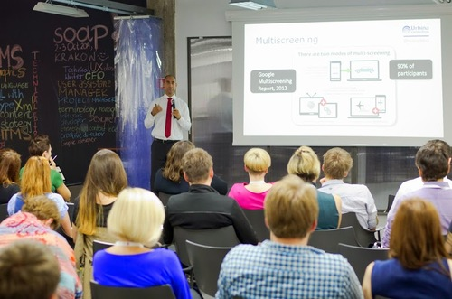
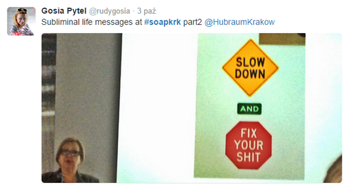
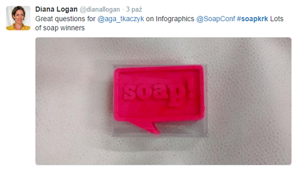

Today, we've got another translation provided by the soapy team. It's the day 2
summary. The Polish version is available
[here](http://techwriter.pl/soap-2014-relacja-z-drugiego-dnia/). Enjoy! Day 2 of
the soap! conference brought even more presentations that were divided into two
tracks. Everyone could find something for themselves. Unfortunately, we weren’t
able to attend all the presentations, so we describe in short only some of them.

## Trust Above All

And not only in a relationship.
[Rahel Ann Bailie](http://soapconf.com/speakers/) talked about the importance of
building trust among our customers. First of all, building trust is a continuous
process. Once built, the trust doesn’t last forever, so we need to constantly
maintain it. Our surroundings generate more stimuli than we can process. We
receive too much information, so we approach it selectively and choose what we
want to focus on. It’s the so-called
[“cocktail party effect”](http://en.wikipedia.org/wiki/Cocktail_party_effect).
We pick out a single stimulus and filter out the rest treating it as background
noise. It’s similar to attending a party during which we are able to focus on a
single conversation in a noisy room. We subconsciously choose the conversation
on which we focus before we join it. The level of engagement in the conversation
depends on the level of trust. Rahel also mentioned that our reactions in
everyday lives when we so to speak function “offline”, aren’t different from our
reactions when we are “online”. We experience the same feelings of acceptance
and rejection in both situations. The current generation looks for the
[social proof](http://en.wikipedia.org/wiki/Social_proof). That’s why we can’t
treat social media simply as another channel for providing content. Such an
assumption leads us to one-sided communication which isn’t social in any way.
User response is necessary. It isn’t about the number of likes and people who
follow a post or a profile. It’s more complicated, just like people are. Rahel
mentioned
[the Cluetrain Manifesto](http://en.wikipedia.org/wiki/The_Cluetrain_Manifesto).
Adding new content isn’t enough, we need to talk with the users. Only then we
can gain their trust.

## Badly Written Instructions Can Kill

Such a terrifying vision was presented by
[Ray Gallon](http://soapconf.com/speakers/). He started his presentation by
describing a situation that occurred in Epinal, France. 24 patients suffering
from prostate cancer were exposed to an excessive amount of ionizing radiation.
Five of them died. It turned out that the tragedy occurred because of human
error, a badly designed interface of the machine and the lack of instructions in
French. The content should be designed so that it helps users undertake better
decisions. Using documentation, people want to learn what our product is for,
how to perform certain tasks, and what choices are available. They also want to
understand why they should perform a given task and what are the most important
parts. That’s why we should show users the easiest way of achieving their goal
and describe the remaining options in a place where they will be able to find
them easily. Ray drew our attention to the fact that the main communication
channel between the customers and the company is the company’s product because
the customers spend the majority of time with it. Users are irritated when they
waste their time. That’s why the content that is displayed on the user interface
of our product must be well-designed as it translates directly into user
experience. Customers don’t care about silos. They communicate with a company,
not with its separate departments. Thus, we have to create integrated
communities inside and outside of the company. We have to listen to what our
customers have to say. We won’t always hear what we’d like to, we don’t always
have to accept all remarks, but our duty is to listen to the users. Such
communities need animation that stimulates rather than moderation that
suppresses. How can we incorporate user opinions into the product? The
traditional model assumes that we have a company on the one side and the user on
the other side. Technical communication that later on influences the product is
in the middle. In a modern approach, the company and users are a single
community in which the users communicate with the company through the product
and have a real influence on its shape. By including users in the decisions
about the product, we build their loyalty. We should thank them every time they
help us.

## The Author Is Also Human

Information is a two-way road and thus we can’t focus only on the end user. We
also need to remember about the author and his experience, as we were told by
[Rick Yagodich](http://soapconf.com/speakers). Rick tried to show us the pain
points of
[content management systems](http://en.wikipedia.org/wiki/Content_management_system).
The majority of CMS platforms aren’t built to facilitate business but to offer
extra functionalities. There’s a considerable gap not only between various
programs but even within one program. Terminology and the way of performing
various actions aren’t consistent. It makes users feel at loss. Poorly organized
systems are frustrating, frustrated users can’t focus and thus make more
mistakes. That’s why we should remember about consistency and content reuse. The
same message should be delivered through all communication channels in the same
way. Our content should adjust to each channel. We can’t punish the user for
using one platform instead of another, for example a mobile phone, for accessing
our content. The systems should be holistic, all components should communicate
with one another. A good example is [Amazon](http://www.amazon.com/) whose
warehouse system is linked with the website that is used for ordering the goods.
We must remember that content management isn’t about technology but about
business. That’s why it’s necessary to make content management easy.

## Draw Instead of Saying

Or present it in the form of an infographic to be more precise.
[Agnieszka Tkaczyk](http://soapconf.com/speakers) talked about her adventure
with creating infographics.
[The forgetting curve](http://en.wikipedia.org/wiki/Forgetting_curve) shows that
we forget 50% of what we read after 24 hours, and almost everything after a
year. Of course, it depends on a number of factors, however the general trend of
information retention is clearly visible. After three days, we remember only 10%
of the text. However, when it’s supported with images, the amount of remembered
information increases to 65%. That’s why substituting a part of the
documentation with infographics is worth consideration. An infographic consists
of data visualizations (e.g. charts), images, and text. It’s important for the
images to be closely related to the topic because only then they reinforce the
message and cause the users to pay more attention to the content of the
infographic. Agnieszka presented how an infographic should be built. It turns
out that, just like the old good essay, it should have an introduction, a body,
and an ending. The introduction should draw the attention of the user and
present the topic of the infographic. In the body, we go to the heart of the
matter by using a combination of text, images, and data visualizations. In the
end, we provide a summary of the presented information. Agnieszka gave us a
couple of tips about creating infographics. One infographic should focus on one
big story rather than a couple of small stories. It should be clear and contain
only data that is important. We need to remember about limiting the amount of
text to minimum and focus mainly on visualizations. Accuracy of our infographic
is also important. Visualizations must match the numbers and the text. We should
quote the sources of the information and inform users if the infographics might
get outdated. Each inaccuracy in the infographic makes it lose its credibility.
The speaker also gave pros and cons of creating infographics. First of all,
infographics are faster to read and remember, plus creating them is fun.
However, it doesn’t change the fact that not all documents can be changed into
infographics. What’s more, infographics might not be treated seriously. Creating
infographics is also time consuming, requires additional software and a good
publication place. At the end of her presentation, Agnieszka showed a couple of
examples demonstrating how infographics can be used to limit the amount of
documentation. One of the examples was an infographic that showed a 7-step
installation procedure. The same process was described in the related
documentation in 329 words. Another example was a color-coded infographic about
the product infrastructure. The related documentation consisted of 457 words.

## Find a Common Language

The management team not always sees the same value in a well-designed content as
people who create that content. [Noz Urbina](http://soapconf.com/speakers) tried
to show what methods and arguments we can use to change the point of view of our
managers. We should look at things from the manager’s perspective, think about
the problems that nag them. We should talk with our colleagues, find out what’s
going on around us. It’ll allow us to find out potential problems that our
content management strategy can solve. We need to show how content management
strategy influences the company’s strategy. It’s a part of the company’s
capital. Easy access to information, user assistance integrated with the
product, consistency of the information cause that users perceive the company as
a whole, not a sum of its departments. Good content management strategy is
needed also because the world is switching to a multi-channel distribution mode.
The channels are pieces of a puzzle. The users use many channels (Twitter,
Facebook, YouTube) in many formats (computer, tablet, mobile phone) in different
ways. It can be a sequential use when we start an action on one device but
continue on another, or simultaneous use that involves performing a couple of
actions on a couple of devices or one action on many devices. That’s why we must
create content that is consistent and the same regardless of the platform. Noz
heralded the advent of the era of
[metadata](http://en.wikipedia.org/wiki/Metadata) that is successively becoming
as important as the content itself. Using metadata is time-consuming but it
helps machines better understand the content.
[The Google search engine](https://www.google.com) can be an example. The
approach to the results has changed. A few years ago, when you entered a
question “When does ASDA close?” you got a link. Now, you get a concrete
answer.  
Noz also touched upon the issue of keeping up with the changes. It turns out
that the strategy of keeping up with the changes is doomed. Instead, we should
introduce the strategy of foreseeing. Rather than watching the competitors, we
should be visionaries. Content influences user experience. Its value is not in
the number of created instructions but in the level to which it meets the needs
of the users. To a large extent, content influences the perception of the brand.
That’s why it’s so important.

Translated: Agnieszka Tkaczyk Proofread: Paweł Kowaluk
