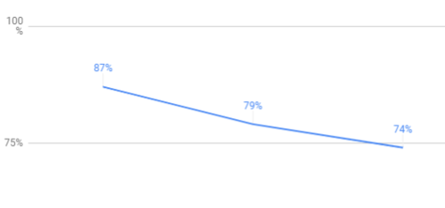
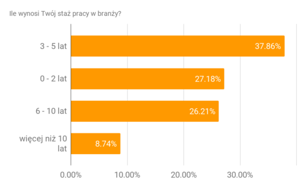
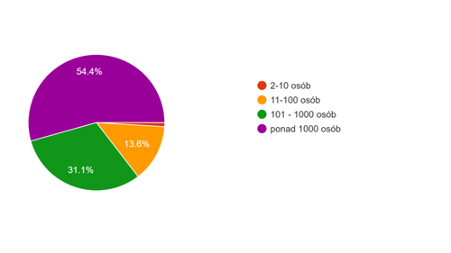
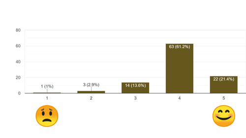

Ile zarabiają specjaliści w branży komunikacji technicznej? Jak różnią się pensje w różnych województwach? Jak na wynagrodzenie wpływa doświadczenie? Przeprowadziliśmy kolejne badanie płac w branży komunikacji technicznej. Oto jego wyniki.

## Porównanie z poprzednimi latami

Wyniki poprzednich badań znajdziecie tu:

- [Wyniki 2018](http://techwriter.pl/wyniki-badania-plac-w-komunikacji-technicznej-2018/)
- [Wyniki 2017](http://techwriter.pl/wyniki-badania-plac-w-komunikacji-technicznej/)

Oto jak sytuacja zmieniła się na przestrzeni lat.

|                                | 2017      | 2018      | 2019      |
| ------------------------------ | --------- | --------- | --------- |
| Liczba odpowiedzi              | 70        | 80        | 103       |
| Średnie wynagrodzenie brutto   | 6 969 zł  | 7 352 zł  | 8 877 zł  |
| Mediana wynagrodzeń brutto     | 6 000 zł  | 7 000 zł  | 8 000 zł  |
| Najniższe wynagrodzenie brutto | 1 970 zł  | 3 000 zł  | 3 500 zł  |
| Najwyższe wynagrodzenie brutto | 15 000 zł | 16 000 zł | 20 000 zł |

Czyli na lepsze zmieniają się następujące rzeczy:

- mamy więcej uczestników ankiety
- uczestnicy zarabiają więcej

## Disclaimer (po polsku: dysklejmowanie)

Zanim przejdziemy do szczegółowej analizy, chcemy zaznaczyć, że 103 osoby to mało jak na badanie i wyników takiego badania nie można nazwać statystyką. Wyniki, które przedstawiamy mają bardziej charakter anegdotyczny, to znaczy "zobaczcie, tak może być". Na przykład, "w województwie małopolskim są technical writerzy, którzy zarabiają X złotych miesięcznie".

Jak można wykorzystać te informacje? Na przykład negocjując podwyżkę z szefem, przygotowując się na pytanie "Ile Pan/Pani chce zarabiać?", czy planując gdzie się przeprowadzić.

## Profesje

Tak jak w poprzednich latach, większość ankietowanych identyfikuje się jako technical writer (74%). Ten udział procentowy zdaje się spadać w ostatnich latach. Być może klarują się role specjalistyczne.

Zarobki w poszczególnych grupach kształtują się następująco (posortowane wg średniego wynagrodzenia brutto):

| Profesja                   | Liczba respondentów | Średnie wynagrodzenie brutto | Mediana wynagrodzeń |
| -------------------------- | ------------------- | ---------------------------- | ------------------- |
| Information Architect      | 3                   | 11 333 zł                    | 8 000 zł            |
| Documentation manager      | 10                  | 10 670 zł                    | 10 500 zł           |
| Content strategist         | 1                   | 9 000 zł                     | 9 000 zł            |
| Technical writer           | 78                  | 8 694 zł                     | 8 000 zł            |
| Project manager            | 5                   | 8 052 zł                     | 7 666 zł            |
| UX Writer                  | 3                   | 7 966 zł                     | 8 000 zł            |
| Training content developer | 2                   | 7 600 zł                     | 7 600 zł            |
| UX Designer                | 1                   | 7 200 zł                     | 7 200 zł            |

Przedziały wynagrodzenia według profesji wyglądają tak:

| Profesja                   | Najniższe wynagrodzenie | Najwyższe wynagrodzenie |
| -------------------------- | ----------------------- | ----------------------- |
| Information Architect      | 8 000 zł                | 18 000 zł               |
| Documentation manager      | 6 500 zł                | 14 000 zł               |
| Content strategist         | 9 000 zł                | 9 000 zł                |
| Technical writer           | 4 000 zł                | 20 000 zł               |
| Project manager            | 3 500 zł                | 13 000 zł               |
| UX Writer                  | 7 400 zł                | 8 500 zł                |
| Training content developer | 7 200 zł                | 8 000 zł                |
| UX Designer                | 7 200 zł                | 7 200 zł                |

Jak widać, wynagrodzenie technical writera może być całkiem atrakcyjne, i nie odstaje zbytnio od wynagrodzenia kierownika. Rekordowy wpis to 20 000 zł miesięcznie brutto. Zdecydowanie jest do czego aspirować. ????

## Przygotowanie do zawodu, doświadczenie i rozwój

Tak jak w poprzednich latach, większość ankietowanych nauczyło się zawodu w pracy. Ciągle brakuje ludzi, którzy chcieliby skorzystać z [kierunkowych studiów](https://www.vistula.edu.pl/kierunki-studiow/kontynuacja-edukacji/studia-podyplomowe/informatyka/komunikacja-techniczna). Pomału rośnie liczba osób z certyfikatem [ITCQF](http://itcqf.org/).

| Przygotowanie do pracy                | Procent | Liczba osób |
| ------------------------------------- | ------- | ----------- |
| Szkolenie i doświadczenie w pracy     | 87,38%  | 90          |
| Studia technical writing lub pokrewne | 5,83%   | 6           |
| Kurs ITCQF z certyfikatem             | 4,85%   | 5           |
| Kurs ITCQF bez certyfikatu            | 0,97%   | 1           |
| Kurs przygotowawczy                   | 0,97%   | 1           |

Jeżeli chodzi o staż pracy, jesteśmy młodym zawodem. 65% ankietowanych ma od 0 to 5 lat doświadczenia. Tylko 9 osób ma więcej niż 10 lat doświadczenia.

Najpopularniejszą formą poszerzania horyzontów jest udział w wydarzeniach takich jak konferencje czy meetupy (63%) oraz czytanie stron lub blogów branżowych (79%). Najmniej popularne są czasopisma i kanały na YouTube, bo tylko jedna osoba zaznaczyła, że z nich korzysta. Pięciu ankietowanych zadeklarowało, że nie poszerza wiedzy.

## Firma, branża

Prawie 90% ankietowanych pracuje w firmie zagranicznej. Nie ma wśród nas freelancerów, ogromna większość pracuje w firmie zatrudniającej powyżej 100 osób.

Jednocześnie ogromna większość z nas pisze dokumentację do oprogramowania.

| Rodzaj dokumentacji         | Liczba respondentów |
| --------------------------- | ------------------- |
| Do oprogramowania           | 91                  |
| Do API                      | 35                  |
| Do urządzeń elektronicznych | 16                  |
| Do maszyn lub pojazdów      | 7                   |
| Do sprzętu AGD              | 5                   |

## Geografia

Większość ankietowanych pracuje w województwie małopolskim lub dolnośląskim.

<table><tbody><tr><td>Województwo</td><td>Liczba ankietowanych</td></tr><tr><td>małopolskie</td><td>42</td></tr><tr><td>dolnośląskie</td><td>30</td></tr><tr><td>mazowieckie</td><td>11</td></tr><tr><td>śląskie</td><td>8</td></tr><tr><td>wielkopolskie</td><td>5</td></tr><tr><td>pomorskie</td><td>4</td></tr><tr><td>łódzkie</td><td>1</td></tr><tr><td>podlaskie</td><td>1</td></tr><tr><td>świętokrzyskie</td><td>1</td></tr></tbody></table>

Rekordowe zarobki (20 000 zł) pochodzą z województwa dolnośląskiego, tak jak i najwyższe średnie zarobki - 9 330 zł. Najwyższa mediana pochodzi z województwa mazowieckiego (9 200 zł).

## Zadowolenie

Zapytaliśmy jak bardzo jesteś zadowolony/a ze swojej pracy w skali od 1 (bardzo nie lubię swojej pracy) do 5 (kocham swoją pracę). Jaki był wynik?

Bardzo lubimy swoją pracę! Najpopularniejszą oceną była czwórka, bo aż 61% tak zagłosowało. Tylko jedna osoba jest bardzo niezadowolona, a trzy kolejne dały ocenę 2.

## Podsumowanie

Tak jak pisaliśmy powyżej, ankieta ma charakter poglądowy, a nie statystyczny. Jednak cieszymy się, że nasi ankietowani zarabiają coraz lepiej i do tego są bardziej zadowoleni ze swojej pracy.

Mamy nadzieję, że w kolejnych latach z ankiety wyłoni się więcej trendów. A tymczasem, liczymy na to, że obecne dane będą dla Was przydatne.

Czego Wam brakuje? Co jeszcze chcielibyście wiedzieć? Piszcie w komentarzach.
