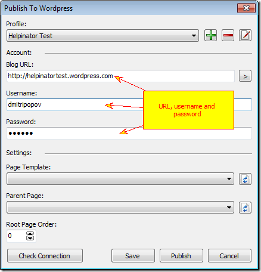

[Helpinator](http://www.helpinator.com/) to nie żaden krewny [Akinatora](http://en.akinator.com/), tylko kolejny [HAT](http://en.wikipedia.org/wiki/Help_authoring_tool). Dlatego też nie potrafi zaklinać umysłów, ale za to udało mu się poskromić [WordPressa](https://pl.wordpress.org/). Helpinator to aplikacja tworzona przez małą firmę [Major Mind Software](http://www.majormind.com/), która ma swoją siedzibę w [Archangielsku](http://pl.wikipedia.org/wiki/Archangielsk) w Rosji. Ogólnie program oferuje to co większość tego typu narzędzi, czyli m.in. edytor WYSIWYG, szablony, wbudowane narzędzie do robienia zrzutów ekranu, style oraz budowanie dokumentacji na podstawie określonych warunków. Poniżej możecie obejrzeć krótki filmik promujący aplikację.

<iframe src="https://www.youtube.com/embed/OO7xKNYXP78?feature=player_embedded" width="640" height="360" frameborder="0" allowfullscreen="allowfullscreen"></iframe>

Jak każdy szanujący się HAT, Helpinator wspiera również generowanie dokumentacji do wielu formatów z jednego źródła, czyli [single sourcing](http://en.wikipedia.org/wiki/Single_source_publishing). Jednak ciekawostką, na której właśnie chcemy się skupić, jest współpraca aplikacji z jednym z najbardziej popularnych systemów zarządzania treścią. Od wersji 3.10 program posiada możliwość generowania dokumentacji i publikowania jej bezpośrednio na WordPressie. W skrócie wygląda to tak:

- Każdy temat (topic) jest generowany jako osobna strona
- Tworzona jest strona główna (root page) ze spisem treści, dzięki czemu zachowana jest hierarchia stron
- Wygenerowaną dokumentację można publikować na podstronie, np. w dziale "Pomoc"
- Istnieje możliwosć wyboru spośród szablonów strony dostępnych w używanym motywie WordPressa
- Zmodyfikowane tematy można ponownie publikować

Konfiguracja Helpinatora wydaje się być dość prosta. W wariancie podstawowym wystarczy podać tylko adres naszego WordPressa, nazwę użytkownika i hasło. W wariancie rozszerzonym możemy opcjonalnie wybrać jeden z dostępnych szablonów strony oraz lokalizację strony nadrzędnej.

_Źródło: http://www.helpinator.com/blog_

Szczegóły dotyczące konfiguracji Helpinatora do współpracy z WordPressem znajdziecie w [dokumentacji produktu](http://www.helpinator.com/webhelp/index.html?wordpresscms.html).

Jeśli chcielibyście podejrzeć efekt końcowy, to można to zrobić dzięki [stronie demonstracyjnej](https://helpinatortest.wordpress.com/) stworzonej przez producenta oprogramowania.

Helpinator zapewne nie jest w czołowej dziesiątce aplikacji, które są brane pod uwagę przy wyborze oprogramowania do tworzenia dokumentacji, niemniej jednak warto się jej przyjrzeć bliżej. Tym bardziej, że cena produktu zdecydowanie zachęca. Licencja na jednego użytkownika z dożywotnimi aktualizacjami kosztuje 250 dolarów, a jeśli wystarczą nam aktualizacje tylko przez rok, wtedy cenę można zbić do 150 dolarów. Producent oferuje wersję testową na 14 dni, którą można pobrać z działu [Download](http://helpinator.com/download.html) na stronie aplikacji i zainstalować na Windowsie XP/7/8. Na szczęście nie wymaga to podawania żadnych danych osobowych.

Owocnego testowania :)
